# Mugshot logging journeys: synthetic research audit and V2 direction

- Date: 2026-07-17
- Panel: 300 modeled users
- Surface: current iOS Debug build on iPhone 17 Pro, 368 x 800
- Scope: Guided Sip, Deep Sip, Guided Cafe, and Deep Cafe

## Executive summary

### Decision

The working hypothesis is directionally supported, but it is incomplete.

- In a forced Guided-versus-Deep choice, the modeled panel prefers Guided for **88% of Sip sessions** and **95% of Cafe sessions**.
- In the product as it actually exists, users also have Quick. When Quick is available, the modeled natural choice becomes:
  - **Sip:** 60% Quick, 32% Guided, 9% Deep.
  - **Cafe:** 76% Quick, 21% Guided, 3% Deep.
- The real conclusion is not simply “make Guided the default.” It is: **make the guided shell the only everyday shell, default its reflection depth to Quick, and offer detail progressively.**

Deep should not remain a separate end-to-end mode. Deep Sip should become optional tasting modules, and Deep Cafe should become context-triggered facet disclosure. Both should be resumable after the core log has already been saved.

### Top findings

1. **Sip versus Cafe is not currently a true entry choice.** The app starts with “Log a sip,” treats Cafe as a location context, and offers Cafe Pulse only after the drink rating. This is internally coherent, but users who think “I want to log this cafe” will not see a matching top-level action.
2. **The core guided composer works.** Context, natural-language drink name, one independent rating, and audience form a clear mobile sequence. The optional photo and one-line thought are well placed.
3. **The word “Guided” is doing too many jobs.** It describes the composer, the Tasting Lens depth, and the Cafe Pulse depth. Users can understand each local selector, but they are unlikely to form one stable global mental model.
4. **Guided Sip is useful but not an everyday default for most people.** The captured matcha fixture showed ten progress segments plus its final snapshot. The uncertainty and skip states reduce anxiety, but this is still a deliberate tasting session.
5. **Guided Cafe is already too long for a default.** It exposes 13 screens. The content is thoughtful, but the sequence feels like a survey after the user has already logged the sip.
6. **Deep Cafe is not viable for normal mobile logging.** The mode declares 28 screens before the user begins. That is useful as an expert review instrument, not as an everyday journal flow.
7. **The highest-value fields are small in number:** drink name, context/place, sip stars, optional cafe stars, reorder intent, return intent, photo/thought, private note, and audience.
8. **The strongest delight is the “two truths” model.** Sip stars and cafe stars remain independent, as do reorder and return intentions. That distinction is worth preserving.

### Biggest UX risks

- Users interpret Quick, Guided, and Deep as commitments before they know what the output will help them remember.
- A 13- or 28-screen cafe reflection occurs inside an already multi-step sip log.
- Repeating Lifted, Neutral, and Detracted across many facets creates mechanical completion behavior rather than honest reflection.
- Deep completion may produce more data without producing proportionally more user value.
- The Cafe Pulse share summary followed by the final sip audience decision creates two publication decisions.
- Power-user tools are mixed into the same temporal moment as capture. The user is being asked to remember the drink, analyze it, analyze the place, decide privacy, and publish in one session.

### Recommended V2 direction

Use one three-step everyday capture:

1. **Place and drink**
2. **Your take**
3. **Remember and save**

After the minimum record is valid, expose:

- **Add tasting notes**
- **Add cafe details**
- **Add brew details**

These are contextual modules, not modes. Let users complete them before saving, immediately after saving, or later from the journal entry.

## Research method and interpretation

This is synthetic research, not a claim about observed customers. The estimates combine:

- current-session capture of the implemented flows;
- current source-defined step counts and field behavior;
- mobile form heuristics;
- modeled goals, patience, expertise, tenure, and privacy preferences for 300 users.

The percentages are directional planning estimates. Treat differences smaller than roughly 8-12 percentage points as noise until validated with real product analytics or moderated sessions.

### What “Guided Sip” and “Deep Sip” mean here

The production product does not expose four parallel top-level logging flows.

- The release composer itself is guided.
- The sip rating step offers Quick rating or Tasting Lens.
- Tasting Lens then offers Quick, Guided, and Deep depth.
- Cafe context can then open Cafe Pulse, which separately offers Quick, Guided, and Deep.

For this audit:

- **Guided Sip** means the guided composer using Guided Tasting Lens.
- **Deep Sip** means the guided composer using Deep Tasting Lens.
- **Guided Cafe** means a cafe-context sip using Guided Cafe Pulse.
- **Deep Cafe** means a cafe-context sip using Deep Cafe Pulse.

This distinction matters: the four requested journeys are nested depths, not four equal entry points.

## Current-flow evidence

### Step 0 — Entry from the app shell: healthy

The central Add action is prominent and the empty state speaks in terms of starting with a sip.

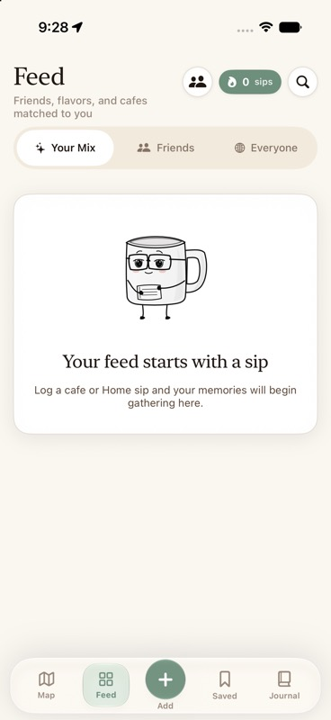

### Step 1 — Sip context: mixed

The sequence is clear, but Cafe is presented as a location choice inside “Log a sip.” Users are not choosing between a Sip record and a Cafe record.

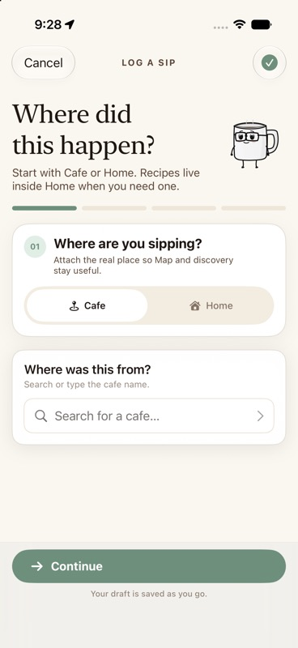

### Step 2 — Natural-language drink entry: healthy

One recognizable order name has high recall value and low cognitive load. Background parsing avoids asking the user to classify every attribute.

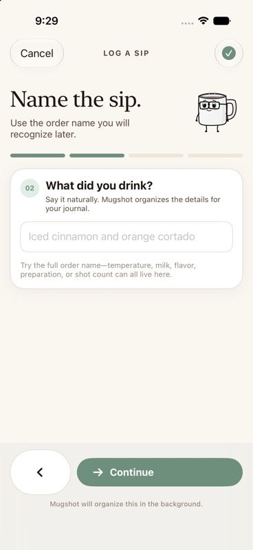

### Step 3 — Rating fork: mixed

“Quick rating” is immediately legible. “Use my tasting lens” communicates personal value, but it does not preview the size of the next commitment.

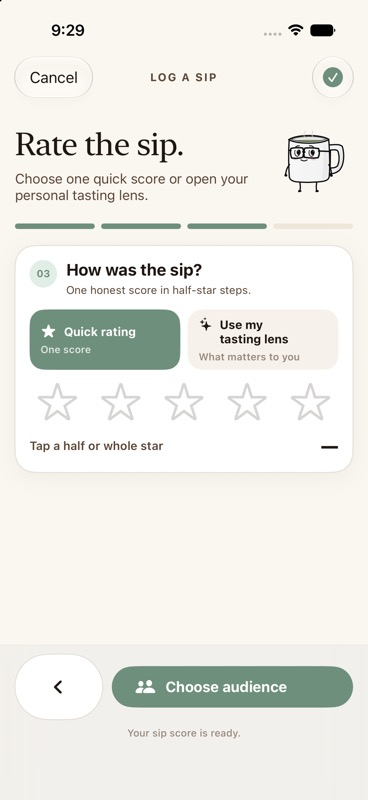

### Step 4 — Tasting Lens depth setup: mixed

The drink-specific identity is reassuring. However, a user has now made one choice to open the Lens and must make another choice about depth.

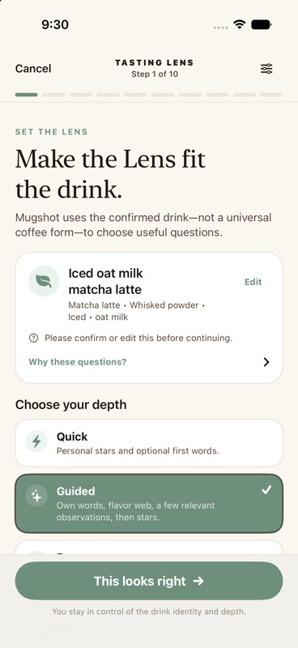

### Step 5 — Guided versus Deep explanation: at risk

The descriptions are good, but Deep sits below the first viewport and the same three depth labels later appear in Cafe Pulse.

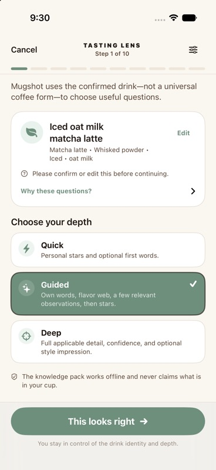

### Step 6 — Guided Sip first impression: healthy for deliberate tasting

Starting in the user’s own words is emotionally appropriate and reduces suggestion bias. It is still writing work, so it should not block an everyday log.

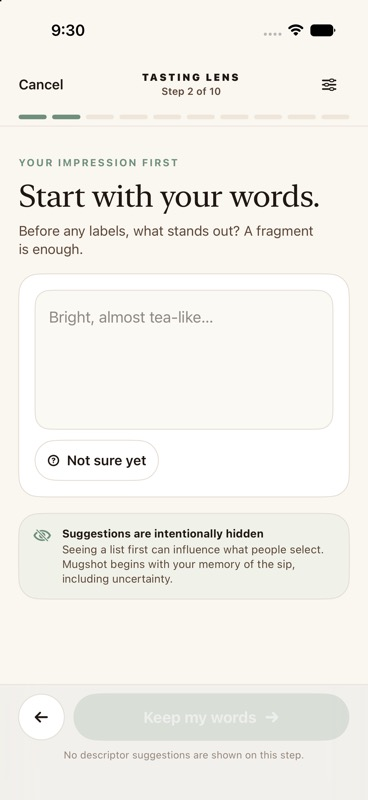

### Step 7 — Deep Sip criterion: high friction

The question is thoughtful, uncertainty is respected, and the data semantics are careful. The density of choices, alternative states, supporting explanation, and later confidence controls makes this an expert reflection surface.

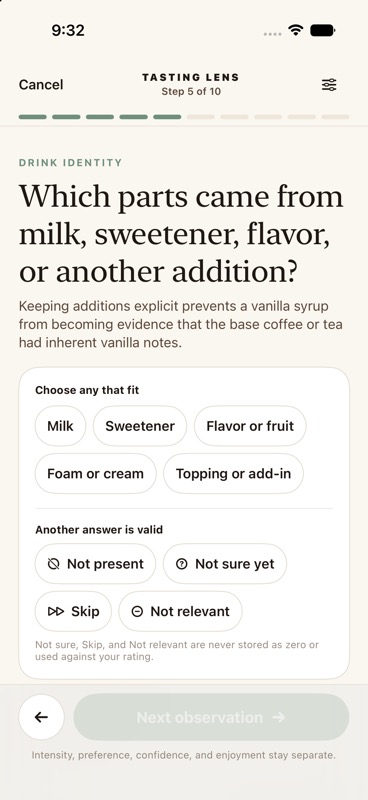

### Step 8 — Cafe Pulse depth choice: mixed

The independent cafe-versus-sip model is excellent. The selector also reveals a second Quick/Guided/Deep taxonomy within the same log.

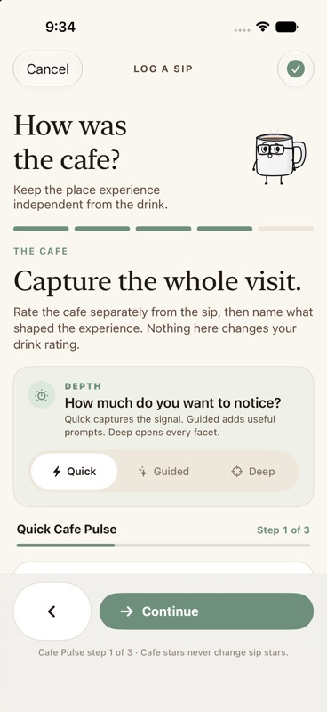

### Step 9 — Guided Cafe start: at risk

“Step 1 of 13” sets an honest expectation, but it also tells an average user that a place reflection is longer than the core memory they came to save.

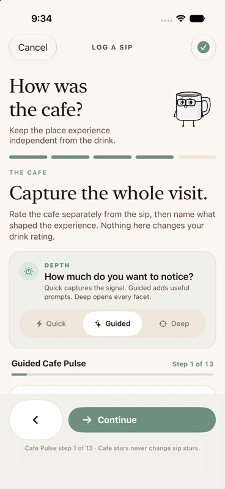

### Step 10 — Guided Cafe dimension: at risk

The context-selected prompts are more relevant than a universal form. Repeating broad signal plus several facet signals across six dimensions still creates survey behavior.

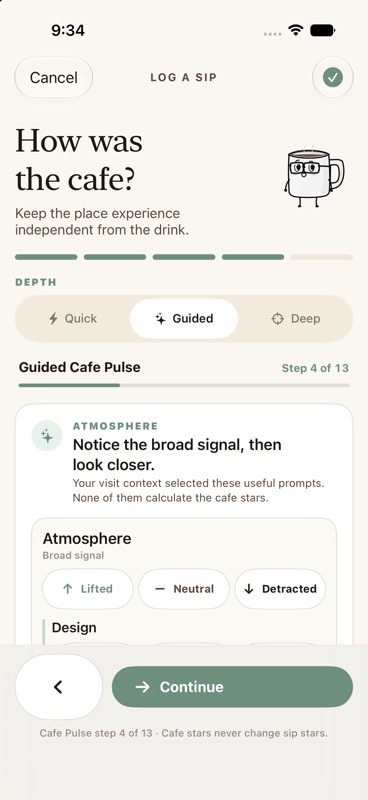

### Step 11 — Deep Cafe start: critical

“Step 1 of 28” is a rational abandonment trigger for normal mobile usage.

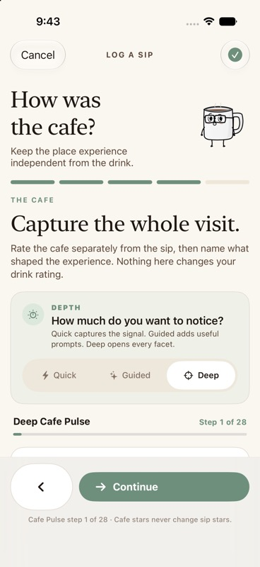

### Step 12 — Deep Cafe facets: critical

Four detailed judgments are shown on this screen, with many more screens remaining. Users are likely to satisfice by leaving items untouched, selecting Neutral repeatedly, or exiting.

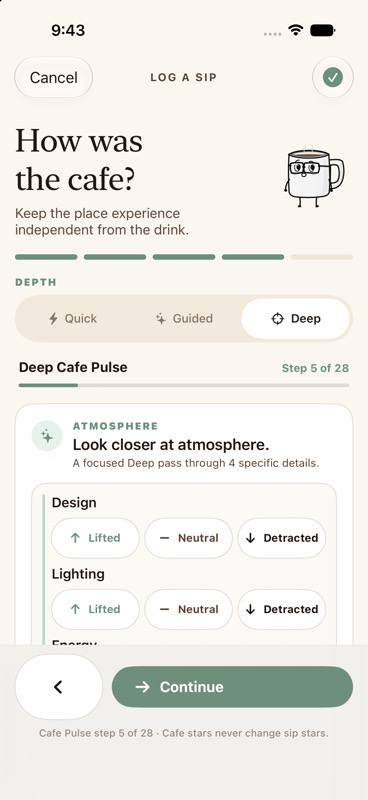

## Synthetic panel

### Primary behavioral groups

These groups are mutually exclusive and total 300. First-time and returning status are modeled as overlays below.

| Primary persona | Users | Main motivation | Expected behavior |
| --- | ---: | --- | --- |
| Casual Cafe visitor | 58 | Remember the place, drink, and whether it was worth it | Uses Quick most days; adds a photo or short thought when the moment feels special |
| Specialty coffee enthusiast | 42 | Build a useful sensory and cafe history | Uses Guided for distinctive drinks; uses Deep selectively, not on routine orders |
| Matcha or tea enthusiast | 34 | Capture texture, preparation, and personal response | Higher Guided adoption; Deep only for comparisons, flights, or learning sessions |
| Home barista | 36 | Improve repeatability and compare attempts | Values brew variables and tasting detail, but wants them attached to a fast base log |
| Traveler | 30 | Preserve place, city, drink, photo, and return memory | Prioritizes place accuracy and image capture; avoids long in-the-moment analysis |
| Social sharer | 28 | Publish a visually meaningful moment | Prioritizes photo, caption, and audience; avoids private analytical fields |
| Private journaler | 30 | Preserve honest memory without performance pressure | Values own words and private notes; prefers optional depth and private defaults |
| Power user | 18 | Capture structured detail and customize the system | Highest Deep use; wants pinned modules, resume, and reusable defaults |
| Low-patience mobile user | 24 | Finish in seconds with minimal typing | Uses Quick almost exclusively; abandons long progress indicators early |
| **Total** | **300** |  |  |

### Tenure overlays

| Tenure | Users | Expected effect |
| --- | ---: | --- |
| First-time user | 96 | Needs a visible minimum path, plain output promise, and no mode vocabulary to learn |
| Returning user | 204 | Benefits from remembered cafe, audience, recent drinks, repeated orders, and pinned advanced modules |

## Mode-choice result

### Forced Guided versus Deep

| Persona | Prefer Guided Sip | Prefer Guided Cafe |
| --- | ---: | ---: |
| Casual Cafe visitor | 94% | 98% |
| Specialty coffee enthusiast | 80% | 91% |
| Matcha or tea enthusiast | 86% | 94% |
| Home barista | 84% | 94% |
| Traveler | 95% | 98% |
| Social sharer | 96% | 97% |
| Private journaler | 90% | 96% |
| Power user | 58% | 75% |
| Low-patience mobile user | 99% | 99% |
| **Weighted panel estimate** | **88%** | **95%** |

The 90% hypothesis is therefore plausible as a rounded forced-choice statement. It is slightly high for Sip and slightly low for Cafe.

### Natural choice when Quick exists

| Surface | Quick | Guided | Deep |
| --- | ---: | ---: | ---: |
| Sip reflection | 60% | 32% | 9% |
| Cafe reflection | 76% | 21% | 3% |

This is the more important product result. Average users do not want to choose between two long paths; most want a valid minimal record, with optional depth when the moment earns it.

## Flow scorecard

Scores are on a five-point scale. Higher cognitive-load and effort scores are worse; higher scores are better for the other dimensions.

| Flow | Clarity | Speed | Cognitive load | Emotional fit | Perceived value | Completion | Abandonment | Confidence at submission* | Repeat use |
| --- | ---: | ---: | ---: | ---: | ---: | ---: | ---: | ---: | ---: |
| Guided Sip | 4.2 | 3.0 | 3.1 | 4.3 | 4.2 | 81% | 19% | 4.2 | 63% |
| Deep Sip | 3.7 | 1.9 | 4.4 | 3.8 | 4.3 | 47% | 53% | 4.5 | 23% |
| Guided Cafe | 4.0 | 2.1 | 4.0 | 3.8 | 4.0 | 65% | 35% | 4.0 | 41% |
| Deep Cafe | 3.5 | 1.0 | 4.9 | 3.0 | 3.7 | 19% | 81% | 4.2 | 6% |

\* Confidence is estimated among users who reach submission. Deep can increase confidence for completers while still being a poor default because most users will not complete it.

## Flow-by-flow audit

### 1. Guided Sip

**What works**

- Drink identity is grounded in the order name the user already knows.
- The flow separates personal enjoyment from observations.
- Own words come before suggestions.
- “Not sure,” “Skip,” and “Not relevant” reduce expertise anxiety.
- The final snapshot makes the extra effort feel more valuable than raw form fields.

**Where users hesitate**

- Opening the Lens already feels like choosing detail; the second depth choice adds decision overhead.
- First-time users wonder whether Guided is the “correct” or expected way to rate a drink.
- Users may not know whether the snapshot will help them later until after they complete it.

**Where users abandon**

- At the ten-segment progress indicator.
- On the flavor explorer when nothing obvious comes to mind.
- During repeated observation questions after the initial novelty wears off.

**Unnecessary or redundant**

- A global depth decision before the user sees a useful first prompt.
- Educational disclosures in the main path; they are valuable, but they belong behind “Why this?”
- Asking users to customize or pin the Lens while they are still logging.

**Missing**

- “Save the sip now and finish tasting notes later.”
- A one-screen preview of what Guided will produce.
- Reuse of a returning user’s preferred two or three observation modules.

**Moments of delight**

- Drink-specific identity.
- Broad-to-specific flavor exploration.
- Mugsy’s single non-judgmental distinction.
- A personal snapshot rather than a professional-sounding grade.

**Recommended changes**

- Keep the Lens entry but rename it **Add tasting notes**.
- Do not ask for depth up front. Start with own words plus one relevant prompt.
- Reveal **Explore more** after each answered module.
- Allow save at every point once personal stars exist.
- Let returning users pin preferred modules.

### 2. Deep Sip

**What works**

- It respects uncertainty and keeps intensity, liking, confidence, and enjoyment separate.
- It can create meaningful comparison data for serious enthusiasts.
- Contextual criteria are better than a generic professional form.

**What breaks down**

- Deep can show the same visible progress count as Guided for a drink even though each screen requires more judgment. Users cannot accurately estimate the commitment.
- Confidence and style-impression controls increase response quality but lower flow speed sharply.
- Evidence, limits, pinning, hiding, and response states compete with the main question.

**Where users abandon**

- At the identity/depth chooser if they expected a fast rating.
- After the flavor web, when more observation questions remain.
- On a criterion with several dimensions of response.

**Unnecessary or redundant**

- Deep as a named end-to-end mode.
- Full educational scaffolding on every criterion.
- Confidence on every observation for normal journal use.

**Missing**

- A session purpose such as “Compare this brew,” “Learn this drink,” or “Run a tasting.”
- A resume-later state distinct from an unfinished core log.
- A compact completion estimate based on the selected drink and pinned modules.

**Moments of delight**

- Drink-specific questions make the system feel knowledgeable without pretending to grade the user.
- Evidence and limits build trust for users who want to learn.
- The final snapshot can make a deliberate tasting feel complete.

**Recommended changes**

- Reframe Deep as **Full tasting** or **Compare in detail**, launched after save or from Journal.
- Group related criteria into modules: flavor, structure, texture, finish, and preparation.
- Ask confidence only once per module or only when the answer will affect future phrasing.
- Preserve every current data semantic while removing the requirement to traverse one linear journey.

### 3. Guided Cafe

**What works**

- The copy makes cafe stars independent from sip stars.
- Visit purpose changes the prompts.
- Return and reorder intentions create a useful “two truths” next move.
- Private notes and share projection are carefully separated.

**Where users hesitate**

- “Step 1 of 13” signals a long commitment.
- Users do not know which of the six dimensions will matter for this visit.
- A cafe reflection after a complete drink rating feels like a second survey.

**Where users abandon**

- Immediately after seeing 13 steps.
- During the middle run of atmosphere, sound, hospitality, menu/value, comfort, and community.
- At private notes or sharing, after the emotionally meaningful questions have already been answered.

**Unnecessary or redundant**

- A broad signal plus multiple facet signals for every dimension.
- Neutral as a repeated explicit choice; untouched already communicates no strong signal.
- Cafe share projection before the final sip audience.

**Missing**

- “What stood out?” as a small set of user-chosen dimensions.
- A single cafe summary screen.
- A clear “No cafe reflection today” default that does not feel like abandoning work.

**Moments of delight**

- Independent stars.
- Visit-context adaptation.
- Return and reorder resolving into one memorable next move.
- Owner-only cafe notes.

**Recommended changes**

- Default to cafe stars plus return intent.
- Ask the user to select up to two areas that shaped the visit.
- Open facet prompts only for selected areas.
- Move share toggles into the final audience screen.
- Keep free text optional and available as a private note.

### 4. Deep Cafe

**What works**

- It is comprehensive.
- Facets are organized into understandable dimensions.
- It could support a deliberate cafe audit, accessibility review, work-session review, or repeat-visit comparison.

**What breaks down**

- Twenty-eight screens exceed the normal mobile logging budget.
- The repeated three-way impact control encourages satisficing.
- The amount of captured data is not matched by an equally clear user-facing output.
- The mode asks users to assess facets they may not have encountered, such as restrooms, outlets, food, or staff recovery.

**Where users abandon**

- At “Step 1 of 28.”
- In the first or second dimension after recognizing the repeated pattern.
- Near the end when intentions, private notes, and sharing remain.

**Unnecessary or redundant**

- Every facet in one linear session.
- Broad dimension judgment followed immediately by all child judgments.
- Explicit Neutral on all facets.

**Missing**

- Event-based prompting: only ask about wait when there was a wait, or outlets when the user worked.
- A focused purpose selector.
- Post-save completion and later editing.

**Moments of delight**

- The facet library can name details that serious reviewers genuinely care about.
- Cafe stars, sip stars, return, and reorder remain semantically independent.
- Visit-purpose routing creates a strong foundation for genuinely contextual prompts.

**Recommended changes**

- Remove Deep Cafe as a logging mode.
- Keep the facet library as progressive detail.
- Trigger relevant facets from visit purpose, selected standout areas, and direct user requests.
- Make detailed cafe review a separate, resumable journal activity.

## Comparative analysis

### Guided Sip versus Deep Sip

Guided Sip better matches the promise of personal, useful reflection. Deep Sip better serves structured learning. Deep adds semantic precision, but average users do not receive enough additional immediate value to justify the extra effort.

Best choice:

- Everyday: Quick stars, with optional own words.
- Meaningful or novel drink: Guided modules.
- Flight, recipe comparison, or deliberate learning: Full tasting after save.

### Guided Cafe versus Deep Cafe

Guided Cafe is substantially better than Deep, but 13 screens still exceeds an everyday logging threshold. Deep Cafe should not be optimized as a faster 28-screen flow; its facet model should be decomposed.

Best choice:

- Everyday: cafe stars, one standout, return intent.
- Meaningful visit: selected dimension prompts.
- Deliberate cafe review: resumable facet modules.

### Sip versus Cafe mental model

Current answer: users understand that sip and cafe ratings are separate once Cafe Pulse appears. They do not choose between a Sip log and a Cafe log at entry.

V2 should state the model plainly:

> Every entry remembers the sip. At a cafe, you can also remember the place.

If Mugshot wants cafe-only visits, add **Remember this visit** on a cafe detail screen. Do not make it an equal global Add choice until real demand is demonstrated.

### Guided versus Deep mental model

The local descriptions are understandable. The system-level mental model is not.

- Guided currently means the release composer presentation.
- Guided also means one Tasting Lens depth.
- Guided also means one Cafe Pulse depth.

V2 should remove mode language from the core flow. Use outcome labels:

- Add tasting notes
- Explore flavor
- Add cafe details
- Add brew details
- Run a full tasting

### Default

The default should be the current guided composer structure with Quick reflection selected. The user should never have to choose “Guided mode” before logging.

## Segment-by-flow data table

Completion and repeat-use values are modeled probabilities after a user starts that flow.

| Flow | User segment | Completion | Friction | Perceived value | Repeat use | Main confusion point | Recommended fix |
| --- | --- | ---: | --- | --- | ---: | --- | --- |
| Guided Sip | Casual Cafe visitor | 78% | Medium | Medium-high | 55% | Why a rating needs a Lens | Start with stars; offer tasting notes |
| Guided Sip | Specialty coffee enthusiast | 88% | Medium | High | 78% | Which depth is expected | Use contextual modules, not modes |
| Guided Sip | Matcha or tea enthusiast | 87% | Medium | High | 75% | Whether prompts fit preparation | Show confirmed drink identity, then relevant modules |
| Guided Sip | Home barista | 85% | Medium | High | 72% | Tasting versus recipe detail | Separate tasting and brew modules |
| Guided Sip | Traveler | 76% | Medium | Medium | 48% | Value versus time while traveling | Save first; finish notes later |
| Guided Sip | Social sharer | 79% | Medium | Medium | 56% | Private analysis versus share output | Preview shareable output |
| Guided Sip | Private journaler | 84% | Medium | High | 69% | What remains private | Keep persistent owner-only labels |
| Guided Sip | Power user | 91% | Low-medium | Very high | 82% | How to reuse preferred criteria | Allow pinned modules |
| Guided Sip | Low-patience mobile user | 62% | High | Low-medium | 35% | Ten-step commitment | Keep stars valid without Lens |
| Deep Sip | Casual Cafe visitor | 30% | Very high | Low | 8% | Why so many distinctions matter | Remove Deep from everyday flow |
| Deep Sip | Specialty coffee enthusiast | 68% | High | High | 35% | Session length is unclear | Add purpose and time estimate |
| Deep Sip | Matcha or tea enthusiast | 64% | High | High | 34% | Confidence and preference feel repetitive | Ask confidence per module |
| Deep Sip | Home barista | 66% | High | High | 40% | Mixing brew diagnosis with observation | Keep observation and recipe comparison separate |
| Deep Sip | Traveler | 29% | Very high | Low | 7% | Poor fit for the moment | Save and revisit later |
| Deep Sip | Social sharer | 31% | Very high | Low | 9% | Little visible social payoff | Show a compact optional share snapshot |
| Deep Sip | Private journaler | 52% | High | Medium-high | 24% | Educational UI interrupts reflection | Collapse supporting evidence |
| Deep Sip | Power user | 79% | Medium-high | Very high | 58% | Linear order limits control | Offer modular navigation |
| Deep Sip | Low-patience mobile user | 15% | Extreme | Very low | 2% | Immediate overcommitment | Do not surface Deep in core capture |
| Guided Cafe | Casual Cafe visitor | 62% | High | Medium-high | 38% | Why a cafe note takes 13 steps | Cafe stars plus one standout |
| Guided Cafe | Specialty coffee enthusiast | 72% | Medium-high | High | 47% | Too many place dimensions | Let user select relevant dimensions |
| Guided Cafe | Matcha or tea enthusiast | 68% | High | Medium-high | 42% | Place detail competes with drink detail | Offer cafe reflection after save |
| Guided Cafe | Home barista | 66% | High | Medium | 40% | Low value for Home-oriented goals | Keep Cafe module contextual |
| Guided Cafe | Traveler | 64% | High | High | 39% | Wants place/photo, not facet survey | Prioritize place, photo, return |
| Guided Cafe | Social sharer | 68% | High | Medium-high | 44% | Share toggles duplicate audience | Merge publication decisions |
| Guided Cafe | Private journaler | 67% | High | High | 43% | Public summary appears after private notes | Default everything private |
| Guided Cafe | Power user | 80% | Medium | High | 58% | Wants faster reuse | Remember preferred cafe modules |
| Guided Cafe | Low-patience mobile user | 42% | Very high | Low | 20% | Step 1 of 13 | Default to three-tap Cafe Quick |
| Deep Cafe | Casual Cafe visitor | 11% | Extreme | Very low | 2% | Step 1 of 28 | Remove as a logging mode |
| Deep Cafe | Specialty coffee enthusiast | 29% | Extreme | Medium | 10% | Too many unseen or irrelevant facets | Choose a review purpose first |
| Deep Cafe | Matcha or tea enthusiast | 22% | Extreme | Low-medium | 7% | Cafe review overwhelms sip memory | Make it a later journal activity |
| Deep Cafe | Home barista | 22% | Extreme | Low | 7% | Weak connection to primary goal | Do not promote for Home users |
| Deep Cafe | Traveler | 10% | Extreme | Low | 2% | Impossible in the moment | Use photo, note, and return intent |
| Deep Cafe | Social sharer | 12% | Extreme | Very low | 3% | No proportional share value | Generate summary from selected signals |
| Deep Cafe | Private journaler | 18% | Extreme | Medium | 5% | Exhaustive prompts feel impersonal | Let free text lead and facets follow |
| Deep Cafe | Power user | 52% | Very high | High | 26% | Linear 28-screen sequence | Provide resumable modules |
| Deep Cafe | Low-patience mobile user | 4% | Extreme | Very low | 1% | Immediate abandonment signal | Never show in core capture |

## Essential, optional, and advanced data

### Essential for an everyday Sip

- Context: Cafe or Home
- Cafe identity when context is Cafe
- Recognizable drink name
- Personal sip rating
- Visible save audience, using a safe remembered default

### High-value optional fields

- Photo
- One-line thought
- Reorder intent
- Private note
- People present
- Helpful tags

### Advanced Sip fields

- Own sensory words
- Flavor families and descriptors
- Intensity
- Mouthfeel, structure, finish, and preparation-specific criteria
- Confidence
- Style impression
- Serving size and shots
- Beans, dose, yield, time, grind, water, equipment, and recipe steps

### Essential for an everyday Cafe reflection

No Cafe reflection should be required to save a sip. If the user opts into the reflection, the minimum useful set is:

- Independent cafe rating
- Return intent

### High-value optional Cafe fields

- One or two standout dimensions
- Lifted or Detracted signal
- Private cafe note
- Visit purpose
- Reorder intent, kept semantically attached to the sip

### Advanced Cafe fields

- Dimension facets
- Repeat-visit comparison
- Work/study practicalities
- Accessibility details
- Hospitality recovery
- Menu, value, food, and pairing detail
- Per-signal share projection

## V2 product recommendation

### Sip logging V2

**Default:** one guided shell with no visible mode label.

**Required**

- Cafe or Home
- Cafe when applicable
- Drink name
- Sip stars

**Optional**

- Photo
- One-line thought
- Reorder
- Private note
- Audience override

**Advanced**

- Add tasting notes
- Add brew details
- Tags and company

**Remove or hide**

- Up-front Quick/Guided/Deep depth selector
- Educational evidence from the main path
- Confidence on every criterion
- Pin/hide customization during capture

**Order**

1. Place and drink
2. Your take
3. Remember and save
4. Optional post-save detail

### Cafe logging V2

**Default:** a compact cafe reflection attached to a cafe-context sip.

**Required**

- Nothing beyond the Sip core

**Optional compact reflection**

- Cafe stars
- Return: Yes, Maybe, No
- Up to two standout areas

**Advanced**

- Visit purpose
- Selected dimension facets
- Repeat comparison
- Private cafe note
- Share summary

**Remove or hide**

- Guided as a 13-screen sequence
- Deep as a 28-screen sequence
- Explicit Neutral for every facet
- Full sharing configuration before final audience

**Order**

1. Cafe stars
2. What shaped the visit?
3. Would you return?
4. Add cafe details, if wanted

## Final proposed V2 flow structure

### V2 Sip flow

| Step | Required | Optional | Advanced | User-facing purpose | Why it is better |
| --- | --- | --- | --- | --- | --- |
| 1. Place and drink | Cafe/Home, cafe if relevant, drink name | Recent/repeat shortcut | Brew or recipe identity | “What are you remembering?” | Combines two low-effort facts and uses natural language |
| 2. Your take | Sip stars | Reorder, cafe stars, return | Add tasting notes | “How did the sip and place feel?” | Captures the highest-value judgments together while preserving separate stars |
| 3. Remember and save | Confirm save | Photo, thought, private note, audience override | Tags, company, serving details | “Keep the part you will want later.” | One clear finish with privacy visible |
| 4. Add detail | None | Resume later | Tasting, cafe facets, brew variables | “Go deeper while the memory is fresh.” | Core memory is already safe; detail no longer threatens completion |

### V2 Cafe flow

This is a module inside a cafe-context sip and can also be launched as “Remember this visit” from cafe detail.

| Step | Required | Optional | Advanced | User-facing purpose | Why it is better |
| --- | --- | --- | --- | --- | --- |
| 1. Cafe pulse | Cafe identity if standalone | Cafe stars, visit purpose | Repeat comparison | “How was the place today?” | Establishes the independent cafe truth in one screen |
| 2. What shaped it? | None | Choose up to two areas; Lifted or Detracted | Open selected facets | “Name only what mattered.” | Relevance is user-led; untouched replaces repeated Neutral |
| 3. Next time | None | Return, sip reorder, private note | Share selected signals | “What would you do next?” | Produces a useful future decision, not just more metadata |
| 4. Save or add detail | Save if standalone | Add photo/thought | Continue selected modules later | “Keep the visit.” | Ends quickly while preserving power-user depth |

## Final recommendation

- **Should Guided become primary/default?** Yes as the interaction shell, but users should not have to select or learn the word Guided.
- **Should Deep remain a separate mode?** No.
- **Should Deep become “Add more detail” inside Guided?** Yes, broken into contextual modules and available after the core save.
- **Best experience for the average user:** three-step capture, Quick reflection by default, under roughly 30-45 seconds, with one visible optional detail action.
- **Best experience for power users:** the same fast base record plus pinned, resumable tasting, cafe, and brew modules. Power users gain control without forcing average users through their workflow.

The product decision is therefore:

> One fast journal entry first. Depth is added only when the drink, place, or user earns it.

## Accessibility and evidence limits

Visible strengths in the captured build include large primary targets, text labels paired with icons, explicit selected states, non-color progress text, uncertainty options, and persistent navigation.

Visible risks include long linear sequences, dense repeated choice groups, lower-screen content hidden behind scrolling, and high reading load. Screenshots cannot prove VoiceOver order, focus recovery, Dynamic Type reflow, contrast compliance, Switch Control behavior, or Reduce Motion behavior. This audit does not claim full accessibility compliance.

No production code was changed. The audit used the deterministic local UI-test fixture and a current Debug Simulator build.
