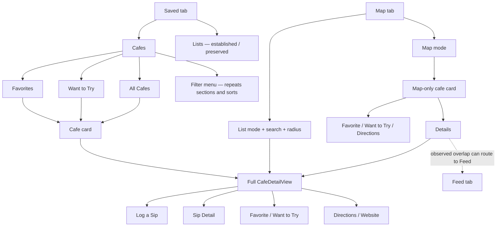
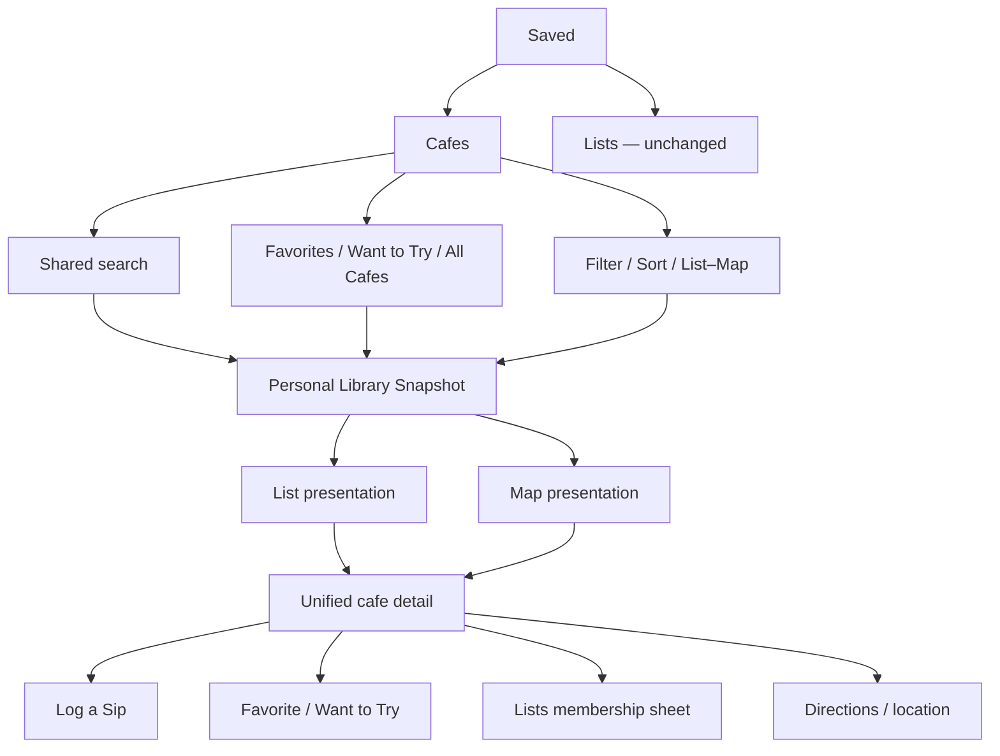

# Deep UX/UI Audit: Saved Cafes

**Audit date:** August 4, 2026

**Build and device:** current Debug source, iPhone 17 Pro Simulator, iOS 26.3

**Scope:** Saved cafes, Saved/Map relationship, cafe details, state changes, resilience, and accessibility

**Protected scope:** existing Lists creation, collaboration, editing, maps, ownership transfer, and deletion remain unchanged

## Executive summary

Saved has a warm, recognizable Mugshot surface and a solid personal-history core. The strongest moments are the branded empty states, photo-led cafe identity, direct transition into Sip Detail, and Map pin accessibility labels. The experience becomes unreliable when the same personal library crosses Saved and Map: search and List/Map switching live only in Map, Saved and Map use different detail surfaces, the Map cafe card can be obstructed by the persistent bottom navigation, and `All Cafes` is not backed by an authoritative personal-library definition.

The highest-risk problems are structural, not cosmetic:

1. The Map cafe card's lower actions can be covered and intercepted by the bottom navigation. In the observed run, tapping `Details` opened Feed instead of cafe details ([screens 30–31](#map-and-saved-to-map)).
2. Saved and Map expose two different implementations of the same personal-library task, with different search, filter, list, map, and detail behavior ([screens 03, 24–29](#map-and-saved-to-map)).
3. Save-state semantics are not trustworthy enough under edge conditions. A visited cafe can still be Want to Try; Favorite and Want to Try can coexist; rollback feedback is below the fold; and mutations are optimistic but not serialized ([screens 02, 11–13, 22–23](#saving-unsaving-and-lifecycle)).
4. Accessibility does not scale with the interface. Accessibility XXXL produced almost no typographic reflow, stateful actions did not expose selected values, several controls are under 44 points, and Increase Contrast produced little visible adaptation ([screens 36–38](#accessibility-assessment)).

No P0 blocker was found. There are five P1 issues that can cause a wrong destination, obscure the user's library model, or weaken trust in saved state. The recommended direction is one shared personal-library store and one unified cafe-detail component, introduced behind a feature flag. Lists should only gain a cafe-membership entry point that reuses the established list system.

## Method and evidence boundaries

The audit used a DEBUG-only `SavedAuditScenario` route with deterministic synthetic cafes and visits. The fixture does not authenticate, call Supabase, emit analytics, or contain personal account content. It covers photos and fallbacks, long and missing metadata, multiple saved-state combinations, visit history, loading, cached loading, offline cache, fatal error, detail error, and mutation rollback. Production UI and backend behavior were not changed.

Observed behavior is explicitly labeled **Observed**. Findings based on source inspection are labeled **Code inspection**. Simulator semantic snapshots were used to inspect labels, values, selected traits, and tappable targets. VoiceOver audio traversal, physical-device focus behavior, and Reduce Motion could not be fully exercised through the available Simulator control surface; those remain named device-verification requirements rather than claimed results.

The fixture deliberately includes:

- Favorite-only, Want-to-Try-only, Favorite + Want to Try, visited-unsaved, and visited + Want to Try cafes.
- Long names and addresses, no address, no location, missing category, valid local imagery, and failed imagery.
- Varied scores, visit counts, dates, privacy levels, and drink types.
- Signed-in and guest presentation.

### Named evidence limitations

- **Rapid-tap remote ordering:** the local rollback recording proves optimistic update and restoration, while source inspection proves the absence of per-cafe serialization. A remote out-of-order response was not generated because the harness is intentionally network-free; this requires a focused deterministic mutation-coordinator test before implementation acceptance.
- **Distinct stale state:** the current presentation has no freshness model or stale timestamp, so there is no separate stale UI to capture. [Screen 17](screenshots/17-offline-cached.png) is the observed cached/offline state and demonstrates the missing freshness information.
- **External Directions handoff:** the audit inspected enabled/disabled behavior and the nil-location no-op but did not leave the app or choose an external map provider. No navigation was started.
- **Signed-in Log a Sip completion:** the entry action and guest authentication handoff were inspected, but no sip was submitted because the audit must not perform destructive or remote mutations.
- **Live friend/community activity:** the privacy-safe fixture contains no remote account activity. Current labels, hierarchy, and error behavior were inspected locally; remote provenance and privacy enforcement remain contract/device verification items.
- **VoiceOver audio and Reduce Motion:** semantic targets, values, Dynamic Type, and Increase Contrast were inspected. Actual spoken order, focus restoration, and motion fallbacks require the named physical-device pass described below.

## 1. Current-state flow and screen inventory



### Screen/state inventory

| Surface | Health | What works | Friction | Direction | Evidence |
|---|---|---|---|---|---|
| Favorites | Needs attention | Clear segment, warm imagery, score and sip count are scannable. | No search, map toggle, or one-tap state action; long content creates tall cards. | Keep the familiar card language but add shared search/mode controls and compact action affordances. | [01](screenshots/01-favorites-default.jpg) |
| Want to Try | Needs attention | Intent is easy to reach as a top segment. | Visited cafes can remain Want to Try; zero-visit and unavailable-location states are visually similar to ordinary results. | Clarify lifecycle and show why an action is unavailable. | [02](screenshots/02-want-to-try.png) |
| All Cafes | Major friction | Three visible sort choices are understandable. | The source is not an authoritative personal-library union; sort controls consume vertical space and search is absent. | Define membership centrally and use one compact control row. | [03](screenshots/03-all-cafes-default-sort.png), [04](screenshots/04-all-cafes-by-name.png), [05](screenshots/05-all-cafes-by-date.png) |
| Filter menu | Major friction | Native menu behavior is familiar. | It duplicates the visible section tabs and All Cafes sort chips without adding filtering power. | Replace with meaningful filters; keep section switching visible. | [06](screenshots/06-redundant-filter-menu.png) |
| Saved cafe detail: top | Needs attention | Strong photo, cafe identity, branded score presentation, prominent Log a Sip. | Personal, community, and venue facts are not clearly separated; state actions are far below the fold. | Use a native detented sheet with identity, reliable metadata, primary action, then explicit state actions. | [07](screenshots/07-detail-top.png) |
| Saved cafe detail: history | Needs attention | `Your Mugshot` is a strong, differentiated idea; recent sips lead to Sip Detail. | Stats, evidence, recent history, and actions create a long scan; provenance of cafe/community signals is unclear. | Personal relationship first, then attributed community activity under progressive disclosure. | [08](screenshots/08-detail-personal-history.png), [09](screenshots/09-detail-recent-sip-transition.png) |
| Saved cafe detail: actions | Major friction | Favorite, Want to Try, Directions, and Website are explicit labels. | State actions appear late; Favorite/WTT selected state is not announced semantically; Lists and Share are absent. | Put stateful actions near identity; expose selected values; add Lists via existing membership flow. | [10](screenshots/10-detail-actions.png) |
| Empty | Healthy with copy caveat | Branded illustration and calm, specific message. | Empty can appear underneath loading or fatal error, making the state contradictory. | Preserve design; make loading/error/empty mutually exclusive. | [14](screenshots/14-empty-favorites.png), [15](screenshots/15-loading-without-cache.png), [19](screenshots/19-fatal-error.png) |
| Loading / cached / offline | Major friction | Cached cafes remain visible and Retry works. | Spinner + empty conflict; recovery card dominates cached content; freshness is never stated. | Treat cache as content with a compact freshness banner and truthful timestamp. | [15](screenshots/15-loading-without-cache.png), [16](screenshots/16-loading-with-cache.png), [17](screenshots/17-offline-cached.png), [18](screenshots/18-retry-success.png) |
| Fatal error | Major friction | Retry control is present. | Error and empty are stacked, implying both failure and a truly empty library. | Exclusive fatal state with Retry and cached fallback if available. | [19](screenshots/19-fatal-error.png) |
| Detail loading / unavailable | Major friction | Loading is visually indicated; unavailable replaces a failed aggregate. | Placeholder redaction is backed by fabricated values in code; detail error has no direct Retry. | Use structural skeletons only, with explicit retry and no fake values. | [20](screenshots/20-detail-loading-redaction.png), [21](screenshots/21-detail-error.png) |
| Map: personal library | Needs attention | Clear map/list switch, personal filters, accessible pin and cluster labels. | It recreates Saved categories and introduces a second personal-library entry point. | Make this the Map mode of the same Saved Cafes state. | [24](screenshots/24-map-personal-library.png) |
| Map: list/search | Needs attention | Search, radius, compact rows, and no-results state work. | These valuable controls are absent from Saved; terminology shifts to Discover/Visited. | Share the same query and presentation state with Saved. | [25](screenshots/25-map-list-mode.png), [26](screenshots/26-map-list-search-result.png), [27](screenshots/27-map-list-no-results.png) |
| Map list → detail | Healthy | A Map list row opens the full detail used by Saved. | This consistency does not extend to map pins. | Make the full unified detail the only detail implementation. | [28](screenshots/28-map-list-to-detail.png) |
| Map pin cafe card | Critical friction | Compact place context works well for map browsing. | Different hierarchy and labels; lower actions are obscured; `Details` was intercepted by bottom navigation and opened Feed. | Replace with the unified native detented detail and safe-area ownership. | [29](screenshots/29-map-cafe-card.png), [30](screenshots/30-map-cafe-card-actions.png), [31](screenshots/31-map-details-overlap-opens-feed.png) |
| Missing location / imagery | Major friction | A neutral visual fallback prevents a broken image. | Directions remains enabled with no coordinates and silently does nothing; generic image failure is indistinguishable from no image. | Disable actions with explanation; distinguish missing from failed/retryable imagery. | [32](screenshots/32-detail-missing-location.png), [33](screenshots/33-missing-location-directions-enabled.png), [39](screenshots/39-photo-failure-and-missing-metadata-card.png) |
| Guest | Needs attention | Read-only browsing is possible; Log a Sip correctly gates authentication. | Saved looks identical to a personal signed-in library, so ownership and persistence expectations are unclear. | Label local/sample/guest state before personal actions. | [34](screenshots/34-guest-saved-cafes.png), [35](screenshots/35-guest-log-a-sip-auth-gate.png) |
| Accessibility variants | Major friction | Baseline hierarchy remains legible and controls have text labels. | Accessibility XXXL barely changes layout; contrast mode barely changes the custom palette. | Adopt scalable text styles, reflow grids, contrast variants, 44-point targets, and reduced-motion fallbacks. | [36](screenshots/36-dynamic-type-accessibility-xxxl.png), [37](screenshots/37-detail-dynamic-type-accessibility-xxxl.png), [38](screenshots/38-increase-contrast.png) |

## 2. Screenshot-backed assessment

### Saved cafe collections

**Observed — strengths**

- Favorites communicates personal taste quickly through photos, scores, and sip counts ([01](screenshots/01-favorites-default.jpg)).
- Want to Try is a first-class intent rather than an obscure filter ([02](screenshots/02-want-to-try.png)).
- All Cafes makes its three current sort options visible and produces visibly different orderings ([03](screenshots/03-all-cafes-default-sort.png), [04](screenshots/04-all-cafes-by-name.png), [05](screenshots/05-all-cafes-by-date.png)).
- Long cafe names and addresses wrap rather than clipping in the baseline size ([01](screenshots/01-favorites-default.jpg)).

**Observed — friction**

- Search, distance, and Map/List controls are missing from Saved even though the Map tab already implements them ([03](screenshots/03-all-cafes-default-sort.png), [24](screenshots/24-map-personal-library.png), [25](screenshots/25-map-list-mode.png)).
- The filter menu repeats Favorites, Want to Try, All Cafes, By Sip History, By Name, and By Date rather than filtering by useful cafe properties ([06](screenshots/06-redundant-filter-menu.png)).
- Cards require opening full detail to change Favorite or Want to Try, making common state management multi-step ([01](screenshots/01-favorites-default.jpg), [10](screenshots/10-detail-actions.png)).
- Missing metadata collapses into generic cards with little explanation ([39](screenshots/39-photo-failure-and-missing-metadata-card.png)).

**Code inspection**

- Default score sorting also affects Favorites and Want to Try, but sort chips appear only for All Cafes. The hidden sort rule can change ordering without a visible explanation.
- `All Cafes` currently uses the cached cafe collection, which can include incidental discovery/search shells. It is not the union of personal visits and active saved states.

### Cafe detail and personal history

**Observed — strengths**

- The top combines a recognizable hero, cafe identity, Mugshot score language, and a highly visible Log a Sip button ([07](screenshots/07-detail-top.png)).
- `Your Mugshot` appropriately centers the user's own relationship rather than generic venue popularity ([08](screenshots/08-detail-personal-history.png)).
- Recent sips are actionable and transition into the existing Sip Detail experience ([09](screenshots/09-detail-recent-sip-transition.png)).
- Text labels accompany the action icons, which is better than relying on symbols alone ([10](screenshots/10-detail-actions.png)).

**Observed — friction**

- Favorite and Want to Try live below personal history, so changing the saved state requires a long scroll ([07](screenshots/07-detail-top.png), [08](screenshots/08-detail-personal-history.png), [10](screenshots/10-detail-actions.png)).
- Cafe average, personal averages, and activity evidence sit close together without consistently naming whether the source is the user, friends, or the Mugshot community ([07](screenshots/07-detail-top.png), [08](screenshots/08-detail-personal-history.png), [21](screenshots/21-detail-error.png)).
- Detail loading redacts stat values rather than presenting a semantic skeleton; error copy appears after the surrounding summary instead of offering a clear retry path ([20](screenshots/20-detail-loading-redaction.png), [21](screenshots/21-detail-error.png)).
- The full detail has no Lists action even though adding a cafe to a list is an established capability ([10](screenshots/10-detail-actions.png)).

**Code inspection**

- The loading placeholders are real strings (`4.5` and `2`) hidden by visual redaction. Visual users see a skeleton, but accessibility or transitional rendering can expose fabricated data.
- Remote detail enrichment failures are displayed but have no local Retry action.
- A remote hero can come from another user's activity without showing photo provenance.

### Saving, unsaving, and lifecycle

**Observed — strengths**

- Unfavoriting updates the detail immediately and removes the cafe from active Favorites ([11](screenshots/11-detail-favorite-removed.png), [12](screenshots/12-favorites-after-unsave.png)).
- The local state persists across relaunch in the test harness ([13](screenshots/13-favorite-removal-after-relaunch.png)).
- A failed save mutation restores the previous Favorite state ([rollback recording](screenshots/22-save-failure-rollback.mp4), [23](screenshots/23-save-failure-rollback.png)).

**Observed — friction**

- A cafe can be visited, Favorite, and Want to Try simultaneously ([02](screenshots/02-want-to-try.png)). This makes Want to Try ambiguous: first visit intent, return intent, or generic bookmark.
- Failure feedback appears below the fold, separated from the action that failed ([23](screenshots/23-save-failure-rollback.png)).
- There is no visible in-progress state or undo affordance close to the state control ([11](screenshots/11-detail-favorite-removed.png), [23](screenshots/23-save-failure-rollback.png)).

**Code inspection**

- Favorite and Want to Try are independent booleans with optimistic local updates and rollback, but mutations are not serialized per cafe. Rapid taps can create out-of-order remote writes.
- Analytics is initiated before persistence succeeds, which can overcount unsuccessful state changes.
- Visit reconciliation can clear Want to Try later, while the detail UI still lets a visited user re-enable it. That produces cross-session contradictions.

### Loading, offline, error, stale, and guest states

**Observed — strengths**

- Cached content remains usable while refresh is in progress ([16](screenshots/16-loading-with-cache.png)).
- Offline copy explains that device data is being shown, and Retry recovers cleanly in the deterministic route ([17](screenshots/17-offline-cached.png), [18](screenshots/18-retry-success.png)).
- The guest auth gate appears only when a protected action is attempted ([35](screenshots/35-guest-log-a-sip-auth-gate.png)).

**Observed — friction**

- Loading without cache displays both a spinner and a true-empty illustration ([15](screenshots/15-loading-without-cache.png)).
- Fatal error displays both recovery and true-empty states ([19](screenshots/19-fatal-error.png)).
- Offline content has no `Updated…` timestamp and no per-field freshness, so users cannot judge whether saved state is current ([17](screenshots/17-offline-cached.png)).
- Guest Saved looks like an owned personal library before the authentication gate ([34](screenshots/34-guest-saved-cafes.png), [35](screenshots/35-guest-log-a-sip-auth-gate.png)).
- A photo fetch failure and a genuinely absent photo resolve to the same generic fallback ([39](screenshots/39-photo-failure-and-missing-metadata-card.png)).

### Map and Saved-to-Map

**Observed — strengths**

- Map supports Favorite, Want to Try, Visited, and All filters with an explicit Map/List switch ([24](screenshots/24-map-personal-library.png)).
- List mode offers search, radius, compact rows, and a clear no-results state ([25](screenshots/25-map-list-mode.png), [26](screenshots/26-map-list-search-result.png), [27](screenshots/27-map-list-no-results.png)).
- A Map list row opens the same full cafe detail used by Saved ([28](screenshots/28-map-list-to-detail.png)).
- Map pins and clusters expose useful semantic summaries, including cafe count, score, and Favorite status.

**Observed — friction**

- Map pin selection opens a different custom cafe card with different hierarchy and labels from the full detail ([29](screenshots/29-map-cafe-card.png)).
- Scrolling the map card leaves lower actions underneath the persistent bottom navigation ([30](screenshots/30-map-cafe-card-actions.png)).
- Tapping the semantic `Details` target in that overlapped region opened Feed in the observed run, demonstrating real event interception rather than a visual-only overlap ([31](screenshots/31-map-details-overlap-opens-feed.png)).
- Saved has no direct Map toggle, so a user must change tabs and reconstruct filters to map the same library ([03](screenshots/03-all-cafes-default-sort.png), [24](screenshots/24-map-personal-library.png)).

**Code inspection**

- Saved and Map maintain separate filtering, query, presentation, and detail code. The duplication explains the visible divergence and raises regression risk.

## 3. Prioritized issue register

Severity definitions: **P0** blocks a core task or causes unrecoverable loss; **P1** causes a major task or trust failure; **P2** is recurring friction; **P3** is polish. No P0 was observed.

| ID | Severity | Evidence | Affected users and impact | Accessibility impact | Architectural cause | Recommended response |
|---|---|---|---|---|---|---|
| S-01 | P1 | [30](screenshots/30-map-cafe-card-actions.png), [31](screenshots/31-map-details-overlap-opens-feed.png) | Map users can trigger Feed when intending to open cafe details. | Switch/Voice Control users are especially exposed because the semantic target exists where a different control intercepts it. | Custom sheet and app bottom navigation compete for the same safe-area layer. | Use one native detented detail surface with explicit safe-area ownership; add a regression test for every lower action. |
| S-02 | P1 | [03](screenshots/03-all-cafes-default-sort.png), [24–29](screenshots/24-map-personal-library.png) | Everyone must learn two library models and reconstruct search/filter state across tabs. | Duplicate hierarchies increase traversal and cognitive load. | Separate Saved and Map query/presentation implementations. | Introduce a shared personal-library snapshot and navigation state; make Map a mode of Saved Cafes. |
| S-03 | P1 | **Code inspection**, contextual [03](screenshots/03-all-cafes-default-sort.png) | `All Cafes` can include incidental cache entries or omit a trustworthy personal-membership explanation. | VoiceOver cannot compensate for incorrect membership semantics. | UI reads the general cafe cache rather than a personal-library projection. | Define All Cafes as visited ∪ Favorite ∪ Want to Try, excluding incidental discovery data. |
| S-04 | P1 | [02](screenshots/02-want-to-try.png), [22–23](screenshots/22-save-failure-rollback.mp4), **Code inspection** | Saved state can contradict visit history; rapid taps risk out-of-order persistence; failure is easy to miss. | Stateful controls do not announce selected/in-progress/error values. | Independent booleans, deferred lifecycle reconciliation, nonserialized optimistic mutations. | Decide lifecycle semantics; serialize per-cafe mutations; co-locate progress, success, failure, and Undo feedback. |
| S-05 | P1 | [36](screenshots/36-dynamic-type-accessibility-xxxl.png), [37](screenshots/37-detail-dynamic-type-accessibility-xxxl.png), semantic snapshots | Large-text users receive nearly baseline-sized typography and fixed grids. | Direct barrier for low-vision users. | Fixed font sizes, fixed hero height, two-column stat/action grids, line limits. | Adopt scalable text styles and layout breakpoints; verify through accessibility XXXL. |
| S-06 | P2 | [10](screenshots/10-detail-actions.png), semantic snapshot | Favorite/WTT state is visually indicated but not exposed as selected. | VoiceOver users cannot reliably determine current state. | Buttons provide labels but not selected traits/values. | Expose `Selected` trait or value (`On`/`Off`), plus syncing/error state and focus restoration. |
| S-07 | P2 | [15](screenshots/15-loading-without-cache.png), [19](screenshots/19-fatal-error.png) | Users see contradictory empty and loading/error messages. | Multiple competing announcements obscure the actionable state. | Independent status and empty-state rendering conditions. | Make content-state rendering mutually exclusive. |
| S-08 | P2 | [32](screenshots/32-detail-missing-location.png), [33](screenshots/33-missing-location-directions-enabled.png) | Directions appears available but silently does nothing. | VoiceOver announces an enabled action with no result. | View renders Directions unconditionally; action guards and returns on nil coordinates. | Disable with reason or omit; offer Copy address/Open website when genuinely available. |
| S-09 | P2 | [07–10](screenshots/07-detail-top.png) | Common saved-state actions are below the fold; list membership is absent. | More traversal; missing action parity. | Detail hierarchy prioritizes long history before state management. | Put Favorite/WTT/Lists/Directions near identity; keep Log a Sip primary. |
| S-10 | P2 | [06](screenshots/06-redundant-filter-menu.png), [25–27](screenshots/25-map-list-mode.png) | Saved browsing is slower and the filter menu adds no capability. | Redundant controls increase rotor/traversal noise. | Separate section, sort, and Map filter control models. | One search field; visible section selector; meaningful filters; compact sort menu; persistent Map/List mode. |
| S-11 | P2 | [17](screenshots/17-offline-cached.png), [20–21](screenshots/20-detail-loading-redaction.png) | Users cannot assess freshness; loading can imply fake facts. | Redaction may expose meaningless values; no freshness announcement. | No freshness metadata in presentation; hard-coded loading values. | Add fetch timestamps/source metadata; use structural skeletons and honest unavailable states. |
| S-12 | P2 | [07–08](screenshots/07-detail-top.png), [21](screenshots/21-detail-error.png), **Code inspection** | Personal, friend, and community signals can be mistaken for objective venue facts. | Ambiguous labels are harder without visual grouping. | Summary model combines sources without required provenance. | Group `Your Mugshot`, `From friends`, and `Mugshot community`; label evidence counts and privacy. |
| S-13 | P3 | [01](screenshots/01-favorites-default.jpg), [39](screenshots/39-photo-failure-and-missing-metadata-card.png) | Dense cards slow scanning; failed and absent media look identical. | Long combined card labels omit address and state. | One tall card template and generic fallback. | Add compact/comfortable density, status-aware image fallback, and complete card semantics. |
| S-14 | P3 | [38](screenshots/38-increase-contrast.png), color-token inspection | Low-contrast secondary text remains hard to read. | Several calculated small-text combinations are roughly 3.15–3.57:1, below Apple's 4.5:1 guidance for small regular text. | Custom palette lacks meaningful increased-contrast variants. | Supply semantic color variants and validate both appearances with Increase Contrast. |
| S-15 | P3 | [01](screenshots/01-favorites-default.jpg), [06](screenshots/06-redundant-filter-menu.png), code inspection | Small controls and unmodified motion add avoidable friction. | Filter control is about 36×36 and chips about 34 points high; transitions do not query Reduce Motion. | Fixed control frames and unconditional animations. | Minimum 44×44 hit regions; fade/no-motion alternatives when Reduce Motion is on. |

## 4. Competitive research

Mobbin was reviewed for task patterns, not visual copying. Each recommendation below is labeled **Adapt**, **Avoid**, and **Mugshot translation**.

### Apple Maps

Evidence: [adding a place to a Guide](https://mobbin.com/flows/b7c771fc-8747-4a1a-a33f-8e3e18abf4be), [saving a Guide](https://mobbin.com/flows/e712bc4f-8cba-4d49-97f8-3f0e84d11349), [Your Guides](https://mobbin.com/flows/bea2a926-0043-4077-ad33-bbc247f3873d), [place detail 1](https://mobbin.com/screens/2f39ae08-57fc-4f4b-8be2-1e58f2d6e73c), [place detail 2](https://mobbin.com/screens/cc13099d-e1c2-43f0-a565-0e93c51c0c82).

- **Adapt:** native detented place sheets, stable identity/metadata at the top, a small set of primary actions, and explicit add-to-guide selection.
- **Avoid:** turning Lists into a Maps-style guide hierarchy or adopting Apple Maps' neutral visual identity wholesale.
- **Mugshot translation:** retain cream, sage, coffee imagery, and `Your Mugshot`; use native presentation behavior and action ordering around Mugshot content.

### Google Maps

Evidence: [save to list](https://mobbin.com/flows/fcd1f02e-80a9-421a-8078-996a8eb13b7c), [You / Saved](https://mobbin.com/flows/9584b830-63de-42d6-9d1d-8ef13f69277b), [saved maps](https://mobbin.com/flows/64427f06-f220-443a-9a89-78270eb39da3).

- **Adapt:** explicit save destinations, immediate confirmation with a `Change` recovery path, optional notes, and grouping that explains why a place appears.
- **Avoid:** proliferation of overlapping lists, dense community layers, and burying personal history beneath global venue content.
- **Mugshot translation:** after Favorite/WTT/List changes, use a compact Mugshot-colored confirmation with Undo/Change; keep Lists' current structure.

### Beli

Evidence: [Want to Try](https://mobbin.com/flows/4b9692ce-bbf8-4d83-977c-0427540a8b62), [search and filtering](https://mobbin.com/flows/4122b78f-1550-4ec0-bf56-96b046cb9813).

- **Adapt:** compact task-focused rows, clear Been/Want-to-Try semantics, filter chips, distance-aware sorting, and a persistent Map toggle.
- **Avoid:** rankings, leaderboards, reservation/import clutter, or forcing cafes into restaurant-scoring conventions.
- **Mugshot translation:** use Mugshot sip history and personal recommendations in place of ranking; preserve softer editorial cards where imagery is valuable.

### Airbnb

Evidence: [save to wishlist](https://mobbin.com/flows/afa1cff0-f3aa-4a48-8462-0001cde57e15), [wishlist browsing](https://mobbin.com/flows/d740a5c9-4649-4a83-a1e7-a2434b53a934).

- **Adapt:** one-tap heart, immediate confirmation, and `Change`/Undo recovery without leaving the browse context.
- **Avoid:** commerce-first urgency, reservation CTAs, and image-led layouts that hide practical location facts.
- **Mugshot translation:** one-tap Favorite on cards with clear selected state; never displace Log a Sip or honest cafe metadata.

### Swarm

Evidence: [place detail](https://mobbin.com/screens/2c5d648b-b8bd-44dd-9f85-7ac71efa2d7b).

- **Adapt:** personal visit count, recency, history, and a concise sense of relationship with a place.
- **Avoid:** mayorship, competitive gamification, and social counts without decision value.
- **Mugshot translation:** `Your Mugshot` remains the narrative anchor: personal score, recommendation, last visit, favorite drinks, and recent sips.

### Yelp

Evidence: [collection detail](https://mobbin.com/flows/fbb3089c-6ab1-49c8-b08e-ab99686ce918), [collections](https://mobbin.com/flows/d9d9115a-63f7-40f6-bd73-c4e9373e91ed).

- **Adapt:** clear collection membership and map/list coordination.
- **Avoid:** dense review chrome, objective-looking global venue score, follower counts, and excessive secondary actions.
- **Mugshot translation:** Cafe Pulse may summarize Mugshot evidence only when its source and sample size are named; it must not impersonate an objective Yelp rating.

### Instagram and Strava principles

- **Adapt:** Instagram-like progressive disclosure for secondary activity and Strava-like personal progress/history.
- **Avoid:** social engagement counters, competitive mechanics, or feed-first framing inside cafe details.
- **Mugshot translation:** show the user's relationship first, friends/community second, and defer lower-value details without hiding core cafe facts.

### Official Apple guidance cross-check

- Apple's [Accessibility HIG](https://developer.apple.com/design/human-interface-guidelines/accessibility/) recommends support for larger text, sufficient control sizes, VoiceOver descriptions, Reduce Motion adaptation, and WCAG AA guidance of 4.5:1 for small regular text.
- Apple's [Color HIG](https://developer.apple.com/design/human-interface-guidelines/color) recommends custom colors work in light, dark, and increased-contrast contexts and that meaning not rely on color alone.
- Apple's [`UIFontMetrics` documentation](https://developer.apple.com/documentation/uikit/uifontmetrics) describes scaling custom fonts with Dynamic Type. SwiftUI equivalents should use semantic text styles and `@ScaledMetric` where fixed geometry must scale.

## 5. Proposed Saved information architecture and interaction model

### Target IA



### Membership definition

`All Cafes` is the authoritative union of:

1. Cafes with at least one personal completed visit.
2. Cafes currently marked Favorite.
3. Cafes currently marked Want to Try.

It excludes cafes that exist only because they were returned by Map search, a picker, list editing, or discovery enrichment. A cafe may have multiple membership reasons, but it appears once. The presentation item must retain those reasons so the UI and accessibility label can explain `Visited`, `Favorite`, and `Want to Try` accurately.

### Shared browse state

- **Section:** Favorites, Want to Try, All Cafes.
- **Search:** one query across normalized cafe name, neighborhood, address, and optionally favorite drink text.
- **Filters:** Visited / Not yet visited, Has notes, Has photo, Rating range, Open now only when hours are trustworthy, Distance only with current location.
- **Sort:** Recommended default per section, Name, Last sip, Recently saved, Distance when available. Always display the active sort.
- **Mode:** List / Map persists while the user remains in Saved and carries query, section, filters, sort, and selected cafe.
- **Navigation:** returning from detail restores scroll position, map region, selected section, and VoiceOver focus to the originating card/pin.

### Cafe rows and cards

Provide two user-selectable or context-driven densities without changing the brand:

- **Comfortable card:** photo, name, neighborhood/address, personal score or `Not rated`, visit count/last visit, membership badges, one-tap Favorite.
- **Compact row:** thumbnail/fallback, name, neighborhood/distance, one concise personal signal, membership icons, overflow actions.

Every card/row opens detail as a whole. Favorite may be one tap. Want to Try belongs in a contextual menu unless product research shows equal frequency; two adjacent icon-only state buttons add ambiguity. A successful state change gives an anchored confirmation with Undo. The accessibility element either exposes subcontrols separately or provides named custom actions; it must not hide address and saved-state context in one overly terse combined label.

### Favorite and Want-to-Try semantics

**Recommended model**

- **Favorite** means a durable, positive personal preference. Visiting does not clear it.
- **Want to Try** means intent before the first completed sip. After the first successful sip, clear it and show `Removed from Want to Try · Undo`.
- A user can Favorite before visiting, so Favorite + Want to Try is temporarily valid. A visited + Want to Try legacy combination is not.

**Compatibility and migration**

- Retain the existing two booleans while the direction is reviewed; no schema change is required to prototype the UX.
- Before automatic lifecycle changes ship, measure legacy visited + Want to Try combinations with privacy-safe aggregate counts.
- Migration option A, recommended: clear legacy Want to Try where a completed personal visit exists and provide a one-time reversible explanation. Cross-device truth requires a backend migration or idempotent reconciliation, not client-only display normalization.
- Migration option B: redefine the state as `Want to Revisit` after a first visit. This avoids clearing data but materially changes the user's mental model and eventually needs a richer enum than one boolean.
- Until the decision is approved, do not silently change either boolean in production.

## 6. Cafe-detail redesign

### One surface, three native presentations

Use one semantic component for Saved cards, Map pins, and Map rows:

| Presentation | Purpose | Required content |
|---|---|---|
| Compact | Fast map confirmation | Photo/fallback, name, neighborhood or address, open/availability only if trustworthy, personal membership state, Log a Sip, expand affordance. |
| Medium | Decision and action | Compact content plus personal score/visit signal, Favorite/WTT/Lists/Directions, freshness/offline label, limited `Your Mugshot` preview. |
| Expanded | Full relationship and history | Full metadata, `Your Mugshot`, recent sips, friend/community activity with provenance, Cafe Pulse evidence, website/share, errors and retry. |

The component should use native sheet detents, safe-area behavior, drag indicator, keyboard avoidance, and focus restoration. A Map selection updates the same sheet rather than layering a second custom card above the app tab bar.

### Expanded information hierarchy

1. **Cafe identity** — photo or honest fallback, normalized name, neighborhood/address, category, open/availability only from a trustworthy source, distance only with permission and a valid location.
2. **Primary action** — `Log a Sip`, full-width and Mugshot-branded.
3. **Stateful action row** — Favorite, Want to Try, Lists, Directions. Each shows selected/disabled/syncing state in text, shape, and VoiceOver value, not color alone.
4. **Your Mugshot** — personal recommendation, personal average, visit count, last visit, favorite drinks, private notes if applicable.
5. **Recent sips** — newest personal entries first, privacy badges where helpful, `See all` after a short preview.
6. **From friends / Mugshot community** — separate sections, attributed authors where privacy permits, evidence counts, no ambiguous global claims.
7. **Cafe Pulse** — a descriptive summary of Mugshot activity only when sample size and recency support it; label its source and confidence.
8. **More** — website, Share, report data issue, copy address. Do not let these compete with the core actions.

### Brand and visual structure

- Keep Mugshot cream surfaces, sage action color, rounded continuous corners, coffee photography, and the existing warm editorial voice.
- Reduce the number of nested cards. Use spacing, typography, and section dividers for hierarchy; reserve tinted cards for a meaningful personal insight or status.
- Preserve the expressive hero in expanded detail, but let it shorten or disappear in compact/large-text modes. Do not fix it at 250 points.
- Use SF Symbols consistently and pair state with text. Avoid importing Apple Maps' monochrome neutrality, Beli's ranking density, or Yelp's review chrome.
- Prefer semantic type roles over bespoke fixed sizes. `Your Mugshot` can remain typographically distinctive if the custom font scales with its text style.

### Action behavior

| Action | Default | Selected / active | Unavailable | Failure |
|---|---|---|---|---|
| Log a Sip | Primary filled button | Opens existing logging flow | Guest: opens auth gate with context preserved | Preserve draft and explain retry. |
| Favorite | Explicit toggle | Filled/selected, VoiceOver `Favorite, selected` | Guest: auth gate; do not appear to persist | Roll back only after serialized request fails; announce failure; offer Retry. |
| Want to Try | Explicit toggle | Selected before first visit | After first visit: lifecycle explanation or approved revisit semantics | Same co-located rollback behavior as Favorite. |
| Lists | `Add to Lists` or count | `In 2 lists` | Guest/auth or permission reason | Keep sheet open, preserve staged selections, retry failed batch. |
| Directions | `Directions` | Opens chooser or preferred map app | Disabled with `Location unavailable`; website/copy address remain separate | Explain handoff failure, never silently no-op. |
| Website | Secondary disclosure | Opens verified URL | Hidden/disabled with reason | Show invalid/unavailable message. |
| Share | Secondary disclosure | Native share sheet | Hidden only when there is no stable share target | Preserve sheet state after cancellation. |

### List membership

The detail surface should open an existing-style membership sheet; it should not redesign Lists. The sheet needs:

- Existing lists with selected states, ownership/collaboration labels, and current permissions.
- Multi-select staging and one `Done` commit so users do not wait after every row.
- A batch membership projection in the detail snapshot. Do not fetch membership once per list.
- Partial-failure handling that identifies which memberships succeeded, preserves failed selections, and offers Retry.
- No collaborator identities or private list names in analytics.

### Detail state matrix

| State | Compact | Medium / expanded | Actions | Accessibility |
|---|---|---|---|---|
| Fresh | Current identity and personal state | Full content | Enabled according to capability | Normal values and selected traits. |
| Loading, no cache | Structural skeleton, no fake numbers | Identity skeleton then section skeletons | Disable data-dependent actions; allow dismiss | Announce `Loading cafe details` once; avoid focus churn. |
| Loading with cache | Show cached content | Compact `Updating…` status | Safe local actions remain available and queued/serialized | Announce cached status without repeating during scroll. |
| Offline cached | Show cached content | `Offline · Updated [time]` with details | Local intent may queue only if product supports it; otherwise explain | Status is reachable but not prepended to every element. |
| Stale | Show content | `Updated [time] · Refresh` | Actions use explicit conflict policy | VoiceOver value includes stale only where relevant. |
| Unavailable metadata | Show known identity | Label each missing field; do not invent it | Disable only dependent actions | `Directions, dimmed, location unavailable`. |
| Photo loading | Stable aspect ratio | Neutral branded placeholder | No impact on other actions | Image hidden from VoiceOver until meaningful alt text exists. |
| Photo failure | Branded fallback + Retry if useful | Keep identity stable | Retry image independently | Do not announce decorative failure repeatedly. |
| Detail fetch error | Cached content if present | Inline section-specific Retry | Unaffected actions remain active | Focus remains on triggering control or moves to concise error. |
| Cafe removed/closed | Identity retained | `Unavailable` reason and last-known metadata | Log/save/list policy explicit; Directions only if still valid | Status announced before actions. |
| Save syncing | Optimistic state + progress | Anchored status near action | Serialize more taps; coalesce to final intent | Announce `Saving` then success/failure once. |
| Save failure | Restore known remote state | Error + Retry/Undo context | Other actions remain available | Restore focus to action and announce result. |

### Proposed implementation interfaces — specification only

```swift
struct PersonalLibrarySnapshot: Sendable {
    let generatedAt: Date
    let freshness: Freshness
    let itemsByCafeID: [Cafe.ID: CafeLibraryPresentationItem]
    let membership: Set<Cafe.ID>
}

struct CafeLibraryPresentationItem: Identifiable, Sendable {
    let identity: CafeIdentity
    let personal: PersonalCafeState
    let membershipReasons: Set<LibraryMembershipReason>
    let locationCapability: LocationActionCapability
    let media: CafeMediaState
    let freshness: Freshness
}

enum CafeDetailPresentationState: Sendable {
    case loading(identity: CafeIdentity?)
    case content(CafeDetailSnapshot, freshness: Freshness)
    case unavailable(CafeIdentity, reason: UnavailabilityReason)
    case failed(identity: CafeIdentity?, error: PresentableError, retryable: Bool)
}

actor CafeSaveMutationCoordinator {
    // One serialized stream per cafe; coalesces rapid taps to final intent.
    func setState(_ intent: PersonalCafeStateIntent, for cafeID: Cafe.ID) async throws
}

struct CafeDetailSnapshot: Sendable {
    let identity: CafeIdentity
    let personal: PersonalCafeSummary
    let friends: AttributedActivitySummary?
    let community: AttributedActivitySummary?
    let listMemberships: [ListMembershipSummary] // batch projection
    let capabilities: CafeActionCapabilities
    let freshness: Freshness
}
```

The store owns membership, search/filter/sort, freshness, and mutation reconciliation. Views consume immutable presentation items. Saved and Map must not independently infer personal state from general cafe cache entries.

## 7. Edge cases, privacy, and accessibility

### Edge cases

- Same cafe returned under different provider identifiers, normalized names, or addresses.
- Cafe moves, closes, is renamed, or loses coordinates after being saved.
- Favorite/WTT state changes on another device while this device is offline.
- First sip completes while a Want-to-Try clear is still syncing.
- Rapid alternating Favorite/WTT taps; app termination during a mutation; retry after auth expiry.
- Cafe is removed from the active filtered section after unsave; Undo must restore it and scroll/focus must remain understandable.
- Search query matches only an old address or favorite drink.
- Location denied, approximate, stale, or unavailable; distance sort must disappear or explain itself.
- Empty results caused by search/filter versus truly empty personal library.
- Zero visits, private-only visits, deleted visits, or personal summary unavailable while cafe identity is cached.
- Lists with read-only collaborator permission, deleted lists, and partial batch membership failure.
- Image absent, corrupt, remote failure, sensitive user photo, or photo deleted while cached.
- Very long localized cafe names, right-to-left layout, non-Latin addresses, and 24-hour versus 12-hour time.

### Privacy requirements

- Personal visits, scores, recommendations, notes, and favorite drinks are private by default unless their source visibility explicitly permits sharing.
- `Your Mugshot`, `From friends`, and `Mugshot community` must be separate data domains in both UI and analytics.
- Do not use a private or friends-only sip photo as a generic cafe hero for another user.
- Community activity must show provenance and respect deleted/block/mute state. Suppress a section rather than backfilling with unattributed content.
- Cache freshness metadata, not sensitive narrative content, in logs. Never log cafe list names, collaborator identities, notes, raw search text, or precise location.
- Rollout analytics should use event categories and coarse counts; do not capture screenshot content or exact coordinates.
- Guest content must be labeled as local/sample and must not imply cloud persistence.

### Accessibility assessment and requirements

**Measured in Simulator**

- Accessibility XXXL produced minimal font scaling and little layout reflow in Saved and detail ([36](screenshots/36-dynamic-type-accessibility-xxxl.png), [37](screenshots/37-detail-dynamic-type-accessibility-xxxl.png)).
- Increase Contrast produced little visible differentiation in the custom palette ([38](screenshots/38-increase-contrast.png)).
- Semantic snapshots exposed `Favorite` and `Want to Try` as buttons without selected values/traits in detail ([10](screenshots/10-detail-actions.png)).
- The no-location detail still exposed Directions as an enabled, tappable target ([32–33](screenshots/33-missing-location-directions-enabled.png)).
- Saved card labels included name, sip average, and sip count but omitted address and saved-state reasons ([01](screenshots/01-favorites-default.jpg)).
- Map pins and clusters had strong aggregate labels, including score and Favorite context ([24](screenshots/24-map-personal-library.png)).

**Required changes**

- Use semantic text styles or scaled custom fonts through accessibility XXXL; remove fixed line limits where they truncate essential information.
- Change two-column stat/action grids to one column at accessibility sizes. Let the hero shrink or disappear rather than force content below the fold.
- Give every control at least a 44×44-point hit region. Visual chips may remain compact inside a larger content shape.
- Favorite/WTT/List membership expose selected state, syncing, success, and failure. Provide VoiceOver custom actions only when they reduce traversal without hiding visible controls.
- After unsaving removes a row, restore focus to the next row or section heading; Undo returns focus to the restored row.
- Sheet detent changes and retries must not reset focus to the top. Errors should announce once, then remain discoverable.
- Meet at least 4.5:1 for regular small text and 3:1 for large/bold text; provide meaningful custom Increase Contrast variants.
- Respect Reduce Motion: replace large position/depth changes with short fades or no animation, tighten springs, and avoid automatically expanding sheets.
- Do not rely on red/green or filled/unfilled color alone; include text, symbol, and selected trait.
- Test VoiceOver order, Switch Control, Voice Control names, Full Keyboard Access where applicable, Bold Text, Button Shapes, Reduce Transparency, and both appearances.

**Named verification limitation**

The available Simulator controls exposed semantic UI snapshots, Dynamic Type, and Increase Contrast but not a reliable end-to-end VoiceOver audio session or Reduce Motion inspection. Actual swipe traversal, spoken announcements, focus restoration, and motion comfort remain required on a physical device or an interactive accessibility test session before release.

## 8. Quick wins versus structural improvements

### Quick wins — Phase 1 candidates

- Make loading, empty, and fatal error mutually exclusive ([15](screenshots/15-loading-without-cache.png), [19](screenshots/19-fatal-error.png)).
- Disable Directions when coordinates are unavailable and explain why ([32–33](screenshots/33-missing-location-directions-enabled.png)).
- Add Favorite/WTT selected values and traits; increase filter and chip hit regions to 44 points.
- Replace fake redacted detail values with structural skeletons ([20](screenshots/20-detail-loading-redaction.png)).
- Move Favorite/WTT nearer the detail top; add clear syncing/failure/Undo feedback near the action.
- Add `Updated [time]` to cached/offline data and reduce the recovery card's height ([17](screenshots/17-offline-cached.png)).
- Rename or remove the redundant filter menu until it contains meaningful filters ([06](screenshots/06-redundant-filter-menu.png)).
- Give missing-photo and failed-photo states distinct, branded handling ([39](screenshots/39-photo-failure-and-missing-metadata-card.png)).
- Add increased-contrast token variants and scaled typography for the highest-use Saved surfaces.

### Structural improvements

- Authoritative personal-library membership and freshness model.
- One shared search/filter/sort/List/Map state.
- Per-cafe serialized save mutation coordinator with conflict policy.
- Unified native cafe-detail presentation for Saved and Map.
- Batch list-membership projection and staged membership sheet.
- Explicit personal/friend/community provenance and privacy-aware media selection.
- Feature-flagged migration for approved Want-to-Try lifecycle semantics.

## 9. Implementation acceptance criteria

### Personal library and navigation

- `All Cafes` contains each cafe with a personal visit, Favorite, or Want-to-Try state exactly once and excludes incidental discovery-only cache entries.
- Favorites, Want to Try, All Cafes, search, filters, sort, and List/Map mode operate on one snapshot and produce the same cafe set in both modes.
- The active query, filters, sort, selected section, scroll/map position, and selected cafe survive detail presentation and dismissal.
- Saved and Map open the same cafe-detail component and expose the same data semantics.
- No cafe-detail action is visually or interactively covered by the bottom tab bar, home indicator, keyboard, or sheet chrome.

### Cards and search

- Cards/rows show name, usable location context, one personal signal, and all active membership reasons without clipping at accessibility XXXL.
- One-tap Favorite changes state immediately, announces progress/result, and offers Undo without forcing detail navigation.
- Search distinguishes true-empty from no-results and matches normalized name, neighborhood, and address.
- Active sort is always visible; unavailable sorts such as Distance explain or remove themselves.

### Saving and lifecycle

- Mutations for one cafe are serialized or safely coalesced to the user's final intent; rapid taps cannot produce an older remote state.
- A failed mutation restores the last confirmed state, displays retry near the control, and does not emit a success analytic.
- Removing a cafe from the active section provides Undo and predictable visual and VoiceOver focus.
- Favorite/WTT lifecycle behavior matches the approved product decision on every client and after relaunch.
- Guest actions never imply persistence before authentication and resume context after successful sign-in.

### Detail

- Compact, medium, and expanded detents use one snapshot and maintain identity/action state while changing detents.
- Log a Sip is the primary action; Favorite, Want to Try, Lists, and Directions are explicit stateful actions; website/share are secondary.
- Directions is enabled only with a valid destination and never silently no-ops.
- `Your Mugshot` precedes separately attributed friend and community activity.
- No score, count, opening status, distance, or photo provenance is fabricated during loading or failure.
- Lists shows current membership from a batch projection, commits staged changes safely, and handles partial failure.

### Resilience and privacy

- Loading without cache, cached refresh, offline cache, stale cache, fatal error, section error, photo failure, unavailable cafe, retry success, and auth expiry each have deterministic coverage.
- Cached/stale content exposes a human-readable freshness timestamp and source; Retry updates it without discarding usable content.
- Private/friends-only content is never exposed as community content or an unattributed hero.
- Analytics excludes precise location, notes, raw query text, list names, collaborators, and private activity content.

### Accessibility

- Text scales and reflows through accessibility XXXL without essential clipping or horizontal scrolling.
- All tappable controls have at least 44×44-point hit regions.
- Favorite, Want to Try, Lists, and capability actions expose correct labels, selected/disabled values, hints only where useful, and progress/error announcements.
- VoiceOver focus returns to the originating card/pin after dismissal and to a logical neighbor after removal.
- Text/icon contrast meets Apple's published guidance in light, dark, and Increase Contrast modes.
- Reduce Motion replaces nonessential scale, depth, and large positional transitions with fades or no motion.

### Protected Lists scope

- List creation, collaboration, existing list maps, editing, ownership transfer, and deletion produce no visual or behavioral regressions.
- Only the cafe membership entry point and its batch data contract may change within this initiative.

## 10. Phased implementation and regression plan

### Phase 1 — low-risk clarity

Scope: truthful copy, mutually exclusive states, target sizes, selected semantics, disabled-action explanations, loading/error treatment, card density, contrast variants, and scalable text in Saved.

Regression containment:

- No backend or schema changes.
- Focused snapshot/semantic tests for Saved sections, loading/error exclusivity, unavailable Directions, and Favorite/WTT values.
- Compile check plus one consolidated Simulator pass at baseline and accessibility XXXL.

### Phase 2 — shared personal-library data model

Scope: authoritative membership, presentation items, personal aggregates, search/filter/sort, freshness, and per-cafe mutation serialization.

Regression containment:

- Introduce the store behind adapters so current Saved and Map can read the same snapshot before their UI merges.
- Pure tests for membership union/deduplication, search normalization, all sort orders, freshness, rapid-tap coalescing, rollback, relaunch, and guest transitions.
- No lifecycle migration for Want to Try until approved.

### Phase 3 — unified cafe-detail component

Scope: compact/medium/expanded native presentation, action hierarchy, complete state matrix, personal/friend/community provenance, and shared Saved/Map behavior.

Regression containment:

- Build the new component behind a feature flag while retaining the old detail as fallback.
- Contract tests for presentation-state mapping; focused UI tests for every detent, navigation origin, capability, and error path.
- Explicit safe-area regression test reproducing screens 30–31.

### Phase 4 — structural IA and list membership

Scope: Saved List/Map model, discovery boundary, shared navigation state, meaningful filters, and batch list-membership contract.

Regression containment:

- Keep Lists implementation intact and call it through a narrow membership adapter.
- Test permissions, selection staging, partial failure, deleted lists, and return-state preservation.
- Compare Map and List result IDs for every section/filter combination.

### Phase 5 — guarded rollout

Scope: feature flag, staged audience, privacy-safe analytics, accessibility regression matrix, approved Want-to-Try migration if selected, and consolidated acceptance.

Regression containment:

- Log only coarse success/failure and task completion metrics.
- Monitor duplicate/missing library counts, mutation rollback, detail-open failures, and navigation misroutes.
- Run one planned iPhone 17 Pro/iOS 26.3 Simulator matrix and one physical-device accessibility pass.
- Roll back by feature flag without changing underlying saved-state data.

### Major tradeoffs for review

1. **Map as a Saved mode vs keeping the Map tab:** The recommendation is to make personal-library List/Map switching live in Saved while the Map tab remains for discovery. This creates a clean boundary but needs shared navigation state. The lower-change alternative is to keep both entry points and share only the store/detail; it reduces migration risk but preserves duplicated mental models.
2. **Want to Try clears after first sip vs becomes Want to Revisit:** Clearing with Undo preserves familiar semantics and works with the current boolean. Revisit semantics preserves intent but requires new wording and eventually a richer state model.
3. **One-tap state actions on cards:** Favorite is suitable for one tap. Showing both Favorite and Want to Try on every compact row speeds management but increases density and accidental taps. The recommended compromise is one-tap Favorite plus a contextual menu/custom accessibility actions.
4. **Native detents vs a fully custom branded sheet:** Native detents materially reduce safe-area, focus, motion, and interaction risk. Mugshot branding should live in content, typography, color, imagery, and action treatment rather than custom sheet mechanics.

## Evidence index

| # | State / flow | Artifact |
|---:|---|---|
| 01 | Favorites baseline | [Screenshot](screenshots/01-favorites-default.jpg) |
| 02 | Want to Try; both-state/visited contradiction | [Screenshot](screenshots/02-want-to-try.png) |
| 03 | All Cafes — sip history | [Screenshot](screenshots/03-all-cafes-default-sort.png) |
| 04 | All Cafes — name | [Screenshot](screenshots/04-all-cafes-by-name.png) |
| 05 | All Cafes — date | [Screenshot](screenshots/05-all-cafes-by-date.png) |
| 06 | Redundant filter menu | [Screenshot](screenshots/06-redundant-filter-menu.png) |
| 07 | Detail top | [Screenshot](screenshots/07-detail-top.png) |
| 08 | Detail personal history | [Screenshot](screenshots/08-detail-personal-history.png) |
| 09 | Recent sip → Sip Detail | [Screenshot](screenshots/09-detail-recent-sip-transition.png) |
| 10 | Detail actions | [Screenshot](screenshots/10-detail-actions.png) |
| 11 | Favorite removed in detail | [Screenshot](screenshots/11-detail-favorite-removed.png) |
| 12 | Active Favorites after removal | [Screenshot](screenshots/12-favorites-after-unsave.png) |
| 13 | State after relaunch | [Screenshot](screenshots/13-favorite-removal-after-relaunch.png) |
| 14 | True empty | [Screenshot](screenshots/14-empty-favorites.png) |
| 15 | Loading without cache | [Screenshot](screenshots/15-loading-without-cache.png) |
| 16 | Loading with cache | [Screenshot](screenshots/16-loading-with-cache.png) |
| 17 | Offline cached | [Screenshot](screenshots/17-offline-cached.png) |
| 18 | Retry success | [Screenshot](screenshots/18-retry-success.png) |
| 19 | Fatal error | [Screenshot](screenshots/19-fatal-error.png) |
| 20 | Detail loading/redaction | [Screenshot](screenshots/20-detail-loading-redaction.png) |
| 21 | Detail error/unavailable | [Screenshot](screenshots/21-detail-error.png) |
| 22 | Failed mutation rollback | [Recording](screenshots/22-save-failure-rollback.mp4) |
| 23 | Rollback result/error below fold | [Screenshot](screenshots/23-save-failure-rollback.png) |
| 24 | Map personal library | [Screenshot](screenshots/24-map-personal-library.png) |
| 25 | Map list mode | [Screenshot](screenshots/25-map-list-mode.png) |
| 26 | Map list search result | [Screenshot](screenshots/26-map-list-search-result.png) |
| 27 | Map list no results | [Screenshot](screenshots/27-map-list-no-results.png) |
| 28 | Map list → full detail | [Screenshot](screenshots/28-map-list-to-detail.png) |
| 29 | Map-only cafe card | [Screenshot](screenshots/29-map-cafe-card.png) |
| 30 | Map card actions overlapped | [Screenshot](screenshots/30-map-cafe-card-actions.png) |
| 31 | Details target opens Feed | [Screenshot](screenshots/31-map-details-overlap-opens-feed.png) |
| 32 | Missing location detail | [Screenshot](screenshots/32-detail-missing-location.png) |
| 33 | Directions enabled without location | [Screenshot](screenshots/33-missing-location-directions-enabled.png) |
| 34 | Guest Saved | [Screenshot](screenshots/34-guest-saved-cafes.png) |
| 35 | Guest Log a Sip auth gate | [Screenshot](screenshots/35-guest-log-a-sip-auth-gate.png) |
| 36 | Saved at accessibility XXXL | [Screenshot](screenshots/36-dynamic-type-accessibility-xxxl.png) |
| 37 | Detail at accessibility XXXL | [Screenshot](screenshots/37-detail-dynamic-type-accessibility-xxxl.png) |
| 38 | Increase Contrast | [Screenshot](screenshots/38-increase-contrast.png) |
| 39 | Photo failure and missing metadata | [Screenshot](screenshots/39-photo-failure-and-missing-metadata-card.png) |

## Semantic UI snapshot excerpts

These excerpts pair semantic evidence with the visual artifacts; they do not substitute for a physical VoiceOver pass.

| Paired evidence | Semantic observation |
|---|---|
| [01](screenshots/01-favorites-default.jpg) | Card exposed `Harborlight Coffee Roasters, Sip avg 4.8, 4 sips`; address and Favorite membership were omitted. The selected top section exposed a selected trait/value. |
| [10](screenshots/10-detail-actions.png) | Buttons exposed `Favorite`, `Want to Try`, `Directions`, and `Website`; Favorite/WTT did not expose selected values or traits. |
| [24](screenshots/24-map-personal-library.png) | Pin exposed `Harborlight Coffee Roasters, Your sip avg 4.8, Favorite`; cluster exposed cafe count, best score, rated count, and Favorite count. |
| [25–27](screenshots/25-map-list-mode.png) | Search field and row targets were reachable; no-results content was represented separately from the search control. |
| [30–31](screenshots/30-map-cafe-card-actions.png) | `Details` existed as a semantic target, but activating its overlapped region routed to Feed. |
| [32–33](screenshots/33-missing-location-directions-enabled.png) | Directions remained an enabled, tappable target even though the cafe had no coordinate. |
| [34–35](screenshots/34-guest-saved-cafes.png) | Guest content presented the same cafe-card semantics as signed-in; protected Log a Sip then opened the authentication gate. |

## Audit instrumentation and verification boundary

- Instrumentation is compile-time DEBUG-only and uses launch arguments to select local scenarios.
- Fixture photos come from existing app assets or an intentionally missing local key.
- No production UI redesign, persistence schema, network contract, Supabase state, or analytics behavior was changed.
- The audit used a single consolidated Simulator evidence session after one Debug compile succeeded.
- Release was intentionally not built because the plan explicitly called for a Debug/UI-test-only audit harness and no release gate.
- Production backend safety was not inferred from Simulator behavior; no Supabase environment was touched.

## Recommendation

Approve the direction, but sequence it. Fix the Map action interception, truthful resilience states, unavailable Directions, state semantics, and accessibility basics first. Then introduce the personal-library snapshot as a shared source beneath the current UIs. Only after that contract is stable should Mugshot replace the two detail implementations and move personal-library Map/List switching into Saved. This ordering makes each step reversible and protects the established Lists experience.
