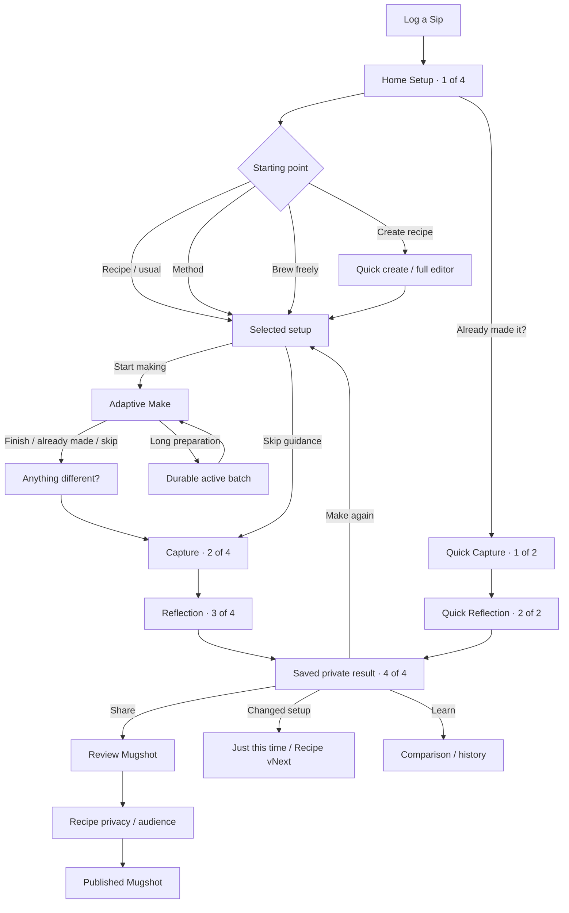

# Home Sip V3 approved gallery and flow manifest

This manifest promotes the approved 50-screen Home Sip V3 mockup into the
repository's versioned design evidence. Native implementation follows the visual
direction rather than reproducing browser-only navigation. The authoritative
product decision is the [Home Sip V3 amendment](../../HOME_SIP_V3_AMENDMENT_2026-09-18.md).

## Primary journeys

## Screen inventory

| # | Approved screen | Production purpose |
| --- | --- | --- |
| 01 | Home start inside Log a Sip | Setup-first composer entry |
| 02 | Start setup sheet | Secondary setup routes |
| 03 | Recipe picker sheet | Search/filter exact recipe versions |
| 04 | Coffee method picker | Recent and recommended coffee methods |
| 05 | Matcha, tea, and other methods | Full family catalog |
| 06 | Selected setup inline | Targets and Start/Skip actions |
| 07 | Adaptive making screen | Method-aware guidance |
| 08 | Record changes sheet | Optional actuals, never copied targets |
| 09 | Capture finished sip | Photos, name, and preparation summary |
| 10 | Home sip reflection | Shared Sip reflection plus Home intent |
| 11 | Next-time note sheet | Conditional private improvement note |
| 12 | Saved private result | Durable result and next actions |
| 13 | Review Mugshot | Existing production publishing spine |
| 14 | Recipe sharing privacy sheet | Version and audience consent |
| 15 | Published Mugshot | Existing completion/share destination |
| 16 | Quick log capture | Quick path surface one |
| 17 | Quick reflection | Quick path surface two |
| 18 | Quick log saved | Shared saved-result destination |
| 19 | Espresso | Dose, ratio/yield, time |
| 20 | Pour-over | Water and ordered pours |
| 21 | AeroPress | Dose, water, steep, press |
| 22 | French press | Immersion and plunge |
| 23 | Moka pot | Dose, water, heat |
| 24 | Drip or batch | Batch targets and brewer |
| 25 | Siphon | Vacuum-brew guidance |
| 26 | Turkish / ibrik | Boiled coffee guidance |
| 27 | Pod / capsule | Capsule and output |
| 28 | Cold brew setup | Brew ratio and steep duration |
| 29 | Cold brew active batch | Timestamped resumable progress |
| 30 | Cold brew finish and serve | Dilution and serving log |
| 31 | Traditional matcha | Powder, water, temperature, whisk |
| 32 | Shaken matcha | Cold shaken preparation |
| 33 | Hojicha | Whisked, steeped, or latte preparation |
| 34 | Western tea steep | Leaf, water, temperature, duration |
| 35 | Gongfu tea | Vessel and infusion schedule |
| 36 | Chai concentrate | Ingredients, simmer, and yield |
| 37 | Milk and foam | Liquid, additions, and intended texture |
| 38 | Tonic or soda sip | Carbonated assembly |
| 39 | Custom method | Arbitrary named fields and steps |
| 40 | Linked component readiness | Explicit already-prepared decision |
| 41 | Quick-create recipe sheet | Name and optional source link |
| 42 | Full recipe editor entry | Complete flexible recipe editing |
| 43 | Recipe update choice | Just this time or immutable vNext |
| 44 | Attempt comparison | Recorded changes and taste evidence |
| 45 | Attempts and recipe history | Separate attempts and versions |
| 46 | Interrupted draft recovery | Resume or safely discard |
| 47 | Pending sync recovery | Non-blocking local success state |
| 48 | Failed posting recovery | Safe entry and idempotent retry |
| 49 | Source-only and unavailable recipe | Save/edit without false extraction promises |
| 50 | Empty recipe library | Intentional first-use guidance |

## Visual rules carried into native UI

- Keep the existing cream, sage, espresso, type, and spacing tokens.
- Keep one primary action per screen and avoid nested-card stacks.
- Use Mugshot-drawn method vectors for method identity and SF Symbols only for
  ordinary actions.
- Preserve Dynamic Type, VoiceOver text labels, Reduce Motion, keyboard-safe
  actions, and native touch targets.
- Never show stock photography as though the user captured it.
