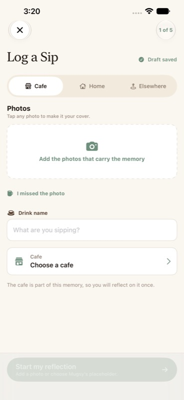

# Mugshot UX Psychology Audit

**Audit date:** 2026-08-10
**Scope:** Native iOS product, current `main` behavior before the V2 implementation
**Status:** Pre-implementation evidence baseline

## Executive finding

Mugshot already has a strong ethical product foundation: real five-step progress, durable local drafts, clear audience controls, a useful signed-out Map and Saved experience, a personal Journal that does not depend on social activity, explicit deletion controls, and restrained analytics that avoid user-authored content.

The largest remaining activation problem is structural, not visual. A new person can discover and save a cafe before creating an account, but cannot begin the product's central act—logging a sip—until after authentication. That asks for identity immediately before the moment where personal effort and ownership could make the account request feel worthwhile. The second largest problem is a privacy contradiction: the product says a sip is private unless the person chooses otherwise, while a first cafe visit currently defaults to Friends. A smaller but meaningful trust defect labels an untouched composer “Draft saved” even though no draft-worthy content exists.

The recommended V2 therefore makes one coherent change to the activation contract:

> Let a guest create a private, locally autosaved sip first; ask for an account only when they choose to preserve it in their Journal; then transfer the draft without publishing it or changing its audience.

This applies smart defaults, value-before-signup, the IKEA effect, ethical loss aversion, progressive disclosure, and honest feedback without manufacturing urgency or hiding tradeoffs.

## Evidence and limitations

This audit combines:

- Static inspection of the SwiftUI application, tests, local persistence, authentication, Supabase integration, privacy controls, and PostHog instrumentation.
- A clean pre-change Debug build and a live signed-in Simulator walkthrough on an iPhone 13 Pro Max profile.
- Accessibility hierarchy inspection and screenshots of Feed, Log a Sip, Map, Saved, Journal, Profile, and Settings. Signed-in screenshots containing personal activity or location context were reviewed locally but are not included in the repository.
- Read-only PostHog event and funnel queries for 2026-07-11 through 2026-08-10.
- Pattern research in Mobbin for guest value, drafts, progress, and empty states.
- A read-only check of the current Supabase breaking-change changelog. The proposed sprint does not require a database, storage-policy, or Edge Function change.

This was not moderated usability research and does not establish causation. Code inspection establishes system behavior. Simulator inspection establishes rendered behavior in one environment. PostHog establishes event occurrence, but its current sample is too small to support statistical conclusions. Psychology principles are design hypotheses to validate, not proof that a change will improve conversion.

### Analytics baseline

PostHog's connected project is active and contains Mugshot events. With test accounts filtered, the last 30 days contained:

| Event | Recorded occurrences |
|---|---:|
| `sip_composer_opened` | 35 |
| `sip_publish_attempted` | 3 |
| `sip_published` | 3 |
| `sip_draft_saved` | 8 |
| `sip_recovery_resumed` | 1 |
| `authentication_completed` | 79 |
| `authentication_failed` | 26 |

The ordered seven-day sip funnel contained only two distinct entrants: two opened, one attempted, and one published. Authentication completion includes session restoration, so `authentication_completed` cannot currently be interpreted as signup conversion. Missing prompt, start, and abandonment events prevent a trustworthy guest-to-account funnel. The V2 instrumentation plan closes that gap without collecting names, notes, images, cafe names, or other user-authored content.

## Product-wide journey audit

The following inventory uses the current production path. The standalone legacy `OnboardingView` is not reachable from the app shell and is treated as dead-code risk rather than current UX.

| Surface | Job and first meaningful action | Required vs optional decisions | Defaults, privacy, and reversibility | Cognitive/abandonment assessment | Verdict |
|---|---|---|---|---|---|
| Guest introduction | Understand Mugshot and start with Map or Saved | Required: none. Optional: continue exploring or sign in | Guest activity stays local; Map and Saved remain available | Short, calm, value-oriented. The copy promises exploration before signup, but the core Log action remains gated | **High opportunity** |
| Authentication | Preserve activity and access personal/social features | Required: choose Apple, Google, or email path. Optional: switch method | Sheet is dismissible; context copy changes by entry point | Clear methods and no forced marketing consent. Prompt happens too early for Log a Sip | **High opportunity** |
| Profile setup | Establish display identity after auth | Required identity fields are separated from later taste/profile enrichment | Profile and Taste Passport audience are independently explained | Mostly progressive, though real progress/abandonment are not measured in the active flow | **Medium instrumentation gap** |
| Map | Find nearby cafes and understand why they are suggested | Required: none. Optional: search, scope, save, directions, open cafe | Discovery scope is explicit; location use is understandable and reversible | Fastest first value. Strong search, map legend, current-location affordance, and recommendation explanation | **Positive** |
| Cafe detail | Evaluate a place and act | Required: none. Optional: save state, directions, list, log sip | Save states are reversible and distinguish Favorites/Want to Try | Good action hierarchy, but starting a sip from here currently hits auth before creation | **High opportunity** |
| Saved | Revisit personally selected cafes and lists | Required: none. Optional: choose segment/sort/list | State changes are reversible and visible | Strong personal utility before social value; useful with sparse data | **Positive** |
| Feed | See relevant people and sip activity | Required: none. Optional: like, open profile, find people, compose | No content is fabricated; social state is distinct from Journal | Populated state is polished. Empty/new-user state relies too much on network availability and can offer clearer personal next steps | **Medium** |
| Friends/people | Find and manage real social relationships | Required: explicit action to follow/request. Optional: search/discovery | Relationship changes are deliberate; no deceptive follower scarcity | Clear when populated; sparse-state motivation should point back to personal value rather than social pressure | **Medium** |
| Notifications | Review meaningful updates | Required: none. Optional: open item or manage preferences | Categories/settings are discoverable; no forced opt-in observed | Functional, but the empty state should pair social setup with an independent action such as logging a sip | **Low/medium** |
| Log a Sip: setup | Establish context, photo choice, drink, and cafe/home | Required: context, photo or explicit missed-photo choice, drink, place. Optional: camera/library path | Five real steps; navigation is reversible; draft storage is durable | Guided sequence sharply reduces blank-page burden. Current auth gate blocks guests before any ownership; untouched screen falsely says “Draft saved” | **Critical focus** |
| Log a Sip: guided details | Capture rating and enough information for a useful memory | Required items are visually distinct. Optional detail stays skippable | Audience is visible before publish; back navigation preserves work | Strong recognition-over-recall design and staged complexity. Existing step count is truthful | **Positive** |
| Tasting Lens/deep details | Add nuanced sensory detail | Entirely optional | Disclosure is user initiated; previous answers remain intact | Appropriate advanced-mode separation; does not interrupt the core path | **Positive** |
| Publish preview | Verify content, audience, and destination | Required: deliberate Publish. Optional: return and edit | Preview is editable; audience can change; failed saves retain the draft | Strong error prevention. For a guest, this is the ethically appropriate point to request an account | **High opportunity** |
| Publish success | Confirm completion and show the created artifact | Required: none. Optional: view/share/continue | Confirms actual Journal storage; no fake celebration before success | Concrete artifact reinforces competence and ownership | **Positive** |
| Draft recovery | Resume unfinished work after exit/failure/relaunch | Required: none. Optional: resume or replace | Durable account-scoped storage, images, pending retry, and deduplication protect real work | Excellent ethical loss-aversion foundation. Guest-to-user transfer is the missing bridge | **High opportunity** |
| Journal | Revisit personal history, ratings, memories, and reflections | Required: none. Optional: filter/open/reflection | Personal entries remain useful without friends; content ownership is clear | Strong long-term value and calm return framing. Avoids social emptiness as failure | **Positive** |
| Visit detail | Inspect one saved artifact | Required: none. Optional: edit/share/delete where available | Audience and content are inspectable; destructive paths require intent | Concrete output supports ownership and recall | **Positive** |
| Taste Passport | Understand learned preferences | Required: none. Optional: enrich/edit/share audience | Audience is independently labeled; not conflated with sip visibility | Good competence/identity reinforcement, though benefit timing depends on enough real entries | **Positive** |
| Profile | Manage identity and reach settings/social features | Required: none. Optional: edit or navigate | Separate profile and Taste Passport controls are explicit | Clear information scent and compact hierarchy | **Positive** |
| Settings/privacy | Control notifications, privacy, account, and product behavior | Required: none. Optional: change one setting | Choices are grouped and reversible; defaults must match surface copy | Good discoverability. New-sip Friends default undermines otherwise strong privacy communication | **High trust issue** |
| Logout | End the current session | Required: explicit confirmation/action | Drafts are account scoped; session can be restored by signing in | Standard and understandable; no shame or coercion | **Positive** |
| Account deletion | Permanently remove an account | Required: explicit verification and destructive confirmation | Destructive effect is stated; action is discoverable in settings | Appropriate friction for irreversible harm, not for retention manipulation | **Positive** |
| Loading/error/offline | Explain asynchronous work and preserve progress | Required: retry only where necessary | Pending save/retry and local draft protection are robust | Most failures are actionable and do not erase work. Network/auth recovery analytics can be clearer | **Positive with measurement gap** |
| Empty states | Explain sparse personal/social collections | Required: none | No fake data or false popularity signals | Journal and Saved protect personal value; Feed/Notifications can better expose Log a Sip and Explore Map actions | **Medium** |
| Accessibility/type scaling | Keep the core journey perceivable and operable at larger settings | Required: none | VoiceOver names and 44-point controls are broadly present | The composer reflows and scrolls at the repository's XXXL fixture, but many legacy design tokens use fixed point sizes and therefore do not fully honor Dynamic Type | **Medium systemic debt** |

## Decision and blank-page burden

### What the person must decide now

The core composer correctly limits Step 1 to context, photo/missed-photo, drink name, and place. Rating, experience, Tasting Lens, visibility, and final verification are postponed. This is a strong progressive-disclosure model: the person is never asked to complete an open-ended tasting form before the basic memory exists.

The current guest shell is less coherent. It asks the person to decide whether Mugshot deserves an identity relationship before they can try the central behavior. Map and Saved demonstrate discovery utility, but not the ownership value of a personal Journal entry.

### Blank-page reduction

The guided composer uses explicit choices, examples, and stepwise prompts rather than a blank journal field. The home/elsewhere context shortcuts also reduce irrelevant cafe decisions. Advanced detail is optional. These are all strengths worth preserving.

The empty Feed and Notifications surfaces should not imply the app is useless until friends arrive. Their most useful next actions are personal and controllable: Log a Sip, Explore Map, or open Saved. Finding people can remain available as an optional social path.

## Ranked findings

### Critical and high

1. **[High impact / high confidence / medium effort / low ethical risk] Let guests create before authentication.**
   Current behavior gates Add and cafe-detail logging before draft creation. This delays ownership and makes the account prompt transactional. Enable the full local guided composer for guests, use local autosave, and request authentication only when Publish is deliberately chosen.

2. **[High impact / high confidence / low effort / privacy-positive] Default a first cafe sip to Private.**
   `CafeVisibilityPreferenceStore` returns Friends when no explicit preference exists, while visible product copy says Private unless changed. Use Private for a new/guest composer; honor the last audience only after a person explicitly changes it. Keep home/elsewhere Private.

3. **[High impact / high confidence / medium effort / low data risk] Adopt a guest draft safely after signup.**
   Store the destination user copy first, including nested cafe-session ownership, then delete the guest source only after success. Do not auto-publish. On failure, keep the guest copy and explain that the work remains on-device.

4. **[High measurement value / high confidence / low effort / low privacy risk] Instrument the revised funnel.**
   Add prompt/start/abandonment, onboarding, guest-draft, draft-restored, and visibility-change events. Store only coarse state and enum-like context; never notes, drink names, cafe names, images, search text, email, or display names.

### Medium

5. **Make autosave feedback truthful.** Show “Drafts save automatically” before content exists and “Draft saved” only after a draft-worthy change is persisted.

6. **Strengthen sparse social states.** Add a primary personal-value action and a secondary people-discovery action to empty Feed/Notifications states. Do not use fake accounts, inflated counts, or social proof.

7. **Measure onboarding as the active guest introduction, not the unreachable legacy view.** Eventually remove or clearly archive the unused `OnboardingView` after dependency checks.

8. **Migrate fixed typography tokens to semantic Dynamic Type styles.** The current accessibility fixture proves reflow and reachability, not full text enlargement. Start with helper/status copy and then migrate shared headers, segmented controls, and card typography under dedicated visual regression coverage.

### Low and preserve

9. Preserve real five-step progress, optional Tasting Lens disclosure, publish preview, visible audience control, draft/pending recovery, Journal return framing, explicit account deletion, and restrained haptics/celebration.

## Principle-to-solution matrix

| Principle | Current user problem | Ethical V2 solution | Expected benefit | Ethical risk and guardrail | Measure |
|---|---|---|---|---|---|
| Value before information | Log value is hidden behind auth | Guest can create a complete local draft; auth appears at chosen preservation point | Better first-value comprehension and more informed signup | Do not imply cloud safety before auth; clearly say local/on-device | Guest composer starts, guest draft creation, prompt-to-auth completion |
| IKEA effect / ownership | No personal artifact exists when auth is requested | Let the person invest meaningful effort and preview their own sip first | Stronger ownership and account relevance | Never trap the artifact; autosave, dismiss, and restore locally | Draft-worthy rate, restored drafts, post-auth adoption |
| Loss aversion | Account prompt could become coercive if work seems threatened | State factually that the completed local draft needs an account to enter the Journal | Protect real work without invented urgency | Draft remains available if prompt is dismissed or auth fails | Auth abandonment followed by restore; zero transfer-loss defects |
| Smart defaults | First cafe sip silently selects Friends | First audience is Private; remembered audience follows explicit choice | Less privacy anxiety and fewer accidental shares | Audience remains visible and editable before publish | Visibility changes; published audience distribution |
| Progressive disclosure | Full tasting vocabulary can overwhelm | Preserve guided five-step path and user-invoked Tasting Lens | Lower cognitive load without removing power | Optional detail must remain skippable and reversible | Step exits, advanced-mode entry, completion time |
| Goal gradient | Multi-step creation can feel indefinite | Preserve truthful “Step n of 5” progress | Better orientation and completion momentum | Never inflate completion or hide added work | Step-to-step conversion |
| Zeigarnik effect | Interrupted work can be forgotten | Restore the actual draft and name that recovery plainly | More successful resumptions | No nagging notifications or artificial incompletion badges | Draft restored, recovery resumed, eventual publish |
| Feedback/competence | Untouched composer claims success | Distinguish autosave capability from successful save | Higher trust and clearer system status | Only claim success after persistence succeeds | Save failure rate; trust interviews |
| Loss/error prevention | Publishing can expose or lose unintended content | Keep editable preview, audience summary, retry, and dedupe | Safer confidence at the irreversible boundary | No preselected public audience; no auto-publish after signup | Publish blocks/failures/retries; visibility changes |
| Social proof | Sparse network may feel empty | Use real relationship/content counts only; emphasize personal value | Motivation without deception | No fake activity, fabricated testimonials, or popularity claims | Empty-state action selection and downstream value event |

## Ethical review

### Approved uses

- A private default reduces the chance of accidental disclosure.
- Progress reflects five real product stages and remains reversible.
- Ownership comes from the person's actual draft, not a fabricated sunk-cost message.
- Loss framing is limited to a true fact: a local draft must be associated with an account before it can be placed in the cloud-backed Journal.
- The account sheet is dismissible and failed authentication does not destroy the draft.
- Analytics describe funnel state without recording the content of the sip.

### Explicitly rejected patterns

- Fake countdowns, expiring drafts, artificial urgency, or claims that work will disappear when it will not.
- Prechecked marketing consent, notification permission before a clear benefit, or hidden privacy controls.
- Friends/Public defaults justified by growth goals.
- Auto-publishing immediately after signup.
- Fabricated social activity, fake popularity, or testimonials presented as measured Mugshot behavior.
- Shame, guilt, streak loss, or exaggerated celebration used to pressure completion.
- Treating the two-person baseline funnel as statistically meaningful evidence.

## Reference patterns reviewed

The patterns below informed interaction structure, not visual copying:

- [Vocabulary: account as data protection after guest value](https://mobbin.com/flows/e166caa3-064f-42f2-82f4-7e57204e45c4) — useful framing for preserving favorites/settings after value is visible.
- [Reddit: Save Draft](https://mobbin.com/flows/4ee2d9bc-a6cc-4d83-8e69-3d398369d949) — neutral Save/Discard language around real work.
- [GoPro Quik: unsaved-work exit](https://mobbin.com/flows/84561eb0-a1d4-4ddb-aca0-79ec90029fe4) — honest loss prevention without guilt.
- [Life Reset: profile setup progress](https://mobbin.com/flows/e91bc9a4-db92-449a-8de2-2d5e81381f6b) and [Evernote onboarding](https://mobbin.com/flows/4f4d734f-364e-4506-917e-6a5a17fbadff) — explicit position in a real sequence; any paywall or social-pressure elements were intentionally excluded.
- [X: photo publishing](https://mobbin.com/flows/82dc9f9c-ef6c-4257-8fdb-9e940ef4e888) and [Character.AI: image post](https://mobbin.com/flows/ddf7664c-20d2-4527-932a-0ba85ffdbdf2) — clear compose, send state, and resulting artifact.
- [Lex: empty notifications](https://mobbin.com/flows/305b7b65-2fa7-4354-b749-f82f5a15be6b) and [TikTok: friends empty state](https://mobbin.com/flows/11300a44-8272-4445-93bf-3c6ec581fa5f) — actionable emptiness; Mugshot should retain an independent personal-value path.

## Before screenshot

| Surface | Baseline |
|---|---|
| Log a Sip setup |  |

The Feed, Map, Saved, and Journal baselines were inspected during the audit but intentionally excluded because the signed-in fixtures contained real activity, saved places, or location context. The focused composer baseline above contains no personal content and captures the trust defect changed by this sprint.

## Backend and platform impact

The V2 can be implemented entirely in the iOS client using the existing local draft model, auth model, PostHog service, and authenticated publish path. No Supabase schema, RLS, storage policy, or Edge Function change is required. The current [Supabase breaking-change changelog](https://supabase.com/changelog?types=breaking-change) was reviewed; its current new-table Data API grant change and self-hosting changes do not affect this client-only sprint.

## Decision

Proceed with the guest-first private draft V2 and its supporting analytics, migration tests, accessibility checks, and copy corrections. Defer broader empty-state redesign and legacy onboarding removal unless the implementation exposes a direct dependency or regression.
