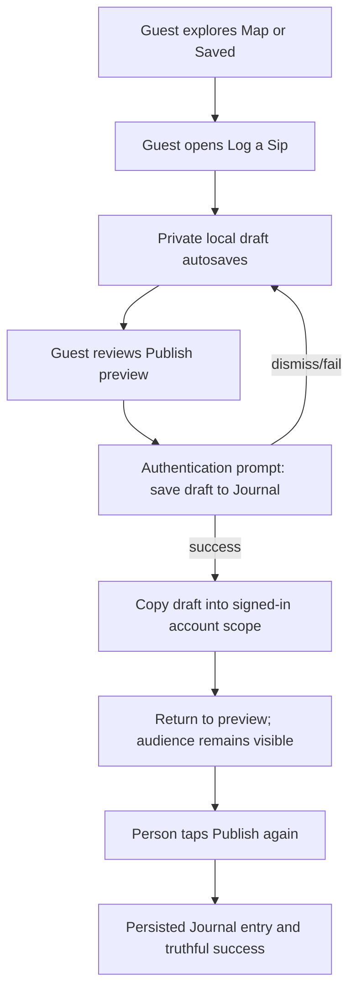

# Mugshot UX Psychology V2 Plan

**Date:** 2026-08-10
**Source audit:** [`mugshot-ux-psychology-audit.md`](mugshot-ux-psychology-audit.md)
**Implementation theme:** Create first, preserve at signup, publish deliberately

## Objective

Improve early Mugshot activation by letting a signed-out person experience the core act of creating a sip before requesting identity, while strengthening privacy, truthful feedback, recoverability, accessibility, and measurement.

## Experience contract

1. A guest can use Map, Saved, and Log a Sip without an account.
2. A new sip starts Private. Home and elsewhere remain Private. A signed-in person may reuse an audience only after having explicitly selected it previously.
3. Draft-worthy guest work is autosaved locally and survives dismissal or relaunch.
4. The composer never says “Draft saved” until a real draft has been persisted.
5. Publish remains a deliberate boundary. A guest who taps Publish sees the existing authentication sheet with plain-language preservation context.
6. Dismissing or failing authentication leaves the local guest draft intact.
7. Successful authentication transfers the draft to the signed-in account scope without publishing it. Destination save occurs before guest deletion.
8. The person returns to the preview, verifies audience/content, and taps Publish again.
9. Analytics contain only coarse funnel and state metadata, never user-authored content.

## Chosen V2 scope

### P0 — guest-first creation

- Open Add for guests instead of showing authentication immediately.
- Allow “Log a Sip” from cafe detail to create a guest-owned local draft.
- Pass an authentication-request callback into the active V3 composer.
- At guest Publish, force a local save and show the existing auth sheet with the title “Save this draft to your journal.”
- Do not auto-publish after authentication.

### P0 — safe guest draft adoption

- Add a focused `SipDraftStore` operation that adopts the active guest draft into a concrete user scope.
- Rewrite the top-level owner and nested cafe-session owner identifiers.
- Persist the destination copy first, re-read it, and remove the guest copy only after destination success.
- Return a clear failure while retaining the source draft if any step fails.
- Cover successful adoption, owner rewriting, and failure-safe source retention with unit tests.

### P0 — privacy default

- Change the no-preference cafe default from Friends to Private.
- Keep stored explicit preferences working for returning signed-in people.
- Make guest-created cafe drafts explicitly Private.
- Update focused tests that currently codify the Friends default.

### P1 — truthful state and recovery

- Replace the untouched “Draft saved” label with “Drafts save automatically.”
- Show “Draft saved” only when draft-worthy content exists and persistence has succeeded.
- Track restored and adopted drafts as state transitions, not content.
- Preserve all existing cancellation, pending-save, retry, and deduplication behavior.

### P1 — ethical funnel instrumentation

Add exact, allowlisted PostHog events:

- `onboarding_started`
- `onboarding_step_completed`
- `onboarding_abandoned`
- `onboarding_completed`
- `time_to_first_value`
- `auth_prompt_viewed`
- `auth_started`
- `auth_abandoned`
- `guest_draft_created`
- `guest_draft_saved_after_signup`
- `draft_restored`
- `visibility_changed`
- `log_abandoned`

Permitted properties are limited to version, entry point, auth method, true/false state, real step number, context enum, visibility enum, elapsed-time bucket/value, and recovery outcome. Names, notes, cafe identifiers/names, drink names, images, search terms, and contact information are prohibited.

### P2 — sparse-state continuity

If it remains isolated and low risk after P0/P1 compile, make the empty Feed point first to Log a Sip or Explore Map and second to finding people. Preserve honest emptiness; add no sample or fabricated activity.

## State flow

## Accessibility and content requirements

- Preserve 44-point minimum targets and existing VoiceOver labels for steps, context, photo choice, audience, and publish.
- Ensure the authentication prompt title and message explain the destination and that the draft remains safe.
- Keep step progress semantic and truthful; do not encode progress only with color.
- Verify the guest composer and auth boundary with a large accessibility Dynamic Type launch configuration.
- Treat that fixture as a layout/reachability check while legacy fixed-size typography is migrated separately; use a semantic caption style for the new autosave status.
- Use the ASCII spellings `cafe` and `cafes` in every new user-facing string and document.
- Preserve Reduce Motion behavior and avoid adding animation that blocks action.

## Verification plan

This is a Tier 4 consolidated acceptance pass under `docs/VERIFICATION_POLICY.md` because it crosses guest navigation, authentication, account-scoped persistence, publish boundaries, analytics, accessibility, and user-requested screenshots.

### Phase A — deterministic checks

1. Inspect the complete diff and scan changed strings for disallowed accented spellings or sensitive analytics properties.
2. Run repository policy/static checks required by the verification script.
3. Run focused unit tests for visibility defaults, guest draft adoption, analytics event names/properties, and guest shell policy.
4. Run the full existing test suite once, as explicitly requested.
5. Run one Debug compile/build check. Do not run Release because this sprint does not touch packaging, availability, or optimization behavior.

### Phase B — one batched Simulator session

1. Launch a deterministic signed-out UI-testing state.
2. Verify Map and Saved remain available.
3. Open Add as guest and confirm no auth sheet appears before creation.
4. Create draft-worthy content, dismiss/reopen, and verify restoration.
5. Reach Publish, verify Private is visible, and verify the preservation-oriented auth sheet appears only after Publish.
6. Dismiss authentication and verify the draft remains.
7. Relaunch with an accessibility Dynamic Type configuration and inspect for blocking clipping/overlap.
8. Capture focused after screenshots and compare with the privacy-safe pre-change composer baseline.

Remote account creation and a real cloud publish are intentionally excluded from automated validation to avoid mutating live user or Supabase data. Account-scope transfer is covered deterministically by local unit tests; the existing authenticated publish pipeline remains unchanged.

## Success criteria

- Guest Add and cafe-detail entry points open the real composer.
- Guest work survives exit, auth dismissal, and relaunch.
- First visibility is Private and remains explicitly editable.
- Auth is shown at Publish, not before creation.
- Successful auth adoption cannot delete the source before a verified destination write.
- No automatic publish occurs after authentication.
- Autosave copy never claims a nonexistent save.
- All added events are exact and contain no user-authored content.
- Focused tests, full tests, Debug build, deterministic UI journey, and accessibility inspection pass.

## Measurement after release

Use a minimum observation window and report sample size before interpreting change. Compare cohorts by app version and guest/signed-in entry point.

Primary funnel:

1. `sip_composer_opened`
2. `guest_draft_created`
3. `sip_publish_attempted`
4. `auth_prompt_viewed`
5. `auth_started`
6. `authentication_completed`
7. `guest_draft_saved_after_signup`
8. `sip_published`

Guardrails:

- Authentication failure and abandonment rate
- Draft restoration/adoption failure rate
- First-publish audience distribution
- Visibility changes immediately before publish
- Publish failure and pending-retry rate
- Median time from composer open to first draft-worthy value
- Support reports concerning lost drafts, unexpected sharing, or unclear signup requirements

No experiment should ship solely to maximize signup if it worsens draft safety, privacy, comprehension, or informed control.

## Deferred backlog

- Rework empty Feed and Notifications states after enough traffic exists to measure action selection.
- Remove the unreachable legacy onboarding implementation after a separate dependency audit.
- Add moderated usability sessions for guest creation, auth context comprehension, and audience understanding.
- Consider an authenticated preference-reset control only if research shows remembered audience surprises returning users.
