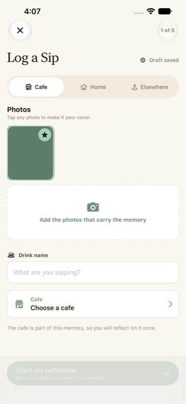
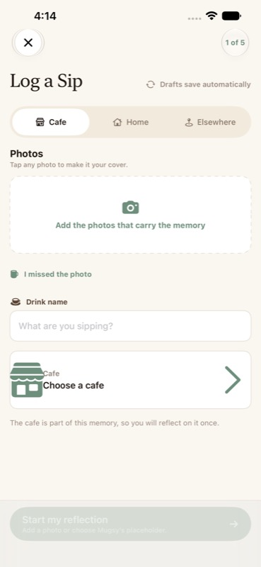
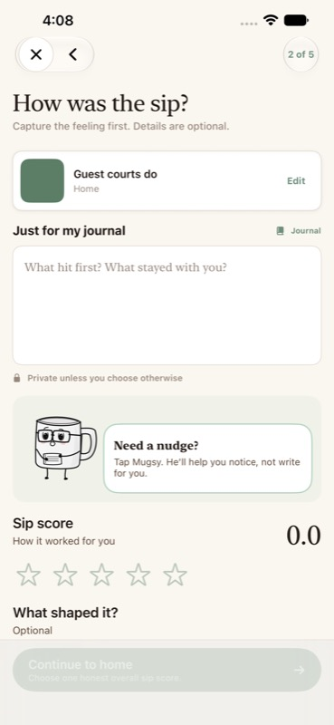
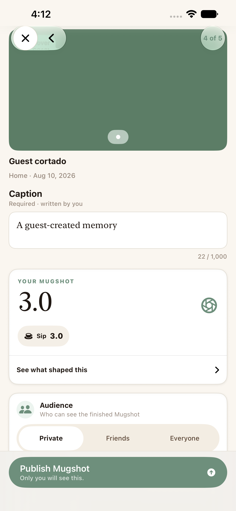
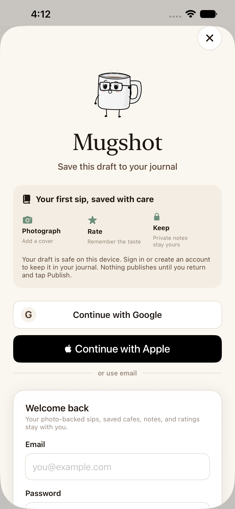

# Mugshot UX Psychology V2 Validation

**Date:** 2026-08-10
**Branch:** `codex/mugshot-ux-psychology-v2`
**Change classification:** Tier 4 consolidated acceptance
**Release status:** Green after dedicated stability closure; ready for review and merge

## Implemented outcome

The V2 changes Mugshot's activation contract from “authenticate before creating” to “create locally, authenticate to preserve, publish deliberately.”

- Newly authenticated people receive an eight-step Mugsy tour of Map, Feed, Saved, lists, Journal, and the first-sip flow before landing in the real app.
- The tour ends with a choice to log a sip now or defer it; choosing now starts Mugsy's guided first-sip experience.
- Signed-out people can open the real Add composer and begin a sip from a cafe detail.
- New sip and cafe-session defaults are Private. A returning signed-in person's explicitly remembered cafe visibility still wins.
- Draft-worthy guest work autosaves in the guest account scope.
- The untouched setup screen says “Drafts save automatically”; “Draft saved” appears only after persistence succeeds.
- A completed guest draft requests authentication at Publish with explicit on-device safety and no-auto-publish copy.
- Dismissing the auth sheet returns to the intact publish preview.
- Successful authentication copies the draft and images into the signed-in scope, verifies the destination, rewrites cafe-session ownership, and only then removes the guest source.
- The person must review and tap Publish again after authentication.
- New PostHog events measure onboarding, auth prompt/start/abandonment, guest draft creation/adoption, restoration, visibility change, and log abandonment without user-authored content.

No Supabase schema, RLS, storage-policy, or Edge Function change was made. No live account, cafe, sip, media, or profile data was created during validation.

## Verification results

| Check | Result | Evidence |
|---|---|---|
| Pre-change Debug build/run | Pass | App built and launched on the named iPhone 13 Pro Max Simulator before implementation |
| Final Debug Simulator build | Pass | `testMugshot` scheme, 14.9 seconds after the final ownership-verification hardening, no compile failure |
| Diff formatting | Pass | `git diff --check` produced no errors |
| ASCII cafe policy | Pass | Repository test passed in the full run; direct scan found no accented cafe spelling in changed code/docs |
| Focused persistence/privacy/analytics tests | Pass | 22 passed, 0 failed, 0 skipped |
| Full shared test scheme after stability fixes | Pass with one corrected order leak | 398 total: 397 passed, 1 failed, 0 skipped; the sole failure was a map scope preference left by an earlier run before the final reset key was compiled |
| Corrected map order proof | Pass | `testSavedDetailAndMapHandoff` passed, then `testForYouCardListAndScopeSelectorKeepMapAsTheDiscoveryHome` passed from the persisted `All` state after `--ui-testing-reset` restored `Visited` |
| Original nine-failure stability matrix | Pass | All nine original UI failures passed in focused or ordered batches and again inside the 398-test shared run |
| Corrected guest activation UI journey | Pass | 1 passed, 0 failed, 0 skipped in isolated rerun; repeated once to export required screenshots |
| Existing signed-in timed V3 publish journey | Pass in full run | `testV3HomeSipCompletesUnderTwoMinutes` completed in 57.502 seconds |
| XXXL guest setup hierarchy/layout inspection | Pass with limitation | Core controls remained reachable and unclipped; autosave status exposed correct semantic text |
| Screenshot review | Pass | Private preview and auth preservation boundary visually inspected at full attachment resolution |

### Focused test coverage

The green 22-test checkpoint includes:

- Guest draft destination-first adoption
- Nested cafe-session and reference owner rewriting
- Guest-source retention when destination storage fails
- Account and guest scope isolation
- New Private defaults and explicit preference retention
- Exact activation event names
- Analytics duration/count bounds
- Absence of email, drink name, notes, cafe name, and user ID properties in the new event payloads

## Full-suite stability closure

The dedicated pass reproduced the original nine failures together, resolved their shared state and contract causes, and then exercised them in bounded batches before running the complete `MugshotTests` scheme. The complete result bundle reported 398 total tests, 397 passes, one failure, and no skips. The one failure was not one of the original nine: Discovery opened with the persisted `All` map scope from prior Simulator activity instead of the `Visited` default.

The final UI-test reset now clears the persisted map scope as well as Saved sort and density preferences. To verify the actual ordering hazard, `testSavedDetailAndMapHandoff` ran first and intentionally selected `All`; a separate fresh launch of `testForYouCardListAndScopeSelectorKeepMapAsTheDiscoveryHome` then passed with `Visited`. No known failing behavior remains.

| Original failure area | Stability correction | Final evidence |
|---|---|---|
| Home publish completion | Assert the current post-publish share hub instead of the retired Taste Passport contract | Home placeholder suite passed in the complete run |
| Cafe Pulse and Saved cafe entry | Include deterministic fixture cafes in the personal library projection | Both long-form journeys passed in the complete run |
| Saved detail, search/undo, and sip-to-cafe handoff | Reset Saved presentation preferences, expose correct selected-state semantics and 44-point targets, and preserve the Map handoff while scope changes | All four Saved redesign tests passed in the complete run |
| Editorial photo placeholder | Align the expected Mugsy state with the current “Oops, missed the photo” copy | Editorial detail test passed in the complete run |
| Immersive Feed push and owner editor | Assert the navigation destination and current Caption/Save contract | Feed journey passed in the complete run |
| Saved accessibility audit | Fix the compact bookmark hit region and wrapping; keep extreme text reflow in the dedicated XXXL Saved/detail test | App-wide actionable audit and dedicated XXXL reflow test both passed |
| V3 typed data | Enter synthetic text deterministically and verify the field value before continuing | Previously corrupted long drink names remained exact in the complete run |
| Cross-test Map scope | Clear `MugshotMap.discoveryScope.v1` during `--ui-testing-reset` | Saved→Map then Discovery order proof passed 2 of 2 |

## Simulator journey evidence

The signed-out deterministic journey verified:

1. Map and Saved remain available without an account.
2. Add opens Log a Sip instead of authentication.
3. A guest can complete setup, sip rating, home reflection, and publish preview.
4. Private is selected and the action says “Only you will see this.”
5. Tapping Publish opens “Save this draft to your journal.”
6. The sheet says the draft is safe on-device and nothing publishes until the person returns and taps Publish.
7. Dismissing authentication returns to the same Publish screen.
8. Closing the composer preserves its draft rather than warning about fabricated loss.

### Before and after

| Evidence | Screenshot |
|---|---|
| Before: signed-in setup showed “Draft saved” before draft-worthy input |  |
| After: guest setup with a real persisted seeded photo |  |
| After: untouched guest setup at accessibility XXXL exposes truthful autosave capability |  |
| After: personal Journal framing and Private-unless-changed copy |  |
| After: Private publish preview |  |
| After: auth preservation boundary |  |

## Accessibility review

Positive evidence:

- The runtime hierarchy exposed “Step 1 of 5,” “Log a Sip,” “Drafts save automatically,” context choices, photo actions, drink name, cafe selector, and the primary action as separate semantic elements.
- The guest setup remained scrollable and operable at the repository's `--ui-testing-accessibility-xxxl` fixture.
- Context, photo fallback, close, and tab targets retained their existing explicit labels/identifiers.
- The new autosave status uses a semantic scaling caption style, wraps vertically, and does not rely on color alone.
- The isolated guest UI journey validated the auth sheet's dismiss path and preservation copy.

Known limitation:

The accessibility fixture verifies layout and reachability, not complete Dynamic Type support. Many existing design-system components use fixed point sizes, so not every label grows with the system setting. That migration is documented as medium systemic debt in the audit and intentionally not hidden behind a passing layout screenshot.

## Analytics and privacy validation

The connected PostHog project was queried read-only before implementation. The 30-day baseline had 35 composer opens, 3 publish attempts, 3 publishes, 8 draft saves, and one recovery resume. The ordered funnel contained only two people, so it is directional and not statistically actionable.

New event payloads are allowlisted shapes. They contain enum-like entry point, context, step, visibility, boolean content-presence flags, bounded counts, durations, and coarse source values. They do not contain the authored text, drink name, cafe name, photo, email, display name, search query, or account identifier.

The intended post-release funnel is:

1. `sip_composer_opened`
2. `guest_draft_created`
3. `sip_publish_attempted`
4. `auth_prompt_viewed`
5. `auth_started`
6. `authentication_completed`
7. `guest_draft_saved_after_signup`
8. `sip_published`

Interpret only with sample size, app version, and entry-point context. Do not optimize signup at the expense of draft safety, privacy, informed audience choice, or auth-sheet dismissibility.

## Ethical sign-off

- No false deadline, countdown, expiring-draft claim, fabricated social proof, or streak pressure was introduced.
- Loss-aversion language protects real local work and accurately states what authentication changes.
- The auth prompt is dismissible and failed/dismissed auth does not delete the guest copy.
- A first sip is Private, audience remains visible, and signup never auto-publishes.
- Progress remains tied to real steps.
- Celebration remains attached to actual successful publication, not account creation.

## Release recommendation

The V2 activation and Mugsy onboarding work is coherent, compiled, unit-tested, and validated through signed-out, signed-in, onboarding, Saved, Map, Feed, Journal, accessibility, restoration, and publication journeys. The original nine blockers are closed, the sole additional order leak found by the complete run is corrected and verified in the failing sequence, and no known merge blocker remains.
