# Instagram Post Flow Research for Mugshot

**Research date:** July 30, 2026

**Decision scope:** Create, publish, review, and manage a Mugshot

**Evidence standard:** Direct screenshot observation is separated from interpretation and source-code findings

**Naming note:** This report uses “Mugshot V2” for the future redesign requested in the brief. The inspected production implementation is named **Log a Sip V3** in the repository.

## 1. Executive summary

Instagram’s strongest contribution to Mugshot is not its visual style or social feature set. It is the clarity of its posting spine:

> Select media → edit media → add details → share → inspect the finished post

At each stage, one decision dominates. Optional complexity is available without becoming the route forward. Numbered badges make carousel order legible during selection, the first selected image becomes the lead image, the final Share action remains visually dominant, and the completed post appears in its canonical owner view almost immediately. Management moves into an overflow sheet after publishing, where reversible Archive and destructive Delete are clearly separated.

Mugshot already has capabilities Instagram does not: structured drink and context memory, private notes, explicit Private/Friends/Everyone visibility, durable draft recovery, meaningful scores, repeat-sip behavior, and a post detail that can stand on journal value instead of social proof. The opportunity is to preserve those strengths while reducing the visible number of compulsory decisions.

The current Mugshot production flow has four creation surfaces—setup, sip reflection, context reflection, and publish review—followed by a rich post-publish Share Hub or Passport completion. A minimum Cafe entry currently requires a visual or explicit fallback, drink name, Cafe, sip score, Cafe score, and caption. This protects journal quality, but it can make a routine log feel like a form. The publish screen also presents Audience and Raw note as parallel visibility controls, even though raw-note visibility is constrained by the post audience. After success, the default-enabled Share Hub foregrounds exporting to Instagram, Stories, and Messages before the user reviews the canonical Mugshot.

### Recommended V2 direction

Use a three-stage default path:

1. **Capture:** context, drink, Cafe/setting, photos, and lead image.
2. **Rate:** one required sip score; everything else is optional and progressively disclosed.
3. **Review & post:** a faithful post preview, one audience control, and one unambiguous Post Mugshot action.

After publishing, open the canonical Mugshot detail with a compact “Published to your journal” confirmation. Offer external sharing as a secondary action from that post. Preserve autosave throughout.

### Top five changes

1. **Reduce the default flow from four reflective surfaces to three task stages.** Keep one required sip score; move Cafe/setting scoring, criteria, flavor coaching, and extended notes into optional depth.
2. **Make multi-photo order and lead-photo behavior continuously explicit.** Number selected photos, label the lead image “Poster,” and let users reorder or change it from both Capture and Edit.
3. **Make caption optional.** Structured journal fields already make the entry useful; a compulsory 1–80 character public caption adds social-post friction to private logs.
4. **Replace parallel Audience and Raw note controls with one primary visibility choice.** Default private journal notes to Private and reveal note-sharing only under an advanced disclosure.
5. **Land on the finished Mugshot before promoting external sharing.** Use the canonical detail as success confirmation; keep Share Mugshot secondary and add Archive alongside Edit, Repeat Sip, and Delete.

## 2. Research method

### What was attempted

The study began with a legitimate Simulator-first setup:

- Native iPhone 17 Pro Simulators on iOS 27.0 and iOS 26.3.1.
- Xcode device and application inspection.
- iOS Simulator Browser for a live, visible-interface mirror.
- The official Instagram App Store page and the official `itms-apps` route.

Instagram was not installed in either Simulator, the Simulator image did not contain the App Store, the official web App Store route ended in a redirect failure, and the `itms-apps` launch failed with `LSApplicationWorkspaceErrorDomain` code 115. No local Instagram `.app` or `.ipa` was available. The study did not sideload software, bypass platform controls, scrape Instagram, or inspect private APIs.

| Simulator evidence | Supported-install failure |
|---|---|
| 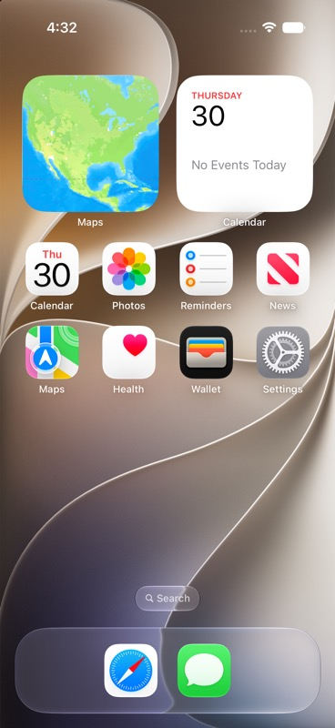 | 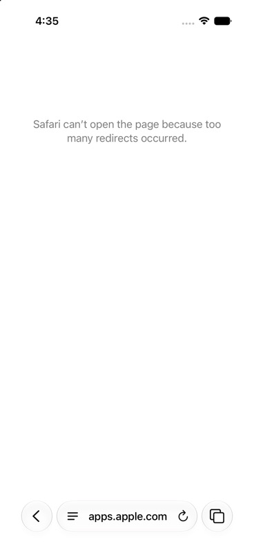 |

A connected physical iPhone inventory exposed Instagram version **440.0.0** on an iPhone 16 Pro running iOS 27.0. That device was not operated because visible device-control tooling was unavailable and it contained personal account state. This avoided exposing or mutating personal data. The version is therefore a verified environment fact, not proof of the version shown in the supplied screenshots.

### Evidence actually analyzed

The Instagram product evidence consists of 15 user-captured iPhone screenshots, saved unchanged in:

`docs/product-research/instagram-post-flow-research-for-mugshot/instagram-user-evidence/`

The screenshots cover multi-photo selection, media editing, final post details, the resulting owner post, owner management, post editing, comments, and mature-account post views. The exact Instagram version shown by those screenshots is not visible and remains unconfirmed.

The Mugshot comparison is grounded in direct inspection of the current production source, especially:

- `testMugshot/Views/Add/LogASipV3ProductionViews.swift`
- `testMugshot/Views/Add/SipComposerView.swift`
- `testMugshot/Views/Feed/SipDetailScreen.swift`
- `testMugshot/Views/Feed/RemoteVisitDetailView.swift`
- `testMugshot/Views/Sharing/MugshotShareHubView.swift`
- `testMugshot/Services/MugshotShareService.swift`

A Debug fixture build of the current app was also launched successfully during environment inspection. That runtime check confirmed the app could start, but the detailed Mugshot findings below rely on production source rather than claiming a complete Mugshot usability test.

### Test-account state and limitations

The requested clean Instagram test account was not available. The supplied screenshots show an established account with existing posts and hundreds of followers and followed accounts. Consequently:

- Empty-social-graph behavior was **not tested**.
- Entry points into creation were **not captured**.
- A controlled single-photo journey was **not captured**.
- Back, cancellation, discard, draft save, and draft return were **not captured**.
- Upload progress, failure, retry, interruption, duplicate Share taps, permission denial, and lost-network behavior were **not captured**.
- Long captions and mixed-aspect-ratio authoring were **not controlled tests**.
- VoiceOver labels, Dynamic Type, focus order, and actual tap-target dimensions cannot be verified from screenshots.
- The screenshots were supplied by the user; this report does not claim that Codex personally tapped through Instagram.

These gaps are treated as unknowns, not filled with remembered Instagram behavior.

### Journey coverage

| Journey | Coverage | Evidence quality |
|---|---|---|
| 1. Entry into posting | Not captured | Blocked |
| 2. Single-photo post | Not captured | Blocked |
| 3. Multi-photo carousel | Selection, order, edit, publish, and post-publish edit captured | Strong direct evidence |
| 4. Caption and post details | Upper/lower details surfaces captured | Strong direct evidence |
| 5. Abandonment, cancellation, drafts | Not captured | Blocked |
| 6. Publishing and success | Share action and owner post 18 seconds after publication captured; progress not captured | Partial direct evidence |
| 7. Reviewing the published post | Owner post, overflow menu, and Edit info captured | Strong direct evidence, except empty social graph |
| 8. Error, empty, and edge states | Empty caption and a fresh post with no visible counts; other cases not captured | Limited direct evidence |

### Timing and measurement caveat

The visible device clock moves from 4:47 in media selection to 4:48 in post details and 4:49 in the owner post. This supports an approximately two-minute **screenshot capture span**, not a controlled completion time. Screenshot-taking, content choice, and pauses are unknown. No journey-specific timing should be treated as benchmark data.

## 3. Instagram flow map

```mermaid
flowchart LR
    A["Create entry point<br/>not captured"] --> B["Media picker<br/>numbered multi-select"]
    B --> C["Media editing<br/>carousel + optional tools"]
    C --> D["Post details<br/>caption + common options"]
    D --> E["Advanced details<br/>audience + governance"]
    E --> F["Share"]
    F --> G["Publishing state<br/>not captured"]
    G --> H["Canonical owner post<br/>visible within seconds"]
    H --> I["Owner actions sheet"]
    I --> J["Edit info<br/>remove, reorder, alt text"]
```

### Observed action/change ledger

| Step | Action evidenced | Visible change | Confidence |
|---|---|---|---|
| 1 | Multi-select is active and four photos are selected | Selected thumbnails receive order badges 1–4; the large preview can show a non-lead selected image | Direct |
| 2 | Album/source disclosure is opened | A compact menu reveals Recents, Videos, Favorites, All albums, and From Meta apps | Direct |
| 3 | The user advances from selection | Selected media becomes a horizontal editing carousel; removal and editing tools appear | Direct |
| 4 | The user advances to New post details | Compact media previews, caption, common enhancements, tagging, location, and Share appear | Direct |
| 5 | The details page is scrolled | Audience and advanced distribution/governance options appear while Share remains dominant | Direct |
| 6 | Share is activated | A completed owner post is visible with an “18 seconds ago” timestamp | Sequence-supported; loading state absent |
| 7 | Owner actions are opened | Reversible, governance, editing, and destructive controls appear in a grouped sheet | Direct |
| 8 | Edit is opened | Photos can be removed and press-held to reorder; caption, audio, people, location, AI label, and alt text are editable | Direct |

## 4. Detailed findings

### Journey 1: Entry into posting

**Status:** Not captured.

The screenshots begin inside the New post media picker. They do not show every create entry point, which entry feels primary, or the transition into the picker. A feed screenshot shows the surrounding Instagram shell but does not expose the create action used for this post.

**What can be concluded:** Once inside creation, “New post” and the “Photo” media-type label establish the object being created. A large X provides an obvious exit from the first stage.

**What cannot be concluded:** Entry-point prominence, competing creation types, early discard behavior, or whether unsaved work is protected.

**Rating:** **Unknown / blocked.** Mugshot should not make entry-point changes based on this evidence alone.

### Journey 2: Single-photo post

**Status:** Not captured.

The direct creation evidence is a four-photo carousel. It cannot establish single-photo crop defaults, single-photo editing effort, or whether the multi-photo control adds friction to the single-photo path.

**Rating:** **Unknown / blocked.**

### Journey 3: Multi-photo carousel

| Media selection | Media editing |
|---|---|
| 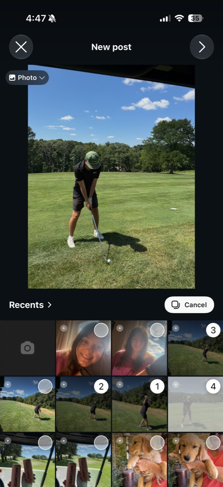 | 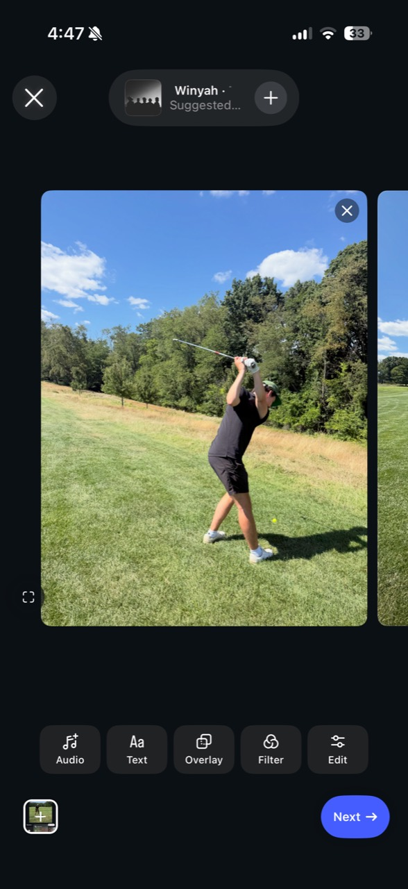 |

#### Direct observations

- Four selected thumbnails carry large white order badges numbered 1–4.
- The large preview can display image 3 while image 1 remains the lead item. Current focus and publication order are therefore visually distinct.
- The album/source menu is compact and appears only when requested.
- After advancing, media becomes a horizontal card carousel.
- Each visible card has an X for removal.
- Audio, Text, Overlay, Filter, and Edit are presented as optional tools in a single row.
- The first editing card matches the first image in the finished owner post.
- Post-publish Edit info explicitly says “Press and hold to reorder,” and each photo remains removable.

#### Interpretation

Instagram communicates order early, but it does not explicitly name the first image as the cover during creation. The numbered badge is familiar and efficient; the meaning of “1” as the profile-grid/first-carousel image may still rely on learned convention. The current photo can be previewed without changing the lead image, which is powerful but potentially ambiguous.

For Mugshot, this maps directly to the poster-image problem. Mugshot should preserve explicit poster selection rather than rely only on order. The best hybrid is:

- Selection badges communicate sequence.
- A persistent **Poster** badge names the lead image.
- Reordering photo 1 changes the poster only after a visible confirmation, or the poster can be changed independently.
- The final review shows the actual poster treatment, not merely a thumbnail.

#### Measurement

| Measure | Observed |
|---|---|
| Major stages | 2 before post details: picker and media editor |
| Required decisions visible | Choose media/order; advance |
| Optional decisions visible | Album/source plus at least five editing tools |
| Primary action clarity | High; forward arrow, then blue Next |
| Back/cancel clarity | High visually; X is prominent |
| Progress preservation | Not tested |
| Main hesitation | Whether current preview, first selection, and cover are the same concept |

**Rating:** Numbered order is a **Positive pattern**. Unnamed lead-image semantics are **Medium friction** for a product with an explicit poster concept.

### Journey 4: Caption and post details

| Details: common choices | Details: advanced choices |
|---|---|
| 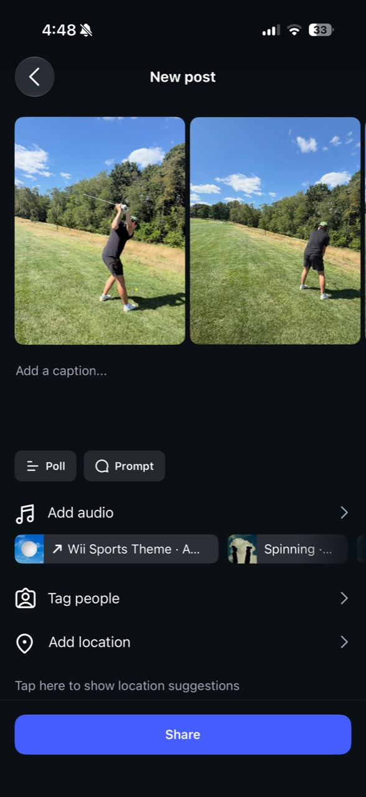 | 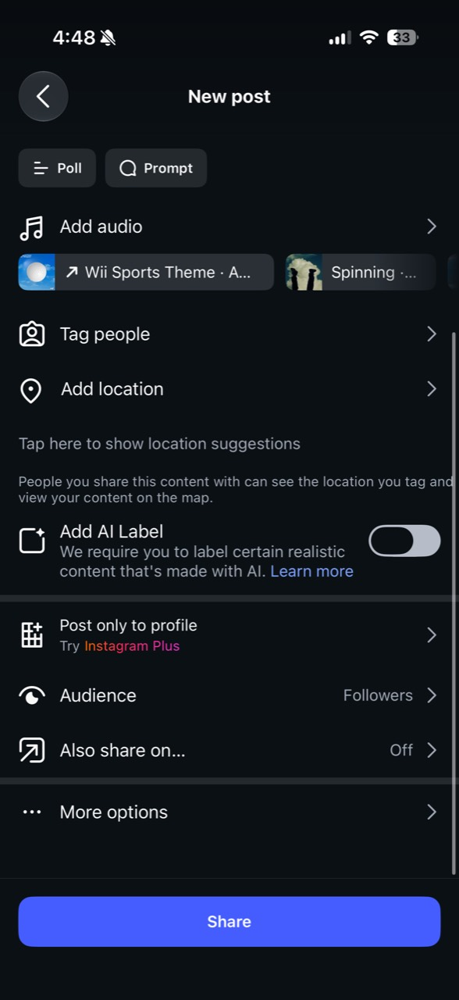 |

#### Direct observations

- The upper surface leads with media previews and an empty caption field.
- Poll and Prompt are compact chips rather than full sections.
- Audio, Tag people, and Add location are presented as rows.
- Suggested music is visible without forcing an audio decision.
- The Share button is a wide, high-contrast bottom action.
- Lower in the same scroll are AI labeling, profile-only distribution, Audience, cross-posting, and More options.
- Audience has a visible current value, “Followers,” without expanding its control.
- Share remains the dominant action at the bottom after scrolling.
- The caption is empty while Share appears active.

#### Interpretation

The hierarchy is effective because common choices come first and governance comes later, but the surface still contains substantial social-production complexity. Polls, prompts, audio, AI labeling, and cross-posting help Instagram’s distribution model; they would dilute Mugshot’s journal purpose.

The most transferable pattern is not the list of features. It is the **single scrolling review surface with summary rows, visible current values, and one persistent completion action**.

For Mugshot:

- Put Caption or public note near the post preview, but make it optional.
- Keep visibility visible on the review surface because it materially affects trust.
- Show private-note sharing as a nested advanced control, not a peer to post audience.
- Put tags, shared ownership, recipe publication, and deep criteria behind disclosures unless already populated.
- Do not import poll, prompt, music, AI-label, or cross-posting controls into the core flow.

#### Accessibility observation

Instagram exposes Edit alt text in post-publish Edit info. That is a positive discoverability signal, but the screenshots do not show whether alt text is available before Share. Icon-only X, arrow, and check controls are visually large; their VoiceOver names and focus behavior are unknown.

#### Measurement

| Measure | Observed |
|---|---|
| Major stages | 1 scrolling post-details stage |
| Required decisions visible | Share; no other visible field appears required |
| Optional decisions visible | Caption plus at least nine enhancements/settings |
| Information hierarchy | Media and caption first; governance later |
| Primary action clarity | Very high |
| Potential abandonment | Optional rows may create “should I configure this?” uncertainty |
| Confidence before publishing | High for media/audience visibility; exact final crop is less explicit |

**Rating:** Progressive disclosure and the persistent Share action are **Positive patterns**. The volume of distribution features is **Medium friction** and mostly irrelevant to Mugshot.

### Journey 5: Abandonment, cancellation, and drafts

**Status:** Not captured.

The X and back controls are visible, but no attempt shows:

- backing out before or after editing;
- entering a caption and leaving;
- a discard/save-draft decision;
- a draft indicator;
- returning to unfinished work.

**Rating:** **Unknown / blocked.**

Mugshot should retain its existing autosave strength. Current production source saves on draft changes and persists again on cancel (`SipComposerView.swift`, around lines 390 and 2821). The missing usability layer is not persistence—it is an explicit, calm exit message such as **“Draft saved”** with a lightweight way to discard when the user truly intends to.

### Journey 6: Publishing and success

#### Direct observations

- The primary publishing action is called **Share**.
- The button is high contrast and spans almost the full width.
- No intermediate upload/progress screenshot was captured.
- The resulting owner post is visible at 4:49 and marked “18 seconds ago.”
- The first selected image appears as the first carousel image.
- No separate success modal or promotional detour is visible in the evidence.

#### Interpretation

The sequence strongly suggests that Instagram confirms success by showing the finished object itself. This is high confidence after publishing: the user can immediately verify media, order, account identity, timestamp, and available actions. It also minimizes ambiguity about where the post lives.

Instagram’s word **Share** fits a social distribution product. Mugshot should use **Post Mugshot** or **Save Mugshot** according to audience, with a stable button label if possible. “Publish” can feel public even when the audience is Private.

#### Measurement

| Measure | Observed |
|---|---|
| Primary action | Share |
| Immediate feedback | Not captured |
| Duplicate-tap prevention | Not captured |
| Error prevention | Audience/defaults visible; validation behavior not tested |
| Success confirmation | Canonical owner post visible within seconds |
| Destination | Owner post detail |
| Published post immediacy | Supported by “18 seconds ago” evidence |

**Rating:** Canonical-post success is a **Positive pattern**. Missing progress/error evidence is **Unknown**, not a finding.

### Journey 7: Reviewing and managing the published post

| Fresh owner post | Owner actions |
|---|---|
| 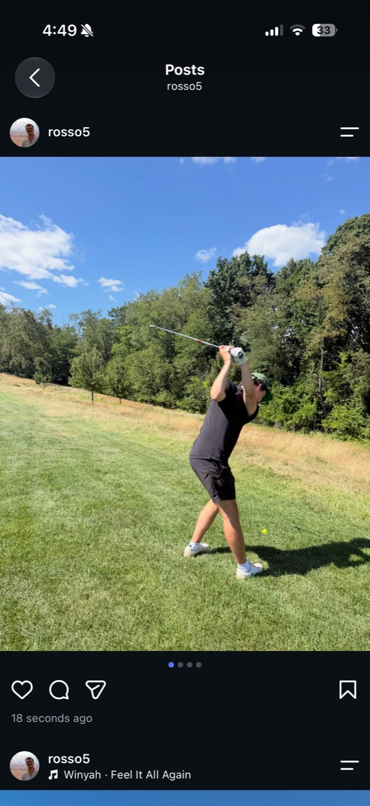 | 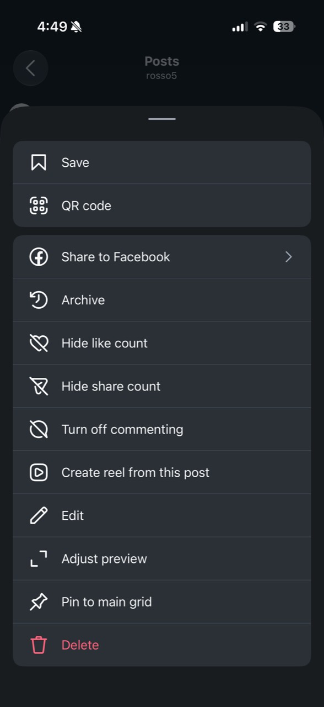 |

| Post-publish edit | Conversation pattern |
|---|---|
| 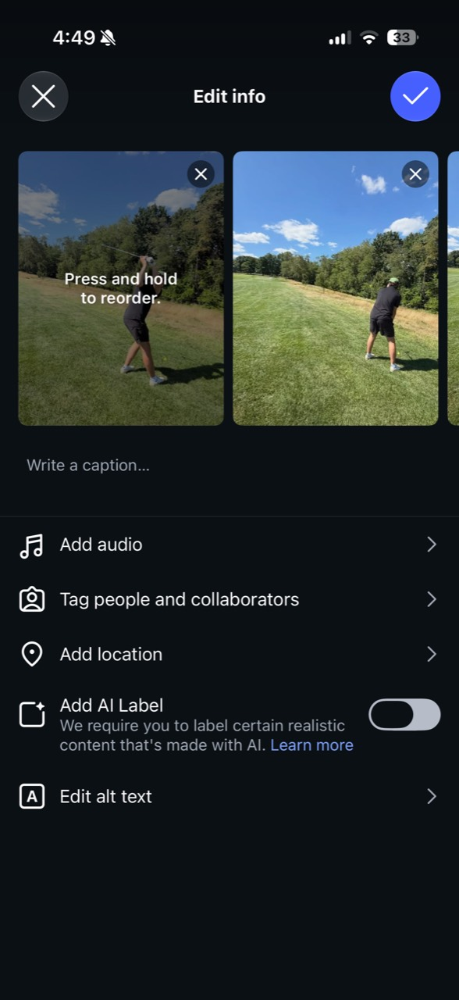 | 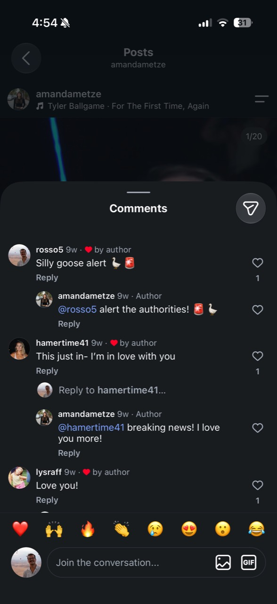 |

#### Direct observations

- The owner post is dominated by identity and media.
- Carousel dots communicate position without adding text.
- Heart, comment, share, and save remain available to the owner.
- The timestamp appears directly under the action row.
- The owner overflow opens a grouped bottom sheet.
- Save and QR code are separated from broader governance.
- Archive is available as a reversible owner action.
- Hide like count, Hide share count, and Turn off commenting are post-specific controls.
- Edit, Adjust preview, and Pin to main grid are grouped near the bottom.
- Delete is last and uses destructive color.
- Edit info allows photo removal, press-and-hold reorder, caption editing, audio, people/collaborators, location, AI labeling, and alt text.

#### Interpretation

The post feels complete because media and identity occupy the primary canvas; engagement is secondary. The fresh owner post shows no visible engagement counts in the captured viewport, yet it does not look broken or empty. This is useful directional evidence, but it is not a valid empty-social-graph test because the account is established.

The owner menu is a strong model for Mugshot:

- Keep viewer actions on the post.
- Put ownership/governance in More.
- Separate reversible Archive from permanent Delete.
- Keep Edit and repeat behavior nearby.
- Do not make engagement counts the proof that a journal entry mattered.

The edit surface also shows a valuable promise: a carousel is not frozen after publication. Mugshot’s current edit form changes the public note, eligible private note, and audience; Correct Drink Details is separate. Photo order and poster correction should be part of owner editing.

#### Empty-social limitation

Instagram was not tested with zero followers, zero following, and no prior posts. Mature-account screenshots of likes, reactions, reposts, and comments cannot answer whether Instagram feels valuable with an empty graph. The fresh post screenshot only establishes that a just-published object can look visually complete before visible counts accumulate.

#### Measurement

| Measure | Observed |
|---|---|
| Major review stages | Post detail, actions sheet, edit surface |
| Media review | Strong; media dominates and carousel state is visible |
| Ownership-control separation | Strong |
| Edit discoverability | Medium; requires More → Edit |
| Archive safety | Strong; reversible action distinct from Delete |
| Delete safety | Destructive styling visible; confirmation was not captured |
| Empty social value | Not validly tested |
| Main hesitation | Large owner sheet contains many unrelated controls |

**Rating:** Canonical owner view, grouped ownership controls, Archive, and post-publish media editing are **Positive patterns**. Menu density is **Low-to-Medium friction**.

### Journey 8: Error, empty, and edge states

#### Directly evidenced

- An empty caption coexists with an active-looking Share button.
- The fresh owner post has no visible like/comment counts in the captured viewport.
- A separate mature carousel demonstrates a 1/20 counter and a long multi-photo post in review.

#### Not evidenced

No media, denied permission, failed upload, lost network, interruption recovery, duplicate Share taps, very long captions, and controlled mixed-aspect-ratio authoring remain untested.

**Rating:** **Limited evidence.** The empty-caption pattern is worth adapting; all other edge-state behavior should be validated on an authorized physical test device before implementation decisions rely on it.

## 5. Post-review analysis

Instagram’s owner review works because it answers five questions in order:

1. **Did my post publish?** The finished object is on screen with a fresh timestamp.
2. **Is the media right?** The lead image fills most of the viewport; carousel dots show there is more.
3. **Is this mine?** Account identity sits directly above the content.
4. **What can I do now?** Common actions sit beneath the media.
5. **How do I govern it?** More opens Archive, visibility-of-counts, commenting, Edit, preview adjustment, pinning, and Delete.

The result is confidence without a separate receipt screen. This works particularly well for media, but it does not prove value in an empty graph. Instagram’s broader viewer experience is engagement-heavy: counts, “Liked by,” comments, reposts, shares, and quick reactions are prominent in mature posts.

Mugshot’s current detail model is better suited to empty-social value:

- Drink, location/context, timestamp, Mugshot score, and caption establish the memory.
- Taste evidence, criteria, recipe, tags, raw note, visit facts, and private note can add personal value.
- The owner dock intentionally omits Like; it offers Comment, Save cafe when applicable, Share, and More.
- Zero reactions do not create an empty “Friends noticed” section.
- Like count is shown only when relevant to a viewer action.
- Owner controls include Edit Sip, Correct Drink Details, Repeat Sip/Brew Again, and Delete Sip.

The main gap is that Mugshot has no per-post Archive action, and its default post-publish Share Hub can delay inspection of the canonical entry. The Share Hub is feature-flagged on by default and gives the sticky primary action to **Share Mugshot — Instagram, Stories, Messages & more**. That is useful after confidence is established, but it is too distribution-led as the first success state for a journal-first product.

### Recommended owner post hierarchy

1. Published-to-journal confirmation banner.
2. Poster/carousel.
3. Drink, Cafe/setting, date, and Mugshot score.
4. Optional public caption.
5. Taste/context evidence.
6. Private note for the owner.
7. Compact action dock: Comment, Save cafe, Share, More.
8. Conversation only after the journal content.

When engagement is zero, omit zero-count labels and keep the conversation composer quiet. The entry should still feel complete because the memory—not audience response—is the payload.

## 6. Pattern classification

| Instagram pattern | User benefit | Potential drawback | Decision | Mugshot application |
|---|---|---|---|---|
| Media-first start | Immediate momentum and familiar task framing | Can imply a post is impossible without a photo | **Adapt** | Open Capture first, but support a graceful automatic no-photo poster |
| Numbered multi-select | Makes carousel sequence legible before editing | “1” does not explicitly explain cover/poster behavior | **Adapt** | Keep numbers and add a persistent Poster badge |
| Large focused media preview | Builds confidence in the selected content | Current focus can be confused with lead image | **Adapt** | Separate “currently previewing” from “Poster” |
| One editing toolbar | Keeps optional enhancement discoverable | Too many creation tools can distract | **Avoid** for core | Offer crop/rotate only; keep journal tools out of media editing |
| Album/source popover | Hides source complexity until needed | Adds one disclosure layer | **Adopt** | Use system Photos behavior and camera/library source disclosure |
| Single scrolling post-details stage | Maintains momentum and one mental model | Long lists can create completion anxiety | **Adapt** | Summary rows with populated values; collapse advanced journal/social options |
| Wide, persistent Share action | Makes the next step unmistakable | “Share” implies public distribution | **Adapt** | Use Post Mugshot or Save Mugshot with visible audience context |
| Audience row with current value | Gives confidence without expanding settings | Default may be accepted without thought | **Adopt** | Show Private/Friends/Everyone on final review; remember a safe contextual default |
| Empty caption permitted | Removes performative writing pressure | Public posts may lack narrative | **Adopt** | Caption/public note optional; structure preserves journal value |
| Immediate canonical post after success | Confirms outcome with the actual object | External sharing becomes a second action | **Adopt** | Open finished Mugshot with a compact success banner |
| Owner actions in overflow sheet | Separates viewing from governance | Important actions are less discoverable | **Adopt** | Put Edit, Correct Drink, Repeat, Archive, and Delete under More |
| Reversible Archive separated from Delete | Provides a safe removal path | Adds another content state | **Adopt** | Add Archive; keep permanent Delete last and confirmed |
| Post-publish carousel reorder/removal | Lets owners correct mistakes | Changes the original artifact after publication | **Adapt** | Allow photo and Poster correction; preserve date and journal history |
| Edit alt text | Gives an accessibility repair path | Hidden behind Edit | **Adopt** | Offer alt text in photo details and owner Edit |
| Poll, Prompt, music, cross-posting | Expands creative expression and reach | Adds social-production clutter | **Not relevant / Avoid** | Exclude from the default Mugshot flow |
| Hide counts and disable comments per post | Gives owner social control | More governance complexity | **Later experiment** | Consider comment control only if users need it; do not build count anxiety first |
| Engagement-first viewer actions | Familiar social feedback loop | Can undermine private journal value | **Avoid** as hierarchy | Keep journal content above social proof |

## 7. Instagram versus current Mugshot

| Dimension | Instagram evidence | Current Mugshot production | Product implication |
|---|---|---|---|
| Entry into posting | Not captured | Center Add tab plus contextual Log a Sip routes from Cafe surfaces, repeat flows, and app shortcuts | Keep the centered Add action; preserve contextual prefill |
| Photo selection | Numbered multi-select and large preview | Photos are added in Setup; users can add multiple images | Add visible order badges during selection |
| Poster image | First selected photo becomes lead; not explicitly named | Tapping a photo explicitly chooses the cover via `posterPhotoIndex` | Mugshot’s explicit model is better; make it more visually persistent |
| Guided vs deeper logging | Creation spine is short; optional production tools are secondary | Setup → Sip → Context → Publish, with coaching, criteria, notes, and scores | Collapse optional reflection into one disclosure from Rate |
| Required vs optional | Media and Share dominate; caption appears optional | Visual/fallback, context, drink, place, sip score, Cafe score when applicable, and caption are required | Reduce required fields to the minimum useful journal |
| Drink and Cafe context | Location is optional metadata | Context and Cafe/setting are core structured identity | Preserve Mugshot’s differentiation |
| Ratings | No rating in observed Instagram flow | Sip score required; Cafe score required; Elsewhere score optional; Home uses make-again reflection | Require one sip score; make second/context scoring optional |
| Caption | Empty field with active-looking Share | Required and limited to 80 characters | Make optional; keep a gentle limit or counter only after entry |
| Private notes | Not present in observed flow | Optional private notes on Sip and Context surfaces | Preserve, but combine into one private note on the fast path |
| Visibility | One Audience summary row; other distribution settings lower | Audience and Raw note use parallel segmented controls | Show one primary audience; nest note-sharing under advanced |
| Review before submission | Media previews plus one details scroll | Rich media preview, caption, score equation, audience, raw note, tags, and shared ownership | Preserve fidelity, reduce default density |
| Publishing state | Not captured | Button changes to Publishing Mugshot, shows progress/status, locks content, and protects retry state | Keep Mugshot’s stronger recovery behavior |
| Success confirmation | Finished owner post visible within seconds | Default-enabled Share Hub/Passport receipt precedes View my Mugshot | Open canonical detail first; offer Share second |
| Published entry detail | Media and identity first, engagement below | Journal summary, score, taste/context evidence, notes, actions, and conversation | Mugshot is stronger for private and zero-engagement value |
| Edit | Caption, media removal/reorder, people, location, audio, label, alt text | Public note, eligible private note, audience; Correct Drink Details is separate | Add photo order/Poster correction and alt text |
| Delete | Destructive action last in owner sheet; confirmation not captured | Permanent Delete Sip confirmation explains scope and irreversibility | Keep current confirmation |
| Archive | Available | No per-post Archive in inspected owner capabilities | Add Archive before expanding social controls |
| Empty social state | Not validly tested | Structured content remains; reaction section is omitted when empty; owner does not Like own post | Design success around journal completeness, not counts |
| Repeat posting | Not captured | Repeat Sip/Brew Again, Use last setup, pinned criteria, and Pour another one | Preserve; surface repeat/prefill after canonical review |

### Current Mugshot strengths to protect

- **Durable drafts:** draft changes are persisted and cancel saves before dismissing.
- **Failure recovery:** protected pending submissions, retry messaging, authentication recovery, and duplicate-publication safeguards exist.
- **Safe privacy constraints:** raw notes cannot be shared more broadly than the Mugshot.
- **Contextual memory:** Cafe, Home, Elsewhere, and Recipe are meaningfully distinct.
- **Journal-rich post detail:** the entry remains useful without reactions.
- **Repeatability:** Use last setup and Repeat Sip/Brew Again reduce future effort.
- **Explicit cover:** Mugshot already treats Poster selection as a first-class journal choice.

### Current Mugshot friction to address

- Four mandatory conceptual surfaces before success.
- A required caption even for Private entries.
- Two required scores for Cafe logs.
- Private reflection is split across sip and context surfaces.
- Audience and Raw note look like equal decisions on the final screen.
- The post-publish experience promotes external sharing before canonical review.
- Owner editing cannot repair photo order/Poster from the primary edit form.
- No reversible Archive action.

## 8. Recommended Mugshot V2 flow

### Design principle

The default flow should capture the **smallest complete memory**, not the smallest social post.

A complete memory needs identity and one judgment:

- what the user drank;
- where or in what context;
- when;
- one sip score;
- optionally, what it looked like and what the user wants to remember.

Everything else can deepen the entry without blocking it.

### Stage 1: Capture

**Screen title:** Log a Sip

**Primary action:** Continue

**Required:**

- Context: Cafe, Home, or Elsewhere.
- Drink name.
- Cafe selection or named Home/Elsewhere setting.

**Optional:**

- One or more photos.
- Brew method or drink type, suggested after drink-name analysis.
- Recipe mode for Home.

**Behavior:**

- Opening from a Cafe detail preselects Cafe and the place.
- Repeat Sip prepopulates drink, context, criteria preferences, and last visibility without copying the old private note or caption.
- Photo selection uses numbered order badges.
- Image 1 receives an explicit **Poster** badge.
- Tapping another image previews it; choosing **Make Poster** changes the poster.
- Reordering is available whenever there is more than one photo.
- If no photo is added, continue without a separate blocking decision and generate a tasteful Mugsy/typographic poster. A subtle “Add a photo” reminder may remain, but no confirmation is required for Private/Friends.
- Show a quiet, truthful **Saved** status once persistence succeeds.

### Stage 2: Rate

**Screen title:** How was the sip?

**Primary action:** Review

**Required:**

- One overall sip score.

**Optional, visible without expansion:**

- One private note field: “What do you want future you to remember?”

**Optional under “Add tasting details”:**

- Flavor helper.
- Sip criteria.
- Cafe score or setting score.
- Cafe/context criteria.
- Home “Make again?” and recipe details.
- Separate context note when the user wants to distinguish drink from place.

**Behavior:**

- Do not show the full criteria editor until expanded or restored from the user’s last setup.
- “Use last setup” should apply criteria configuration, not overwrite today’s score.
- For Cafe entries, suggest—but do not require—a Cafe score.
- Show the blended Mugshot score only after a second score exists. Do not ask users to reason about an equation before they have chosen to add the second dimension.

### Stage 3: Review & post

**Screen title:** Review Mugshot

**Primary action:** Post Mugshot

**Required:**

- All Stage 1 required fields.
- Sip score.
- Audience: a safe remembered/default value displayed on screen.

**Optional:**

- Public caption.
- Tags.
- Shared Mugshot invitation.
- Recipe-sharing controls, when relevant.
- Raw-note sharing under Advanced.

**Layout order:**

1. Faithful Poster/carousel preview.
2. Drink, Cafe/setting, date, and score summary.
3. Optional caption with character count shown only when typing or near the limit.
4. Audience row with visible current value.
5. Collapsed **More options** containing tags, shared ownership, recipe publication, and raw-note sharing.
6. Sticky Post Mugshot action with a short privacy summary, for example “Private · only you.”

**Privacy behavior:**

- Private note defaults to Private regardless of post audience.
- If a user chooses to share the note, expose that as an explicit nested choice.
- Never let private-note visibility exceed post visibility.
- Explain audience in human language; avoid making “publish” synonymous with public.

### Draft preservation and exit

- Autosave every meaningful change, as Mugshot already does.
- When closing, dismiss immediately after persistence and show a non-blocking “Draft saved” confirmation.
- If the draft contains meaningful content, offer **Discard draft** from a secondary menu rather than interrupting every exit.
- On the next Add action, resume the latest draft with a compact banner and an option to start fresh.
- Preserve photo order, Poster index, current stage, notes, scores, audience, and advanced disclosures.

### Submission state

- Disable duplicate submissions while a save is active.
- Change the action to **Posting…** with inline progress.
- Keep the protected draft until remote confirmation completes.
- On failure, remain on Review with “Your Mugshot is safe. Try again.”
- Retry the same idempotent submission.
- If authentication expires, ask the user to sign in without clearing the draft.

These behaviors align with current Mugshot recovery architecture and are stronger than anything directly evidenced in the Instagram screenshots.

### Success state

Open the canonical owner detail immediately and show a temporary, accessible banner:

> Published to your journal

The banner can include the audience value and a Share action, but Share should not replace the finished entry.

From the post:

- **Share** opens the existing branded Share Hub.
- **More** contains Edit Sip, Correct Drink Details, Repeat Sip/Brew Again, Archive, and Delete Sip.
- **View Passport** can remain a secondary completion action.
- **Pour another one** belongs after review or in Repeat, not before the user sees what was saved.

### Published-entry review

The entry should lead with:

- Poster/carousel.
- Drink and context identity.
- Date/time and visibility.
- Mugshot score.
- Optional caption.
- Taste evidence and optional context evidence.
- Owner-only private note.
- Actions.
- Conversation last.

Do not render zero-like, zero-reaction, or zero-comment summaries as empty social proof. A quiet comment affordance is enough.

### Edit, Archive, and Delete

**Edit Sip** should support:

- public caption;
- private note;
- audience;
- photo removal and reorder;
- Poster correction;
- alt text;
- tags and shared ownership where safe.

Keep **Correct Drink Details** separate if changing structured identity has different validation or data consequences.

Add **Archive** as a reversible removal from active Journal/Feed surfaces. Keep **Delete Sip** last, destructive, explicitly permanent, and confirmed with its existing scope explanation.

## 9. Prioritized Mugshot backlog

### Immediate improvements

| Problem | Proposed change | Expected user benefit | Priority | Instagram evidence |
|---|---|---|---|---|
| Success promotes external sharing before canonical review | Route success to the finished Mugshot with a published banner; make Share secondary | Higher confidence and clearer journal ownership | **P0** | Fresh owner post is the visible success state |
| Caption blocks otherwise complete entries | Make caption optional, especially for Private entries | Faster first post and less performative writing | **P0** | Empty caption with active-looking Share |
| Final privacy requires two parallel decisions | Show one Audience row; keep raw note Private unless Advanced is changed | Lower cognitive load and stronger trust | **P0** | Instagram summarizes Audience in one row |
| Carousel order lacks Instagram-like selection numbering | Add order badges and persistent Poster label | Fewer cover/order mistakes | **P1** | Numbered 1–4 selection and stable first image |
| Cancel saves silently | Confirm “Draft saved” after close and expose discard secondarily | Confidence without an interruptive modal | **P1** | Instagram behavior untested; change is grounded in current Mugshot autosave |

### V2 improvements

| Problem | Proposed change | Expected user benefit | Priority | Instagram evidence |
|---|---|---|---|---|
| Four reflective stages make routine logs feel long | Merge Sip and Context into one Rate stage with optional depth | Faster habit loop, lower abandonment | **P0** | Instagram maintains a short stage spine |
| Cafe posts require two scores | Require sip score; make Cafe score optional | Minimum useful Cafe log becomes faster | **P0** | Instagram postpones optional detail rather than blocking Share |
| No-photo choice is a blocking explicit decision | Auto-create a tasteful poster when photos are omitted | Mugshot remains useful in everyday missed-photo moments | **P1** | Instagram is media-bound; adapting rather than copying preserves journal uniqueness |
| Advanced fields remain visually present | Use populated summary rows and collapsed More options | Less survey feeling without losing depth | **P1** | Optional governance sits below the main details |
| Post edit cannot repair photo order/Poster | Add reorder, remove, Poster, and alt-text editing | Recoverable mistakes and better accessibility | **P1** | Edit info supports reorder, removal, and alt text |
| No reversible post removal | Add Archive | Safer content management | **P1** | Archive is distinct from destructive Delete |

### Later experiments

| Problem/opportunity | Experiment | Expected user benefit | Priority | Evidence |
|---|---|---|---|---|
| Repeat logs can still require setup work | One-tap “Log this again” with context-aware prefill and a fresh score | Higher repeat-post frequency | **P2** | Mugshot already has Repeat Sip and Use last setup |
| Users may want fast expert logging | Let returning users set a preferred Capture/Rate density | Personal speed without hurting first-time clarity | **P2** | Instagram preserves a stable spine while optional tools vary |
| External sharing may improve acquisition | Test Share prompt after canonical review, not before | Growth without compromising journal trust | **P2** | Instagram shows the post itself immediately |
| Comment control may matter for public logs | Add per-post commenting control only after demonstrated demand | More owner control | **P3** | Instagram exposes Turn off commenting |
| Poster confidence could improve | Test a profile-grid/poster preview on Review | Fewer visual surprises | **P2** | Instagram offers Adjust preview after publication |

### Patterns Mugshot should explicitly avoid

| Pattern | Why to avoid |
|---|---|
| Polls, prompts, music, and creation effects in the core composer | They shift attention from memory capture to content production |
| Engagement counts as the success signal | They weaken private-entry value and create anxiety in an empty graph |
| Requiring a public-style caption for every log | It makes journaling performative |
| Exposing every rating criterion before the first score | It turns reflection into a survey |
| Making external Share the first post-publish task | It puts distribution ahead of journal confidence |
| Treating photo order as the only explanation of Poster choice | Mugshot’s poster has more meaning than a carousel lead image |
| Copying Instagram’s dark visual language or dense owner menu | Familiarity should come from behavior, not imitation |

## 10. Final product decision

Mugshot should copy Instagram’s **interaction grammar**, not its social priorities.

- **Familiarity versus uniqueness:** Adopt familiar selection badges, forward progression, a clear final action, immediate canonical review, overflow ownership controls, and reversible Archive. Keep Mugshot visually and conceptually centered on drinks, places, scores, and personal memory.
- **Speed versus depth:** Make one complete log possible in three short stages. Put criteria, second scores, recipes, and extended context behind progressive disclosure, then remember the user’s preferred depth.
- **Journaling versus social posting:** The journal entry is the success state. External sharing and conversation follow the saved memory; they do not define it.
- **Required structure versus optional detail:** Require only context, drink/place identity, and one sip score. Let photos, caption, private note, Cafe score, setting score, criteria, tags, recipe details, and shared ownership deepen the entry without blocking it.

The central decision is to make Mugshot feel as easy to move through as Instagram while ensuring the finished object remains valuable when it is private, unliked, uncommented, and never shared anywhere else.
