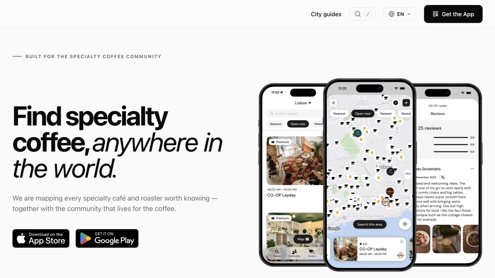
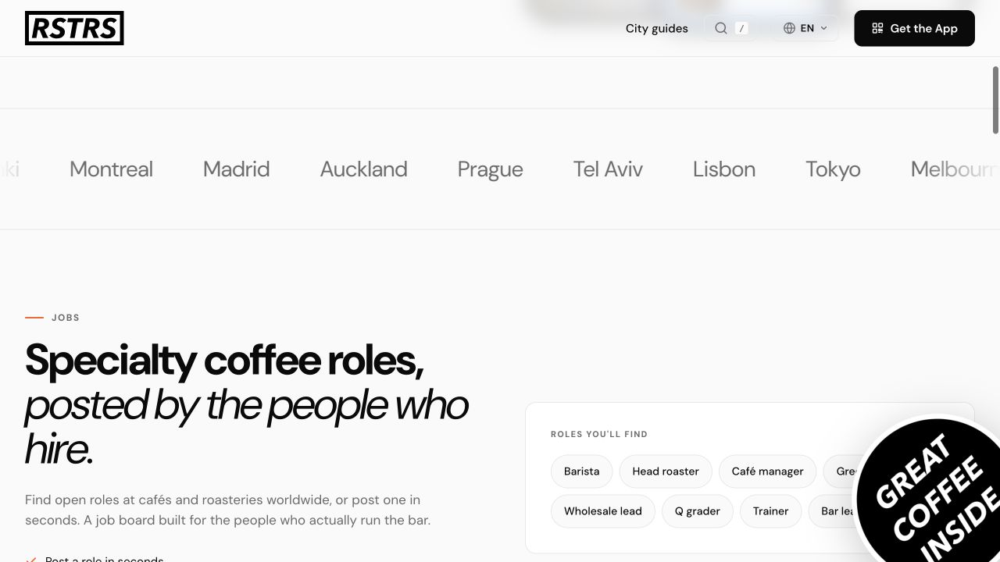
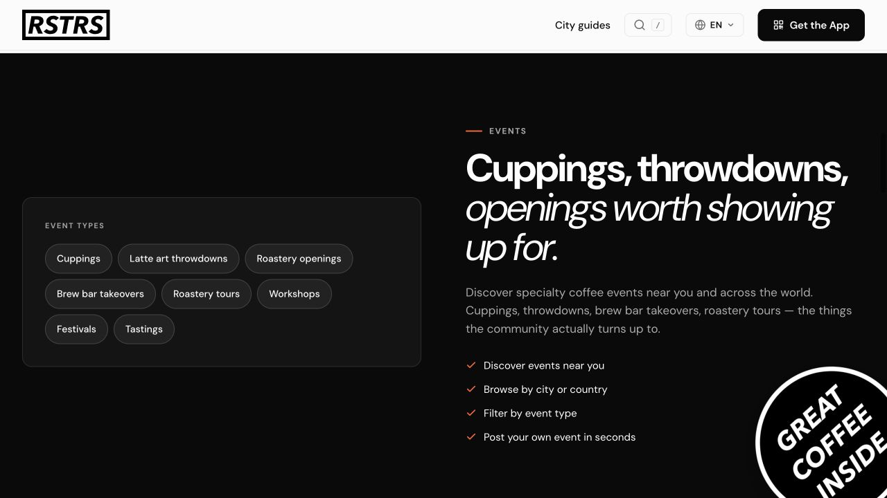
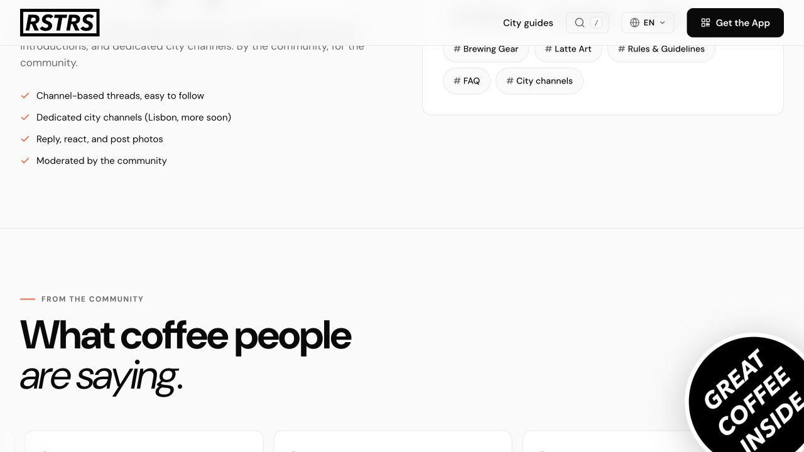
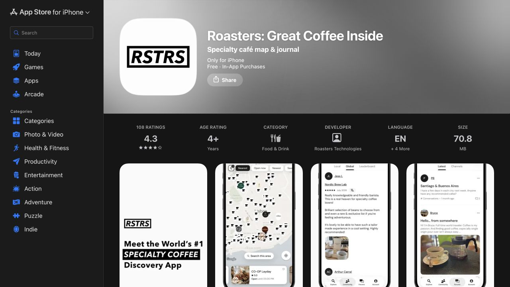
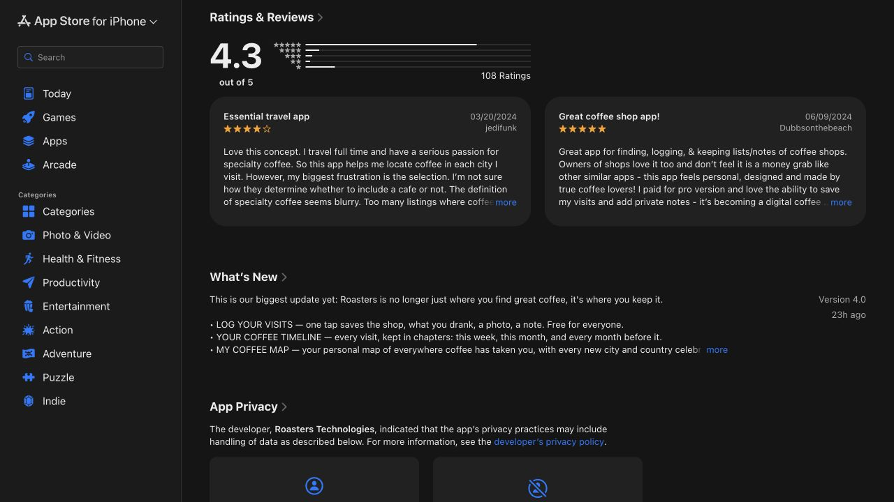
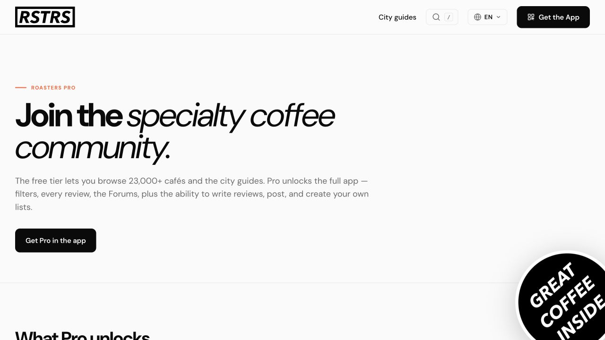
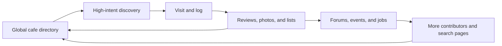

# Mugshot competitive gameplan: Roasters 4.0

**Decision date:** August 14, 2026

**Competitive target:** Roasters: Great Coffee Inside, version 4.0 on iOS

**Mugshot baseline:** `main` at `04f310d`, product version 0.5.2

**Decision owner:** Joe Rosso

**Status:** Decision-ready strategy and 90-day operating plan

## Executive call

Roasters is no longer just a specialty-coffee directory. Its version 4.0 release turns the product into a travel journal with one-tap visit logging, a personal timeline, a personal coffee map, drink tags, editable visits, community reviews, lists, forums, events, and jobs. It already claims more than 23,000 cafes and roasters, has a mature search footprint, and spans iOS, Android, and a content-rich website.

Mugshot should not answer by building a smaller Roasters.

The winning move is to own a narrower and more emotionally durable job:

> **Mugshot helps people notice, remember, and understand the drinks that matter to them, then discover what to try next through people they trust.**

That makes Mugshot a **coffee memory network**, not a specialty directory or public review marketplace. The defensible wedge is the combination of:

1. A fast, in-the-moment memory ritual across Cafe, Home, and Elsewhere.
2. A private raw journal separated structurally from the social caption.
3. An explainable Taste Passport built from the person's own evidence.
4. Trusted-friend discovery with a visible reason for every recommendation.
5. Durable drafts, recovery, ownership, and privacy that make reflection safe.

The next 90 days should prove that loop with a dense friend cohort. Do not spend those 90 days chasing global cafe coverage, public review volume, forums, events, job listings, merchant tools, loyalty, or a broad Android launch.

## The 90-day objective

By day 90, demonstrate with the first 20-30 segmented beta participants that Mugshot can reliably turn a first memory into repeat reflection and genuine friend connection:

- Median fast-path publish time under 60 seconds after visual selection.
- Median reflective path under three minutes.
- At least 75% of people who name a drink publish or intentionally save a draft.
- At least 40% of activated testers publish a second Mugshot within seven days.
- At least 30% of activated testers give or receive a meaningful friend interaction within 14 days.
- Zero lost or duplicated memories in the recovery matrix.
- At least 70% of interviewed testers can explain why a recommendation appeared and describe it as useful or plausible.

These thresholds extend Mugshot's existing [V3 alpha gates](../MUGSHOT_V3_PRODUCT_INTERVIEW.md#alpha-success-gates). They are learning gates, not claims of statistical significance.

## Scope and evidence

This analysis combines:

- A current-run visual inspection of Roasters' public website, Roasters Pro page, and U.S. App Store listing.
- First-party product and pricing claims from Roasters.
- Current App Store and Google Play ratings, release notes, and selected reviews.
- First-party positioning from direct and adjacent competitors.
- Mugshot's current product decisions, shipped code, analytics taxonomy, and release state.

It does **not** include a hands-on authenticated session inside the Roasters native app. App Store screenshots and first-party public pages can support a product, positioning, and visible-accessibility audit, but they cannot prove native interaction quality, performance, screen-reader behavior, data accuracy, paywall timing, or retention.

## Captured evidence

### 1. Roasters enters through global discovery

The promise is immediate and legible: specialty coffee anywhere in the world. The visual proof is a dense map, a cafe list, and public reviews. This is a strong travel and unfamiliar-city entry point.

### 2. Roasters is expanding into an industry platform

Jobs, events, and forums increase search inventory and give shops and professionals reasons to contribute. They also broaden the product away from the everyday drinker's personal outcome.

### 3. App Store conversion is travel-first, with journal now promoted

The listing has a clear category claim, recognizable monochrome brand, visible map density, and screenshots for discovery, community, and forums. At capture time it showed a 4.3 rating from 108 U.S. ratings.

### 4. Version 4.0 directly enters Mugshot's journal territory

The release note says Roasters is becoming a place to keep coffee, not only find it. The new loop includes visit logging, a timeline, a personal map, drink tags, and editing. The same screen shows the central customer tension: people value the travel utility and private journal, but some question how specialty listings are selected.

### 5. Contribution is the monetization boundary

The free tier exposes the large directory and city guides. Pro gates advanced filters, complete review reading, forums, writing reviews, creating lists, following contributors, and public contributor status. Version 4.0 says personal visit logging is free, so the new journal is an activation and retention layer while community participation remains the monetized layer.

## Roasters 4.0 teardown

### Positioning

Roasters currently occupies three overlapping positions:

| Position | Promise | Primary user moment | Strategic value |
| --- | --- | --- | --- |
| Specialty discovery | Find a credible cafe in any city | Travel or unfamiliar neighborhood | High-intent utility and global place graph |
| Coffee passport | Keep a record of where coffee has taken you | Immediately after a visit and later nostalgia | Repeat use and personal switching cost |
| Industry community | Reviews, lists, forums, events, jobs | Planning, contributing, and professional participation | Content supply, SEO, moderation rationale, and monetization |

The first position is proven and coherent. The second is the version 4.0 expansion. The third creates breadth and supply but risks diluting the consumer product.

### Core jobs to be done

Roasters serves these jobs well:

- "I just landed in a city; show me a specialty cafe I can trust."
- "Show me what is open and worth the walk."
- "Help me remember the cafes I visited while traveling."
- "Let me build and share a coffee itinerary."
- "Let me contribute to the specialty-coffee scene."
- "Show me events, roles, and conversations in the industry."

It appears less purpose-built for:

- "Help me pause and articulate what this drink felt like."
- "Help me understand how my taste is changing."
- "Help me repeat a home drink or recipe without expert logging work."
- "Show me what a specific friend with relevant taste loved and why."
- "Let me keep an honest private reflection without turning it into a public review."

Those are Mugshot's opening.

### Product loop

Roasters' flywheel is place-supply led. More listings and contributions make discovery better; discovery creates visits; visits create reviews and logs; community and industry surfaces create additional contributions.

This is a meaningful moat, but it is expensive to moderate and maintain. A directory can be large while still being locally thin, stale, or inconsistently curated.

### Distribution and scale signals

- Roasters Pro claims **23,000+ cafes and roasters** in its free catalog. Its June 2026 business report names 23,237 cafes across 126 countries. [Roasters Pro](https://roasters.app/pro/) and [Roasters business report](https://roasters.app/business/)
- The U.S. App Store showed **4.3 from 108 ratings** at capture time, while Google Play showed **4.0 from 284 reviews and 10K+ downloads**. [App Store](https://apps.apple.com/us/app/roasters-great-coffee-inside/id1466079049) and [Google Play](https://play.google.com/store/apps/details?id=app.roasters.roasters)
- iOS version 4.0 shipped within the day before this capture. The public Android listing was still dated April 10, 2026, which suggests a temporary platform-parity gap rather than proof of a permanent Android weakness.
- Roasters also operates a multi-language web acquisition system: city guides, country pages, editorial journal pieces, business content, shop-operator content, and product pages.
- The same developer offers Home Barista and Brewspace, creating potential consumer, creator, and merchant cross-sell.

Public store ratings and download bands do not reveal active users, retention, revenue, geographic density, or the percentage of verified listings. Those figures remain unknown.

### Business model

Roasters uses a freemium membership model:

- Free: broad catalog and city guides; version 4.0 says visit logging is free.
- Pro: advanced discovery filters, full reviews, forums, review creation, photos, custom/public lists, contributor follows, and status badge.
- The U.S. App Store exposes several historical or active monthly, annual, and lifetime purchase SKUs. The public surface does not identify one canonical current price, so pricing should be checked in-app before making a price comparison.
- Shop claims, premium profiles, industry content, jobs, events, and Brewspace create plausible future B2B paths.

The Pro boundary has a smart side and a vulnerable side. Charging contributors can raise commitment and fund moderation, but gating the people who create supply can also slow the network and make basic utility feel constrained. Several public reviews specifically object to limited search or participation without Pro. Treat that as a qualitative signal, not a quantified churn rate.

### Roasters strengths

1. **Global place graph.** Mugshot cannot economically reproduce 23,000+ curated specialty listings in the near term.
2. **Clear travel wedge.** "Find great coffee anywhere" is concrete and high intent.
3. **Map density as visual proof.** The product looks useful before the user reads feature copy.
4. **Strong brand consistency.** The black-and-white RSTRS system is recognizable across app, web, stickers, and store assets.
5. **Search and content distribution.** City guides and business/editorial content capture demand before app installation.
6. **Multi-sided expansion.** Consumers, contributors, shops, baristas, and roasters can all create supply.
7. **Rapid shipping cadence.** The version history shows frequent releases and multiple meaningful platform expansions.
8. **Journal adjacency.** Version 4.0 gives discovery users a reason to retain the app between trips.

### Roasters vulnerabilities

1. **Breadth can blur the core job.** Discovery, reviews, personal logging, forums, jobs, events, editorial content, and business tooling compete for product focus.
2. **Quality is hard to explain at global scale.** Reviews question the definition and selection of specialty cafes. A large catalog magnifies stale hours, uneven coverage, ambiguous qualification, and missing top venues.
3. **The contribution paywall adds friction to the flywheel.** Filters, reviews, forums, and lists are central to utility and supply, yet much of that participation requires Pro.
4. **Public rating logic is venue-first.** Separate coffee, service, and place ratings help decisions, but they still frame a person's experience as evidence about a business. Mugshot can frame the same evidence as a personal memory.
5. **The journal is structurally downstream of the cafe.** The public copy centers shop, city, travel, and place history. Home, tea, matcha, recipes, non-cafe settings, private thought, and longitudinal taste identity are not the organizing model.
6. **Community is broad rather than relational.** Forums and public contributors create reach, but visible materials do not show a close-friend recommendation graph or shared-memory model.
7. **Platform parity is uneven at this moment.** iOS received version 4.0 while the public Android listing remained months behind.
8. **Visible accessibility evidence is incomplete.** Apple says the developer has not yet declared supported accessibility features. That is an evidence gap, not proof that the app is inaccessible.
9. **Store sentiment is good, not dominant.** Ratings are positive but not category-owning, and review volume is modest relative to the catalog claim. This may indicate geographic fragmentation, a small active-contributor core, or simply low review conversion; active usage is unknown.

### UX and accessibility assessment

**Visible strengths**

- The acquisition story is direct and visually proven.
- Map, list, reviews, community, and forums appear to use familiar mobile patterns.
- The monochrome visual system is consistent and high contrast in the public assets.
- The new journal uses plain concepts: visit, photo, note, timeline, map.
- App Store screenshots communicate breadth quickly.

**Visible risks**

- The number of product areas increases information-architecture pressure.
- Dense map pins may be hard to parse without clustering, zoom, and accessible alternatives.
- Monochrome controls require state differences beyond color and subtle weight.
- A rating/review/list/forum paywall may appear only after intent, creating perceived bait-and-switch if the boundary is not explained early.
- Public scores can encourage expertise performance or popularity behavior, especially when contributor badges and follows are visible.
- Apple reports no declared accessibility support, so VoiceOver, Dynamic Type, focus order, Reduced Motion, and target-size behavior remain unverified.

**Privacy assessment**

Apple's disclosure says Roasters may link user identifiers to identity and may collect precise location, contact information, usage data, and diagnostics without linking those categories to identity. The disclosure is developer-provided and not independently verified by Apple.

Mugshot should not make a broad "we collect less" claim without a field-by-field comparison. Its credible trust advantage is narrower: private raw notes are structurally separated from social captions, visibility is explicit, home addresses are excluded, recommendations show evidence, and users retain export/deletion controls.

## Competitive landscape

| Product | Primary wedge | Discovery | Personal memory | Taste intelligence | Social model | Structural opening for Mugshot |
| --- | --- | --- | --- | --- | --- | --- |
| **Roasters 4.0** | Global specialty map and travel passport | Global catalog, reviews, filters, lists | Visit timeline and personal map | Drink tags; limited visible longitudinal taste model | Public contributors, forums, events, jobs | Deeper private reflection, Home/Elsewhere, trusted friends, explainable taste identity |
| **Google Maps** | Universal local utility | Dominant coverage, hours, routing, broad reviews | Saved lists and timeline adjacency | None for personal drink taste | Mass public reviews | Specialty context, reflection, trusted taste, emotional memory |
| **European Coffee Trip** | Curated European specialty guide | 6,502 cafes and 282 city guides; premium shop profiles | Limited visible journal depth | Editorial/venue expertise | Editorial and shop-led | Personal identity, multi-context logging, friend loop outside Europe |
| **FIKA** | Curated community lists and coffee events | Early city network, detailed brew methods and roasters on bar | Lists and crawl planning | Venue/coffee detail, not a visible personal learning system | Curators, events, kudos, leaderboards | Private utility, no popularity pressure, evidence-based personal taste |
| **Specialty Atlas** | All-in-one specialty ecosystem | Curated map, beans on bar, events | Passport and recipes | Bean taste matching with flavor-wheel input | Reviews, discussion, community | Casual memory ritual, privacy, friend trust, simpler product focus |
| **Beanconqueror** | Expert home-brew tracking | No meaningful cafe-discovery wedge | Deep brew, bean, water, roast, and equipment history | Detailed statistics and repeatability | Open-source enthusiast community | Non-expert reflection, cafe context, close friends, emotional memory |
| **Mugshot** | Coffee memory network | Apple/Mugshot map with reasoned friend and taste evidence | Cafe, Home, Elsewhere, raw note, caption, Journal, Memories | Explainable Taste Passport and owner-correctable evidence | Friends-first reactions, tags, shared lists, invitations | Must prove speed, retention, social density, and public availability |

Sources: [European Coffee Trip](https://europeancoffeetrip.com/), [FIKA](https://fikacoffee.app/), [Specialty Atlas](https://specialtyatlas.com/download/), and [Beanconqueror](https://beanconqueror.com/).

## Mugshot's current strategic position

### What is already unusually strong

The current repository has more defensible product depth than its public availability suggests:

- A locked [journal-first, social-second direction](../MUGSHOT_V3_PRODUCT_INTERVIEW.md#the-product-direction-that-emerged).
- Cafe, Home, and Elsewhere as first-class capture contexts.
- A five-screen composer with optional progressive depth rather than an expert form.
- Private raw notes separated from public captions and protected by viewer-specific projections.
- Durable drafts, upload recovery, retry, deduplication, and automatic reconciliation.
- A canonical Journal with search, filters, calendar/map, tags, bookmarks, drafts, On This Sip, Repeat Sip, and versioned recipes.
- An explainable taste graph and Taste Passport with evidence and owner correction.
- Lightweight friends, trusted recommendations, collaborative lists, reactions, and recipe sharing.
- Reflections and milestones designed around memory and learning rather than consumption volume.
- Public Mugshot links, share formats, App Intents, widgets, shortcuts, deep links, export, deletion, and safety controls.
- A privacy-safe [PostHog measurement plan](../POSTHOG_ANALYTICS_PLAN.md) that already centers completion, repeat publishing, friend connection, and recovery.

The [full-lifecycle checkpoint](../FULL_LIFECYCLE_PHASES_0_6_CHECKPOINT.md) confirms these capabilities are implemented on the lineage merged into `main`, not merely roadmap ideas.

### What is strategically weak today

1. **No public distribution.** The latest durable readiness record still had no App Store record or external TestFlight cohort. Roasters is compounding while Mugshot is not yet learning from real users.
2. **Low network density.** Friends-first discovery only works when each tester has relevant friends and shared place history.
3. **Discovery is not release-default.** Discovery feature flags default off in Release unless remotely enabled. The code is strong, but customer availability needs deliberate rollout.
4. **The product surface is broad.** Five main tabs, a deep composer, taste intelligence, friends, Saved, Journal, activity, sharing, and ownership controls can overwhelm the first session.
5. **The differentiation is not yet packaged.** "Journal-first memory ritual" is internally clear, but there is no public App Store page proving it in five seconds.
6. **Existing status documents age quickly.** Older feature matrices understate capabilities already merged into `main`. The team needs one live release/experiment board.
7. **The local-cafe graph is early.** Apple place data and Mugshot evidence can support a utility map, but Mugshot cannot yet promise Roasters-like specialty coverage.

## The strategic choice

### Category

**Coffee memory network**

This category is broad enough to include cafe, home, tea, matcha, friends, and taste learning, but narrow enough to reject the directory race.

### Positioning statement

> For curious coffee, tea, and matcha drinkers who want to remember what they loved and find the next good sip through people they trust, Mugshot is a journal-first coffee memory network that turns each sip into an explainable Taste Passport. Unlike directory and review apps, Mugshot starts with your experience, keeps private thought private, and uses real memories—not popularity—to guide discovery.

### The four product pillars

| Pillar | Customer promise | Proof in product | Competitive meaning |
| --- | --- | --- | --- |
| **Remember** | Capture the moment without making it homework | Sub-minute path, raw note, caption, photo/placeholder, Cafe/Home/Elsewhere, recovery | More personal than Roasters; more approachable than expert brew trackers |
| **Understand** | See taste patterns emerge with evidence | Taste Passport, criteria, confidence, "why" explanations, owner correction | A durable identity layer Roasters cannot copy with a single profile field |
| **Connect** | Share with friends without performing for a crowd | Friends audience, reactions, tags, invitations, shared lists, no follower counts | Relational quality instead of forum or leaderboard breadth |
| **Discover** | Find the next place or drink for a reason | Friend evidence, Taste Passport match, prior memories, local utility map | Avoids the global directory race and makes a smaller graph useful |

### Win on these dimensions

- Emotional fidelity of the memory.
- Fast capture with optional depth.
- Longitudinal personal taste understanding.
- Trusted-friend relevance.
- Home, tea, matcha, and non-cafe context.
- Transparent recommendations.
- Recovery, privacy, ownership, and user agency.
- A warmer, character-led brand through Mugsy.

### Concede or borrow these dimensions

- Use Apple Maps and user/friend evidence for broad place utility.
- Let Roasters, Google, and editorial guides own global catalog completeness.
- Do not attempt to out-index Roasters' web content in 90 days.
- Do not build public venue rankings as the source of truth.

## 90-day operating plan

The plan assumes a small team. "Owner" names the accountable hat; one person may wear several hats.

### Phase 0 — Days 0-14: get into users' hands and establish truth

| Deliverable | Owner | Ship criteria | Primary measure |
| --- | --- | --- | --- |
| Finish first external TestFlight release | Release owner | Processed build, review metadata, internal device gate, Beta App Review, first cohort invited | Eligible testers can install without founder intervention |
| Recruit 12-person alpha by behavior | Product/Research | Cafe casuals, Home makers, tea/matcha users, reflective users, and at least four friend pairs represented | Coverage matrix complete |
| Validate analytics dashboard | Data | Product activation, second publish in seven days, social activation, publish duration, failure/recovery, and share funnels visible | Required events and bounded properties present |
| Establish live release board | Product | One page shows build, flags, cohort, gates, decisions, and unresolved blockers | No contradictory status source used for go/no-go |
| Competitor baseline checkpoint | Product | Roasters 4.0 capabilities, store metrics, pricing boundary, and screenshots archived | Monthly refresh takes under 30 minutes |

**Decision gate:** do not add new scope until the build is installed by real testers and the first-session funnel is observable.

### Phase 1 — Days 15-35: win the memory ritual

| Deliverable | Owner | Ship criteria | Primary measure |
| --- | --- | --- | --- |
| Fast-path composer pass | iOS/Product | A casual tester can choose context, visual, drink, score, caption, audience, and publish without encountering optional depth | Median under 60 seconds after visual selection |
| Recovery confidence pass | iOS/Backend | Force quit, backgrounding, offline, upload failure, relaunch, retry, and multiple drafts preserve and deduplicate memories | Zero loss and zero duplication |
| Post-publish memory payoff | iOS | Finished Mugshot is the success state; Passport evidence and Repeat Sip are discoverable; share is secondary | Completion confidence in interview; repeat-action taps |
| First-three-memory arc | Product | Each of the first three logs reveals a meaningful but cautious new piece of personal value | Second publish within seven days |
| Home and matcha parity | Product/Research | Home and matcha users produce finished memories without feeling like edge cases | Completion and repeat by context |

**Decision gate:** if fewer than 75% of drink-namers publish or intentionally save, fix friction before growth. If criteria feel required, demote them further.

### Phase 2 — Days 36-60: create friend density, not audience breadth

| Deliverable | Owner | Ship criteria | Primary measure |
| --- | --- | --- | --- |
| Pair-based onboarding | Growth/Product | Each activated tester can invite one relevant coffee friend after a completed memory, with a reason to join | Invite acceptance and social activation |
| Meaningful interaction loop | iOS/Backend | Reaction, comment, tag, recommendation, or accepted collaboration returns both people to a real memory | 30% social activation within 14 days |
| Friend recommendation object | Product/Data | Every recommendation names the friend/evidence and why it may fit; no popularity score | Explanation comprehension and save/log action |
| Shared list activation | iOS/Product | Friend pairs can plan one real cafe outing with a collaborative list and clear ownership | List created to cafe visited/logged |
| Shareable memory acquisition | Growth/iOS | Public Mugshot links and image formats preserve the memory first and offer installation second | Share handoff completion and qualified opens |

**Decision gate:** if social activation is weak, diagnose missing friend relevance before adding broader community mechanics.

### Phase 3 — Days 61-90: turn memory into reasoned local discovery

| Deliverable | Owner | Ship criteria | Primary measure |
| --- | --- | --- | --- |
| Reasoned For You rollout | iOS/Data | Staged Release flag enables recommendations for the beta cohort; each result exposes nearby, friend, taste, or memory evidence | 70% useful/plausible in interviews |
| Discovery-assisted memory tracking | Data | Search, result view, save, detail, directions, and assisted Mugshot are connected without storing search text or coordinates in analytics | Recommendation to save/log conversion |
| One-city density playbook | Growth/Product | A single city or neighborhood has enough friend, list, and memory evidence to feel alive | Relevant evidence per active tester |
| App Store positioning package | Product/Growth | Subtitle, description, screenshots, privacy copy, and keywords center memory and taste identity rather than directory size | Product-message comprehension |
| Day-90 decision review | Decision owner | Continue, narrow, or stop decisions use behavior plus interviews | All gates explicitly decided |

**Decision gate:** do not broaden geography until one cohort gets value from a small, trusted graph.

## Priority stack

| Rank | Initiative | Impact | Confidence | Effort | Why now |
| --- | --- | ---: | ---: | ---: | --- |
| P0 | External TestFlight and live measurement | 5 | 5 | 2 | No strategy improves without real behavior |
| P0 | Fast-path completion | 5 | 5 | 3 | The memory ritual is the wedge |
| P0 | Zero-loss recovery | 5 | 5 | 3 | Trust failure destroys journal retention |
| P0 | First-three-memory Taste Passport arc | 5 | 4 | 3 | Converts logging into personal compounding value |
| P0 | Repeat Sip and On This Sip payoff | 5 | 4 | 2 | Makes the second log easier and memory useful |
| P1 | Pair-based friend activation | 4 | 4 | 3 | Creates network density with low scale |
| P1 | Reasoned friend/taste recommendations | 4 | 3 | 4 | Makes discovery differentiated rather than merely available |
| P1 | Public memory links and share assets | 3 | 4 | 3 | Acquires users through the artifact, not generic invites |
| P2 | One-city evidence seeding | 3 | 3 | 4 | Useful only after the personal loop works |
| P3 | Global specialty directory | 2 | 1 | 5 | Competes into Roasters' strongest moat |
| P3 | Forums, jobs, events, merchant profiles | 1 | 2 | 5 | Expands breadth before product-market fit |

## Experiment cards

### E1 — The memory ritual

- **Hypothesis:** A casual user can create a memory in under a minute without perceiving criteria or coaching as required.
- **Cohort:** All 12 alpha testers; segment results by context.
- **Measure:** Median duration after visual selection, publish/save completion, step abandonment, interview language.
- **Pass:** Under 60 seconds and at least 75% completion/save.
- **If it fails:** Remove or defer fields from the fast path; do not add growth work.

### E2 — The Passport reveal

- **Hypothesis:** A cautious new Taste Passport observation after three memories creates a stronger reason to return than a generic badge.
- **Cohort:** Testers with three completed memories.
- **Measure:** "Why" opens, owner corrections, seven-day second/third publish, qualitative trust.
- **Pass:** At least 70% call it accurate enough to be interesting and understand that it is evidence-based, not objective truth.
- **If it fails:** Reduce claim strength, improve evidence, or delay the reveal; do not gamify consumption.

### E3 — The coffee-friend pair

- **Hypothesis:** Inviting one relevant friend after the second memory creates meaningful interaction without public-audience pressure.
- **Cohort:** At least four preexisting friend pairs.
- **Measure:** Invite acceptance, first interaction, recommendation/save/list action, notification tolerance.
- **Pass:** At least 30% social activation within 14 days and fewer than 20% describe notifications as noisy.
- **If it fails:** Improve pair relevance and notification control before widening the graph.

### E4 — Reasoned discovery

- **Hypothesis:** "Amanda loved this and your recent sips favor bright, fruit-forward drinks" is more useful than an unexplained popularity rank.
- **Cohort:** Testers with at least three memories and one connected friend.
- **Measure:** Explanation comprehension, save/directions/log action, owner correction, relevance interview.
- **Pass:** At least 70% useful/plausible and no material privacy confusion.
- **If it fails:** Fall back to explicit friend evidence or nearby utility; never hide a weak model behind confidence.

### E5 — Category message

- **Hypothesis:** "Remember every sip. See your taste take shape." creates better product comprehension than "find great cafes."
- **Cohort:** 8-12 people who have not seen Mugshot.
- **Measure:** Five-second recall, expected first action, differentiation from Roasters/Google Maps.
- **Pass:** At least 75% describe journaling, memory, or personal taste without prompting.
- **If it fails:** Rewrite the store story before public launch.

## Metric tree

### North-star behavior

**Weekly completed memories that produce either repeat reflection within seven days or meaningful friend connection within 14 days.**

This keeps the outcome grounded in memory, learning, and relationships. It explicitly rejects time spent, caffeine consumed, paid visit count, streak preservation, and notification opens alone.

### Input metrics

- Install to composer open.
- Composer open to context selected.
- Visual selected to drink named.
- Drink named to publish or intentional draft.
- Median fast and reflective path duration.
- Draft recovery and deduplication.
- First to second publish within seven days.
- First meaningful friend interaction within 14 days.
- Repeat Sip and On This Sip use.
- Taste Passport evidence view and owner correction.
- Share hub to successful system handoff.
- Discovery result to save, directions, or assisted Mugshot.

### Guardrails

- Lost memories: zero.
- Duplicate published memories: zero.
- Private raw-note exposure: zero.
- Home-address exposure: zero.
- Recommendation explanations that users cannot understand: below 30%.
- All-notification disable or repeated noise complaint: warning at 20%.
- Blended-score confusion: reconsider above 25%.
- Report, block, restriction, export, and deletion routes remain available and truthful.

## Product and growth moves Roasters makes more urgent

### Make the first screen prove the category

Mugshot's store and onboarding should show the memory artifact before the map. Recommended App Store story:

1. **Remember the sip, not just the place.**
2. **See your taste take shape.**
3. **Find the next cafe through friends.**
4. **Cafe, home, or anywhere.**
5. **Your private journal stays yours.**

Recommended subtitle direction: **Coffee journal & cafe map**.

The map remains a valuable acquisition term, but it is supporting proof rather than the category claim.

### Acquire friend pairs and small clusters

- Recruit pairs or trios, not isolated testers.
- Seed one neighborhood or city before broad geography.
- Use completed Mugshots, public links, and collaborative lists as the invite object.
- Ask local shops only for tester recruitment or feedback during beta; do not build merchant tooling.
- Include casual latte, tea, matcha, and Home behaviors so specialty expertise does not define the culture.

### Keep the core memory utility free through beta

Do not answer Roasters Pro with a cheaper membership. First prove retention. If monetization is tested later:

- Never paywall durable drafts, core logging, private journal access, export, deletion, safety, or friend interaction.
- Consider premium aesthetic exports, advanced longitudinal insight, optional creator customization, or high-cost intelligence after value is proven.
- Keep merchant, loyalty, payments, and promotion out of the consumer learning phase.

## Explicit non-goals for the next 90 days

- A 23,000-place specialty cafe database.
- Public star rankings intended to grade businesses objectively.
- Paid placement or sponsored discovery.
- Forums, city channels, jobs, events, or editorial media expansion.
- Follower counts, public creator leaderboards, kudos, or consumption streaks.
- A professional cupping form as the default experience.
- Device-integrated brew telemetry to compete with Beanconqueror.
- Merchant profiles, claims, loyalty, payments, POS, or rewards.
- Broad Android parity before the iOS loop is proven.
- Generative captions or autonomous publishing.
- Sophisticated models without an editable, evidence-linked customer outcome.

## Competitive response playbook

| If Roasters... | Mugshot response |
| --- | --- |
| Deepens its taste profile | Emphasize evidence, confidence, owner correction, Cafe/Home/Elsewhere continuity, and private raw thought |
| Makes more Pro features free | Do not price-war; strengthen the memory-to-friend loop and generous core utility |
| Adds friends or shared visits | Win on close-friend relevance, contribution ownership, independent visibility, and shared-memory safety |
| Adds home recipes | Keep Home approachable for casual users and connect recipe evidence to the same Taste Passport |
| Improves global curation | Concede coverage; make every Mugshot recommendation explain why it fits this person now |
| Expands merchant tools | Avoid the distraction until consumer retention is proven; protect recommendation neutrality |
| Copies Mugsy-like personality | Treat mascot charm as an amplifier, not the moat; the moat is accumulated private evidence plus trusted relationships |

## Risks and mitigations

| Risk | Early signal | Mitigation |
| --- | --- | --- |
| Composer feels like homework | Criteria abandonment, duration over three minutes | Preserve the fast path; progressively disclose reflection depth |
| Taste Passport feels presumptuous | Corrections, distrust, "the app decided for me" | Weaken claims, expose evidence, require distinct memories, support correction |
| Friends graph is empty | Activated users have no meaningful interaction | Recruit pairs; do not launch users alone into a social empty state |
| Map is judged against Roasters/Google | Complaints about missing cafes or stale data | Position map as reasoned personal utility; use Apple coverage; show evidence source |
| Public sharing eclipses journaling | Share actions exceed finished-memory review and repeat use | Keep finished Mugshot first; make external share secondary |
| Scope breadth obscures the wedge | Low five-second comprehension | Lead with Remember and Understand; stage Connect and Discover |
| Alpha enthusiasm lacks behavior | Positive interviews but weak repeat posting | Use the existing repeat-use gate; do not rationalize weak retention |
| Notifications feel coercive | Mutes or repeated noise complaints near 20% | Add category and per-friend controls; never optimize notification opens alone |

## Operating cadence

- **Weekly:** review funnel, failures, recovery, second publish, social activation, and the top three interview observations.
- **Every two weeks:** decide one product change, one cohort action, and one thing to stop.
- **Monthly:** refresh the Roasters checkpoint, including store release, Pro boundary, public metrics, and visible new surfaces.
- **At day 35:** memory-loop gate.
- **At day 60:** friend-density gate.
- **At day 90:** continue, narrow, or stop decision using behavior and interviews together.

## Audit step health

| Step | Surface inspected | Health | Main conclusion |
| ---: | --- | --- | --- |
| 1 | Public product entry | Strong | Clear global discovery promise with immediate visual proof |
| 2 | Jobs and events expansion | Strong execution, focus risk | Expands supply and SEO while broadening the product beyond the drinker's core job |
| 3 | Forums/community | Mixed | Creates contribution and retention, but adds moderation and information-architecture load |
| 4 | App Store conversion | Strong | Brand, category, map density, and travel value are immediately legible |
| 5 | Version 4.0 journal transition | Strategically strong, experientially unverified | Directly enters visit memory and personal-map territory |
| 6 | Ratings and customer signals | Mixed-positive | Travel and journal value resonate; curation clarity and focus recur as concerns |
| 7 | Pro conversion | Clear but polarizing | Transparent public page, yet important filters and participation are gated |
| 8 | Accessibility and privacy evidence | Incomplete | Public disclosures exist; native assistive-technology behavior was not tested |

## Sources

### Roasters

- [Roasters product homepage](https://roasters.app/)
- [Roasters Pro](https://roasters.app/pro/)
- [Roasters U.S. App Store listing](https://apps.apple.com/us/app/roasters-great-coffee-inside/id1466079049)
- [Roasters Google Play listing](https://play.google.com/store/apps/details?id=app.roasters.roasters)
- [Roasters business content and directory report](https://roasters.app/business/)
- [Roasters discovery behavior article](https://roasters.app/business/how-specialty-coffee-drinkers-find-new-cafes/)
- [Roasters editorial journal](https://roasters.app/journal/)

### Market comparators

- [European Coffee Trip](https://europeancoffeetrip.com/)
- [FIKA](https://fikacoffee.app/)
- [Specialty Atlas](https://specialtyatlas.com/download/)
- [Beanconqueror](https://beanconqueror.com/)

### Mugshot sources of truth

- [Mugshot V3 product interview](../MUGSHOT_V3_PRODUCT_INTERVIEW.md)
- [Mugshot full-lifecycle checkpoint](../FULL_LIFECYCLE_PHASES_0_6_CHECKPOINT.md)
- [Mugshot PostHog analytics plan](../POSTHOG_ANALYTICS_PLAN.md)
- [Mugshot TestFlight alpha readiness audit](../audits/testflight-alpha-readiness-2026-08-08/README.md)
- [Main tab architecture](../../testMugshot/Views/MainTabView.swift)
- [Map discovery implementation](../../testMugshot/Views/Map/MapTabView.swift)
- [Discovery feature flags](../../testMugshot/Services/DiscoveryFeatureFlags.swift)

## Final recommendation

Ship Mugshot to the smallest dense group that can prove its unique loop. Make the first three memories delightful, make the second memory easier than the first, let the Taste Passport reveal something earned, and connect each person to one relevant friend. Only then turn that evidence into local discovery.

Roasters can own the map of specialty coffee. Mugshot should own what the cup meant to you—and who helps you find the next one.
